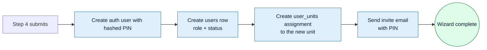

<Section id="overview" num="01 — Overview" title="When to add a client">

A **client** is a brand or organisation that owns one or more **units** (physical or virtual sites where bookings happen). Examples: a pharmacy chain, a corporate wellness programme, a single private clinic. Each client carries its own branding (logo, accent colour) and billing configuration (which flows the operator sees).

<Callout variant="warn" title="Admin-only">
Adding a client is a <Pill variant="brand">system_admin</Pill> action. Unit managers and operators can't see this flow. If you need a new client created, escalate to a system admin.
</Callout>

Use **Client Management → Add Client** in the sidebar. The Add Client wizard is four steps, each of which saves progress as you go — you can leave mid-flow and resume.

</Section>

<Section id="prerequisites" num="02 — Prerequisites" title="What to gather before you start">

You'll move faster if you have all of this ready before opening the wizard:

| Item | Notes |
|---|---|
| Client legal name + trading name | Trading name appears on the booking UI |
| Primary contact (name, email, phone) | Where billing / support enquiries go |
| Logo file | PNG or SVG, transparent background preferred, ~512×512 |
| Favicon file | 32×32 or 64×64 PNG; defaults to CareFirst's if blank |
| Accent colour | Hex string, e.g. `#3ea3db` — used on buttons, pills, headers |
| Billing mode | Gateway (PayFast) / Self-collect / Monthly invoice |
| First unit name | Usually the first physical location going live |
| First admin user (name, email) | They'll get a sign-in invite |

</Section>

<Section id="step-1" num="03 — Step 1" title="Client details">

The basics — who the client is and how to contact them.

<Grid2>
<Card variant="brand" title="Required fields">
- **Client name** — the legal entity
- **Trading name** — what shows in the operator UI (defaults to client name if blank)
- **Contact email** — billing / support
- **Contact number** — voice contact
</Card>

<Card variant="brand" title="Optional fields">
- **Address** — for invoices
- **Notes** — free-text, visible only to admins
</Card>
</Grid2>

Click **Next** once the required fields are valid. The client row is **not yet committed to the database** at this point — that happens at the end of step 2.

</Section>

<Section id="step-2" num="04 — Step 2" title="Branding & billing settings">

This is where the client's UI fingerprint is set: logo, accent colour, favicon, and the booking-flow flags that decide what the operator sees.

### Branding

<Grid2>
<Card variant="brand" title="Logo">
Uploaded to the same `branding-assets` storage bucket as user avatars. Shown in the sidebar when this client's unit is active. Falls back to the CareFirst logo if blank.
</Card>

<Card variant="brand" title="Accent colour">
Native colour picker — pick a hex. Drives `--client-primary` on the dashboard wrapper, which cascades through buttons, pills, and section dividers. Variants (tints / darkens) auto-derive via `color-mix()`.
</Card>
</Grid2>

### Billing settings

<Callout variant="warn" title="Mutual exclusion">
<code>collect_payment_at_unit</code> and <code>bill_monthly</code> cannot both be ON. The UI cascades the toggles — turning one on auto-disables the other. The server PATCH also clamps if both arrive TRUE, so it's safe at both layers.
</Callout>

| Flag | When ON |
|---|---|
| `collect_payment_at_unit` | Operator confirms payment at the unit with PIN — skips PayFast entirely |
| `bill_monthly` | Client invoiced monthly — operator never sees Step 6 |
| `skip_patient_metrics` | Skips the vitals page; only available when one of the two above is ON |
| `nurse_verification` | Requires nurse PIN at search, verification, and handoff — 4 PIN gates total |

**End of Step 2 commits the client row** to the database, including all of the above. Step 3 onward edits it incrementally.

</Section>

<Section id="step-3" num="05 — Step 3" title="First unit">

A client must have at least one unit before it can take a booking. Step 3 captures it.

| Field | Notes |
|---|---|
| **Unit name** | The display name (e.g. "Sandton City Pharmacy") |
| **Unit code** | Short identifier for reports / exports |
| **Address** | Physical address (or "Virtual" for online-only units) |
| **Contact email/phone** | Unit-level contact (separate from client contact) |

You can add more units later from the **Manage Client → Units tab**. The wizard insists on at least one so Step 4 has something to assign the first user to.

<Callout title="If the client is virtual-only">
Set the address to "Virtual" or the city the consultation is delivered from. Other unit fields still need to be populated.
</Callout>

</Section>

<Section id="step-4" num="06 — Step 4" title="First admin user">

The wizard finishes by creating a <Pill variant="brand">unit_manager</Pill> account for the client's first staff member, assigned to the unit you just created in Step 3.

| Field | Notes |
|---|---|
| **First names, surname** | Display name |
| **Email** | Sign-in identity. They'll receive an invite email with their initial PIN |
| **Role** | Defaults to <code>unit_manager</code>; can be set to <code>user</code> if you'd rather create a manager separately later |
| **Initial PIN** | Auto-generated 6 digits; emailed to the user |

<Callout variant="warn" title="The wizard creates exactly one user">
If you need to add more users at the same time, use Step 4 to create one, finish the wizard, then add the rest from <b>User Management → Add User</b>. Or use <b>Manage Client → Users tab</b>.
</Callout>

</Section>

<Section id="after-create" num="07 — After creation" title="Verify everything's wired up">

After the wizard finishes, do this sanity check:

1. **Sidebar switches**: when you switch to a unit under the new client, the logo + accent colour should change to match.
2. **Operator can sign in**: ask the new user to sign in with the emailed PIN. They should land on Home with their unit assigned and visible.
3. **Test booking**: have the operator create a test booking and walk through the configured flow — confirm the right payment branch appears (gateway / self-collect / monthly).
4. **Audit log**: every step of the wizard writes an audit-log row. Check **Audit Log → filter by client** to confirm the creation events are there.

</Section>

<Section id="manage" num="08 — Manage Client" title="Editing later — the four tabs">

Once created, the client is editable from **Client Management → \[client name\] → Manage**. The page is organised into four tabs that mirror the wizard's stages.

<Grid4>
<Card variant="brand" title="Details">
Contact info, address, notes. <b>Editable</b> by system_admin.
</Card>

<Card variant="brand" title="Branding">
Logo, favicon, accent colour. <b>Editable</b> by system_admin. Changes apply immediately — operators see them on their next page load.
</Card>

<Card variant="brand" title="Settings">
The billing flags (<code>collect_payment_at_unit</code>, <code>bill_monthly</code>, <code>skip_patient_metrics</code>, <code>nurse_verification</code>). <b>Editable</b> by system_admin. Toggles cascade.
</Card>

<Card title="Units & Users">
Two read-only tabs. To add a new unit, use <b>Unit Management → Add Unit</b>. To add a new user, use <b>User Management → Add User</b>. The lists here show what already exists scoped to this client.
</Card>
</Grid4>

<Callout title="What stays editable">
Three of the four tabs are editable; only Units and Users are read-only (their CRUD lives on their own pages). The <b>Update Information</b> button appears below the active tab when the tab is editable — it's the same button across tabs, scoped to whichever tab you're on.
</Callout>

</Section>
