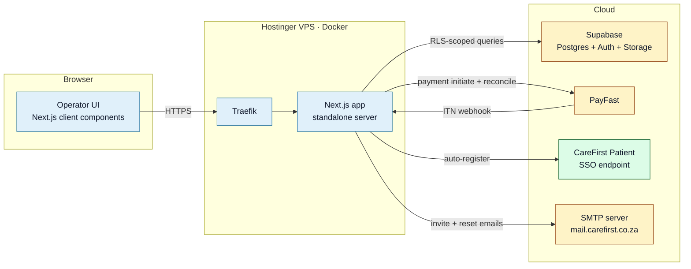
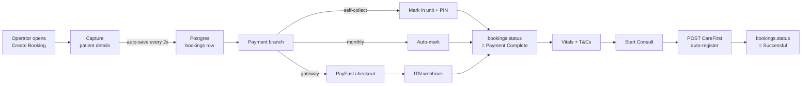

<Section id="stack" num="01 — Stack" title="Tech stack at a glance">

| Layer | Choice | Notes |
|---|---|---|
| Frontend framework | Next.js 16 (App Router) + React 19 | Server components by default; client components only where interactivity demands them |
| Styling | Tailwind 4 + a small shadcn slice | Plus brand tokens in `globals.css` for per-client accents |
| Auth + DB | Supabase (Postgres + Supabase Auth) | Real Row-Level Security — every table has policies; we don't have a "service mode" that bypasses RLS in user-facing code |
| File storage | Supabase Storage | Used for client logos / favicons / user avatars |
| Payments | PayFast (sandbox + production) | Both the ITN webhook *and* the Transaction History API for reconcile |
| Email | nodemailer over SMTP | `mail.carefirst.co.za:465` — used for invite codes and PIN reset |
| Hosting | Docker on Hostinger VPS | Traefik reverse proxy with HTTPS auto-renewed via Let's Encrypt (HTTP-01 ACME). Public URL [bookings.carefirst.co.za](https://bookings.carefirst.co.za); HTTP &rarr; HTTPS auto-redirect at the entrypoint |
| External APIs | CareFirst Patient SSO | Single outbound integration point — `POST /api/external/client-sso/auto-register` |

</Section>

<Section id="topology" num="02 — Topology" title="Topology">

All inbound traffic is HTTPS. See [Deployment & Hosting](/reports/deployment-hosting) for the Traefik + ACME details.

</Section>

<Section id="request-life" num="03 — Request lifecycle" title="Lifecycle of one booking">

A single booking flows through these stages — each is a request to our Next.js server, validated by the proxy (CSRF + admin-route auth), RLS-scoped at the DB, and audit-logged.

Every transition is recorded in `audit_log` with actor, action, before/after diff, and source IP. The handoff itself is the only step where our server makes an outbound call to CareFirst.

</Section>

<Section id="state" num="04 — State" title="Where state lives">

| State type | Where | Lifetime |
|---|---|---|
| Booking record | Postgres `bookings` table | Forever (subject to POPIA retention sweep) |
| Operator session | Cookie (Supabase Auth JWT) + Postgres session table | 30 days default, revoked on PIN reset |
| Patient-details auto-save draft | Same `bookings` row — written every 2s during capture | Until the booking moves to a terminal status |
| PayFast payment | Postgres + PayFast — we reconcile against PayFast as source of truth | Per booking |
| Operator UI state | React (in browser) | Per session |
| Audit log | Postgres `audit_log` table | Forever |
| CSRF token | Cookie (non-HttpOnly, SameSite=Lax) | 1 week, rotates if missing |

We are deliberately **stateless** in the application layer — no in-memory caches that matter, no sticky sessions. Restarting the Next.js container drops nothing user-visible; the Postgres state survives.

</Section>

<Section id="external" num="05 — External" title="External dependencies and how we depend on them">

| Service | Sync/async | What breaks if it's down |
|---|---|---|
| Supabase | Sync | Everything — we can't read or write without it |
| PayFast | Sync (initiate) + async (ITN) | Gateway-paid bookings can't initiate; ITN drops get rescued by reconcile on restore |
| CareFirst Patient SSO | Sync (handoff only) | Start Consult fails; booking stays at Payment Complete; operator can retry |
| SMTP | Async | New users can't receive invite codes; forgot-PIN doesn't deliver |

Note that CareFirst being down **doesn't block bookings from being created or paid** — only the final handoff. Bookings queue at Payment Complete and clear automatically once handoff is reattempted.

</Section>

<Section id="dev-cycle" num="06 — Dev cycle" title="Build, release, rollback">

| Stage | What happens |
|---|---|
| Local dev | `npm run dev` → Next.js on port 3000, hot reload, Supabase remote |
| CI | None today — direct-to-main workflow; tests run locally before merge |
| Deploy | SSH to VPS → `git pull && docker compose build && docker compose up -d` with `IMAGE_TAG=<short-sha>` |
| Rollback | `IMAGE_TAG=<previous-sha> docker compose up -d --no-build` — ~10 seconds, no rebuild |
| Health check | `GET /api/health` → `{ status: "ok", checks: { db: "ok" } }` |

Every deploy tags the new image with the commit SHA, so the previous image stays available locally as a rollback target until pruned.

</Section>

<Section id="recent" num="07 — Recent" title="Recent shape changes (since 2026-06-02)">

These changes don't alter the topology above, but they're material to how the system behaves under load and how a reader should reason about specific paths.

<Grid2>
<Card variant="brand" title="Coupons (shipped 2026-06-02)">
Per-client discount codes on the PayFast payment step. WooCommerce-style — percent or fixed amount, optional client scope, usage limits, validity window, min-spend. R0 comp endpoint bypasses PayFast for 100%-off totals; <code>payment_type = "coupon_comp"</code> distinguishes them from gateway / self-collect / monthly. Postgres trigger releases the usage slot when a coupon-bearing booking flips to Abandoned or Discarded. Apply endpoint also accepts Abandoned bookings (2026-06-05 hotfix) and resumes them to In Progress in the same write.
</Card>

<Card variant="brand" title="HTTPS migration (shipped 2026-06-03)">
<code>bookings.carefirst.co.za</code> with Let's Encrypt cert auto-renewed by Traefik via HTTP-01 ACME. Global HTTP &rarr; HTTPS redirect at the <code>web</code> entrypoint. <code>NEXT_PUBLIC_APP_URL</code> updated; cookie Secure flag now flips on automatically. Side bonus: First Care Solutions' FortiGuard categorises the subdomain as Business so it's reachable from the office network too.
</Card>

<Card variant="ok" title="Backend performance (2026-06-05)">
Booking-flow round-trips reduced. <code>payment-mode</code> resolves booking + unit + 5 client flags in one nested embed; <code>audit-log/bookings</code> collapses bookings + units + clients into a single embed; <code>admin/users PATCH</code> consolidates legacy <code>unit_id</code> sync into the main UPDATE; coupon apply does one combined COUNT-friendly read instead of two <code>count: exact</code> head queries; coupon code lookups use a STORED GENERATED <code>code_lower</code> column with a plain unique index instead of <code>ILIKE</code> on a functional index. <code>record_incident</code> is now a single SECURITY DEFINER RPC replacing 2-3 sequential SELECT/UPDATE/INSERT calls.
</Card>

<Card variant="ok" title="Frontend performance (2026-06-05)">
Patient History map / filter / count chains are memoised; search input is debounced 150ms; <code>bookingById</code> Map index replaces three inline <code>bookings.find()</code> calls (O(n&sup2;) &rarr; O(n) per visible page render); pagination is windowed (max 7 buttons + ellipses regardless of total pages); booking-store context value is memoised so consumers don't cascade on every store change; mobile drawer is lazily imported so desktop bundles drop ~15-25 kB.
</Card>
</Grid2>

<Callout title="Outage-path improvements">
<code>POST /api/payfast/reconcile</code> now processes its batch with a bounded-concurrency pool (5 in flight) instead of a serial loop. On the 1 vCPU box this changes the worst-case cron tick from blocking the event loop for ~30 seconds to ~6 seconds. <strong>Watch for PayFast rate-limit signals after this change</strong> — if their 429s appear in <code>/var/log/booking-cron.log</code>, drop <code>CONCURRENCY</code> from 5 to 2 or 3 in <code>src/app/api/payfast/reconcile/route.ts</code>.
</Callout>

</Section>
