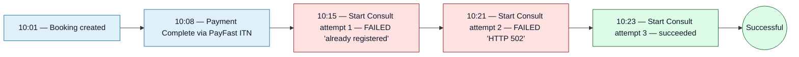

<Section id="overview" num="01 — What it is" title="What the audit log is">

The `audit_log` table is our **append-only ledger** of every state-changing action. Every time someone creates / updates / discards a booking, adds a user, changes a client flag, runs reconcile, fires Start Consult — a row lands in `audit_log`.

It's used for:

- Compliance and POPIA — proving who did what when
- Internal forensics when a booking goes sideways
- Support — answering "what happened to this booking?" without guessing
- **Sharing with CareFirst** when a support ticket needs cross-system context

It's never used as **business logic input** — the source of truth for booking state is the `bookings` table; `audit_log` is observability only.

</Section>

<Section id="shape" num="02 — Shape" title="Row shape">

| Column | Type | Notes |
|---|---|---|
| `id` | `uuid` | Primary key |
| `created_at` | `timestamptz` | When the action happened |
| `actor_id` | `uuid` | User who performed the action (null for system events) |
| `actor_name` | `text` | Snapshot of the user's name at the time |
| `actor_role` | `text` | `system_admin` / `unit_manager` / `user` / `system` |
| `action` | `text` | `create` / `update` / `delete` |
| `entity_type` | `text` | `booking` / `client` / `unit` / `user` / `payment` / `handoff` |
| `entity_id` | `uuid` | The thing being acted on |
| `entity_name` | `text` | Human-readable name (e.g. patient name on a booking action) |
| `changes` | `jsonb` | Per-field `{ old, new }` diff |
| `ip_address` | `text` | Caller's IP (X-Forwarded-For-aware) |

The `actor_*` fields are **snapshotted** rather than joined, so a user being renamed or disabled doesn't rewrite history.

</Section>

<Section id="examples" num="03 — Examples" title="Example entries">

```payload
// A successful Start Consult
{
  "created_at": "2026-05-14T09:30:12Z",
  "actor_name": "Sarah Khumalo",
  "actor_role": "unit_manager",
  "action": "update",
  "entity_type": "user",
  "entity_id": "<booking uuid>",
  "entity_name": "Start Consult: John Doe",
  "changes": {
    "Status":           { "old": "Payment Complete", "new": "Successful" },
    "Handoff Status":   { "new": "sent" },
    "External Reference": { "new": "cf-ref-abc123" },
    "Attempt":          { "new": "1" }
  },
  "ip_address": "102.165.0.12"
}
```

```payload
// A failed handoff
{
  "created_at": "2026-05-14T09:31:55Z",
  "actor_name": "Sarah Khumalo",
  "actor_role": "unit_manager",
  "action": "update",
  "entity_type": "user",
  "entity_id": "<booking uuid>",
  "entity_name": "Start Consult (FAILED): John Doe",
  "changes": {
    "Handoff Status": { "new": "failed" },
    "Error":          { "new": "Already registered to a different account" },
    "Attempt":        { "new": "2" }
  },
  "ip_address": "102.165.0.12"
}
```

</Section>

<Section id="handoff-trail" num="04 — Handoff trail" title="A booking's handoff trail">

For one booking that had two failed attempts before succeeding, the audit log shows three rows in order. CareFirst support can ask us for "all audit entries for booking `<uuid>`" and we can hand over the full timeline:



The trail is enough to answer: who clicked, when, what reason came back from CareFirst, what IP they were on.

</Section>

<Section id="retention" num="05 — Retention" title="Retention">

| Data | Retention |
|---|---|
| Audit log rows | Indefinite |
| `actor_name` snapshot | Indefinite — survives user deletion |
| `changes` JSON diff | Indefinite |
| `ip_address` | Indefinite (but see POPIA RFC for thinking on truncation) |

We don't currently expire audit rows. POPIA compliance requires we have a defensible retention policy, which we're still working through — see [POPIA & Data Retention](/reports/popia-data-retention) for current thinking.

</Section>

<Section id="support" num="06 — What we can pull" title="What we can pull for CareFirst">

If a CareFirst support ticket references a booking UUID, we can pull:

- Every audit-log row for that booking (creation, payments, handoff attempts, status changes)
- The full booking row (see [Data Model](/reports/data-model-booking-row))
- The captured patient data we sent in the SSO payload
- The verbatim error reason CareFirst returned, if any

**Email <code>support@firstcare.solutions</code>** with the booking UUID; we'll respond with a JSON dump or a formatted summary, whichever is easier.

For repeated investigations (e.g. monthly billing reconciliation against your records), an automated export endpoint would be more efficient — happy to scope one if needed.

</Section>

<Section id="limitations" num="07 — Limitations" title="Limitations">

<Grid2>
<Card variant="warn" title="No real-time stream">
The audit log is queryable but there's no webhook or Kafka equivalent for streaming changes to CareFirst. If you need real-time visibility, that's a separate integration to scope.
</Card>

<Card variant="warn" title="No structured 'consult outcome'">
Because we don't know what happens on CareFirst's side after handoff, the audit log can show "we handed off at 10:23" but never "the consultation finished at 10:48". The proposed <a href="/reports/consultation-outcome-webhook">outcome webhook</a> would close this.
</Card>

<Card variant="brand" title="Scoped, not global">
The audit log records actions on our entities (bookings, clients, units, users). It doesn't log every HTTP request or low-level event — for that we have container logs (operational, not durable).
</Card>

<Card variant="brand" title="Snapshot fields are permanent">
Once an audit row is written, the snapshot fields (<code>actor_name</code>, <code>entity_name</code>, <code>changes.old/new</code>) are immutable. Renaming a user later doesn't rewrite their past audit entries.
</Card>
</Grid2>

</Section>
