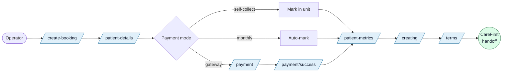
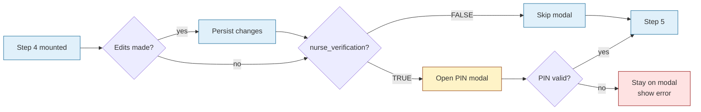
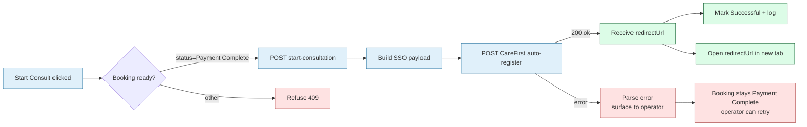
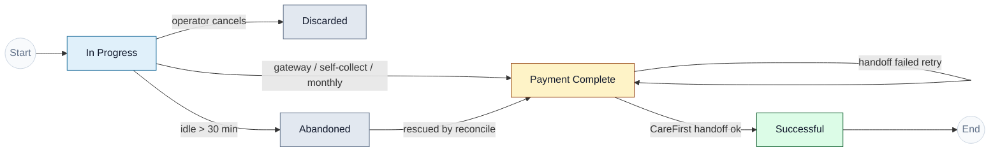

<Section id="overview" num="01 — Overview" title="The big picture">

Booking system is the **intake + payment gateway**. It captures patient details, takes payment, and hands the consultation off to the CareFirst Patient app via SSO.

Each rounded box = a page. Diamond = branch resolved from the parent client's settings.

</Section>

<Section id="settings" num="02 — Client Settings" title="Settings that bend the flow">

Each client carries flags on the `clients` table that change which pages render and which prompts appear.

| Flag | When ON | Where it shows |
|---|---|---|
| `collect_payment_at_unit` | Skip PayFast — pay at unit, confirm with PIN | Step 5 |
| `bill_monthly` | Skip payment entirely; client invoiced at month-end | Auto-skip step 5 |
| `skip_patient_metrics` | Skip vitals capture (only with one of the two above) | After payment |
| `nurse_verification` | Require nurse PIN before booking + before handoff | 4 PIN gates across the flow |
| `accent_color` | Custom brand colour for buttons + pills | Whole UI |

**Mutual exclusion:** `collect_payment_at_unit` and `bill_monthly` cannot both be ON. UI cascades the toggles; server PATCH clamps if both ever arrive TRUE.

</Section>

<Section id="search" num="03 — Search" title="Step 0 — Search patient">

`/create-booking` — operator picks a search method and (optionally) enters a nurse PIN.

<Grid2>
<Card variant="brand" title="Search modes">
- **National ID** — 13 digits, SA Luhn checksum
- **Passport** — alphanumeric
- **Date of Birth** — first name + surname + DOB
</Card>

<Card variant="warn" title="Nurse PIN gate">
- Shown only when `clients.nurse_verification = TRUE`
- Verified server-side via `/api/verify/manager-pin`
- RLS forbids reading other users' PINs directly
</Card>
</Grid2>

### Scenarios

<Grid3>
<Card title="New patient">
<Pill variant="ok">ok</Pill> No prior record → blank patient-details form
</Card>

<Card title="Existing patient (single match)">
<Pill variant="brand">prefill</Pill> Pre-fills name / address / contact. Identity locked on Step 1 if name was already established.
</Card>

<Card title="Multiple DOB matches">
<Pill variant="warn">disambiguate</Pill> → `/select-patient` page. Patient self-confirms by email or phone.
</Card>
</Grid3>

### Errors

  <Pill variant="err">Invalid SA ID</Pill>
  <Pill variant="err">Wrong PIN</Pill>
  <Pill variant="err">PIN throttled</Pill>
  <Pill variant="warn">Patient identity conflict</Pill>

SA ID validates length, month, day, citizenship digit, and Luhn checksum before submit. PIN failures trigger shared-throttle (per IP + per unit).

</Section>

<Section id="patient-details" num="04 — Patient Details" title="5 steps in one page">

One page, five logical steps. Auto-saves every 2 seconds so a crash costs at most a sentence of typing.

<StepRow>
  <Step num="1." title="Basic Info">Name, ID, title, gender, DOB, nationality</Step>
  <Arrow />
  <Step num="2." title="Address">Street, suburb, city, province, country, postal code</Step>
  <Arrow />
  <Step num="3." title="Contact">Number, email, optional script-to-someone-else</Step>
</StepRow>

<StepRow>
  <Step num="4." title="Verification">Review + edit + nurse PIN if required</Step>
  <Arrow />
  <Step num="5." title="Payment Type">Branch on client settings</Step>
</StepRow>

### Persistence

- **Auto-save** debounced 2s on basic / address / contact changes
- **Step Next** always persists the step's fields plus `current_step`

</Section>

<Section id="step-1" num="05 — Step 1" title="Basic Info">

<Grid2>

### What's captured

- First names + surname
- ID type + number (national / passport)
- Title, gender, date of birth
- Nationality (default ZA)

<Card variant="warn" title="Identity lock">
If another booking exists with the same ID number AND has a populated name, the identity fields become **read-only**. Edits are not allowed.

Why: prevents a CareFirst handoff later rejecting with *"already registered to a different account"*. Surfaced as a warning banner.
</Card>
</Grid2>

### Errors handled

| Tag | Behaviour |
|---|---|
| <Pill variant="err">Conflict</Pill> | Same ID number, different name → identity-lock + banner |
| <Pill variant="err">Invalid SA ID</Pill> | Failed Luhn / future DOB / impossible date → inline error, Next disabled |
| <Pill variant="warn">Auto-save fails</Pill> | Logged to console as warn; Next click retries — last few seconds of typing may be lost |

</Section>

<Section id="steps-2-3" num="06 — Steps 2 & 3" title="Address & Contact">

<Grid2>
<Card variant="brand" title="Step 2 — Address">
- Street address, suburb, city, province, country, postal code
- Pre-filled from existing booking when patient is known
- All required for Next
</Card>

<Card variant="brand" title="Step 3 — Contact">
- Country code + phone (E.164-ish)
- Email address
- Optional: send script to additional email
</Card>
</Grid2>

### Scenarios

  <Pill variant="brand">prefill</Pill>
  <Pill variant="warn">missing field</Pill>
  <Pill variant="mute">resume draft</Pill>

Resume draft: if the operator left mid-flow, the booking row already has `current_step`. The patient-details page reads existing values and re-mounts at the same step.

### Errors handled

Field-level validation only. Empty required fields leave the Next button disabled. No server validation here — fields are stored as-is and validated where they matter (CareFirst handoff, PayFast).

</Section>

<Section id="step-4" num="07 — Step 4" title="Verification">

Read-only review of all captured fields, with the option to **edit any section in place**. Nurse PIN gate (if enabled) fires on Next.

### Errors handled

  <Pill variant="err">Wrong PIN</Pill>
  <Pill variant="warn">Throttle lock</Pill>
  <Pill variant="warn">Network error</Pill>

Modal stays open on wrong PIN with inline error. After N consecutive failures the operator is throttled (shared per-IP) and must wait.

</Section>

<Section id="step-5" num="08 — Step 5" title="Payment branches">

Resolved server-side from the booking's parent client. UI auto-renders the right panel.

```mermaid
flowchart TD
    A[Step 5 mounted] --> B{client config}
    B -->|gateway| C[Show payment-type picker]
    B -->|self-collect| D["Show &#39;Confirm payment in unit&#39; panel"]
    B -->|monthly| E[Auto-fire mark-monthly-invoice]

    C --> C1[Device payment]
    C --> C2[Send a payment link]
    C1 --> F[/payment/]
    C2 --> F
    F --> G[/payment/success/]

    D --> D1[Operator confirms with PIN]
    D1 --> H[mark-self-collect]
    H --> I[Status = Payment Complete]

    E --> J[Status = Payment Complete<br/>auto-marked]
    J --> K{skip_patient_metrics?}
    I --> K
    G --> K
    K -->|yes| L[/creating/]
    K -->|no| M[/patient-metrics/]

    classDef brand fill:#e0f0fa,stroke:#1f6f9d;
    classDef ok fill:#dcfce7,stroke:#166534;
    classDef warn fill:#fef3c7,stroke:#92400e;
    class C,F,G brand;
    class D,H,I warn;
    class E,J ok;
```

</Section>

<Section id="payfast" num="10 — PayFast" title="Gateway flow">

The standard paid path. Operator hands the patient a payment URL or device-flow.

### Happy path

1. Operator picks "Device payment" or "Send payment link"
2. Booking redirected to PayFast checkout
3. Patient completes payment
4. PayFast posts **ITN** webhook to `/api/payfast/itn`
5. ITN handler validates signature + status, marks booking Payment Complete
6. Patient redirected to `/payment/success` — countdown to vitals capture

### Error / edge cases

| Tag | Detail |
|---|---|
| <Pill variant="warn">ITN dropped</Pill> | HTTPS off / firewall — booking stays "In Progress" with `payment_amount` set. Reconcile button on Patient History pulls Transaction History API and matches by reference. |
| <Pill variant="warn">User cancels</Pill> | Returns to `/payment/cancel`. Booking stays In Progress; operator can retry. |
| <Pill variant="err">Invalid signature</Pill> | Forged or corrupted POST → rejected, logged, no status change. |
| <Pill variant="warn">Pending / failed</Pill> | PayFast reports a non-success state. Booking unchanged; operator can retry or contact support. |
| <Pill variant="mute">Idle &gt; 30 min</Pill> | Operator left mid-payment. Auto-marked **Abandoned**; reconcile can still rescue if patient finished paying. |

</Section>

<Section id="self-collect" num="11 — Self-collect" title="Pay at unit">

For clients where the unit handles payment directly. Skips PayFast entirely.

<Grid2>
<Card variant="warn" title="Flow">
1. Operator clicks "Confirm payment in unit"
2. POST `/api/bookings/[id]/mark-self-collect`
3. Server re-checks `collect_payment_at_unit` on the parent client
4. Status flips to Payment Complete; `payment_type = 'self_collect'`
5. Operator continues to vitals or T&Cs
</Card>

<Card variant="brand" title="Auto-handoff at T&Cs">
For `system_admin` / `unit_manager` roles, Accept on T&Cs immediately:

1. Persists T&Cs acceptance
2. Prompts for operator PIN (skipped if `nurse_verification` is OFF)
3. POSTs Start Consultation to CareFirst
4. Opens CareFirst app in new tab

For `user` role, Accept just goes home — manager runs Start Consult later from Patient History.
</Card>
</Grid2>

### Errors

  <Pill variant="err">Server flag mismatch</Pill>
  <Pill variant="err">Invalid PIN</Pill>
  <Pill variant="warn">CareFirst handoff fails</Pill>

If CareFirst rejects (e.g. "already registered to a different account"), operator stays on /terms with the error banner. Acceptance is already saved; manager can retry from Patient History.

</Section>

<Section id="monthly" num="12 — Monthly invoice" title="Bill at month-end">

For clients invoiced at month-end. The operator never sees Step 5.

```mermaid
flowchart LR
    A[Step 5 mounts] --> B["useEffect detects mode=&#39;monthly_invoice&#39;"]
    B --> C[POST mark-monthly-invoice]
    C --> D[Server: re-check bill_monthly flag]
    D -->|valid| E[Status = Payment Complete<br/>payment_type=monthly_invoice]
    D -->|invalid| F[400 — refuse]
    E --> G{skip_patient_metrics?}
    G -->|yes| H[/creating/]
    G -->|no| I[/patient-metrics/]
    F --> J[Show error banner<br/>retry available]

    classDef ok fill:#dcfce7,stroke:#166534;
    classDef err fill:#fee2e2,stroke:#991b1b;
    class B,C,E,H,I ok;
    class F,J err;
```

### Why server-side authority matters

The client's `bill_monthly` flag is checked again in the API. This means a malicious caller cannot forge a monthly_invoice booking for a normal client — even with browser tampering, the server refuses.

</Section>

<Section id="post-payment" num="13 — Post-payment" title="Vitals, terms, handoff">

<StepRow>
  <Step title="Patient Metrics">BP / glucose / temp / O₂ / heart rate. Skippable per client.</Step>
  <Arrow />
  <Step title="Creating">Animation while we finalise the booking record.</Step>
  <Arrow />
  <Step title="Terms & Conditions">Patient consent. Stored with timestamp.</Step>
  <Arrow />
  <Step title="Start Consult" muted>Either auto on Accept (non-gateway, manager+) or later from Patient History.</Step>
</StepRow>

### Skip-patient-metrics rules

| Client config | Behaviour |
|---|---|
| Standard gateway | Always show metrics |
| Self-collect, sub-flag OFF | Show metrics |
| Self-collect, sub-flag ON | Skip → straight to /creating |
| Monthly, sub-flag ON | Skip → straight to /creating |

</Section>

<Section id="handoff" num="14 — CareFirst handoff" title="SSO auto-register">

Booking system passes the patient to the CareFirst Patient app via SSO auto-register.

### Common errors surfaced

- **"Already registered to a different account"** — patient ID was used by a different person before. Identity-lock on Step 1 normally prevents this; if it slips through, operator must investigate via admin tools.
- **500 / 502** — CareFirst down or rate-limited. Retry from Patient History.
- **No redirect URL returned** — handoff registered but URL missing. Banner asks operator to contact support; booking is still marked Successful.

</Section>

<Section id="lifecycle" num="15 — Lifecycle" title="Booking statuses">

| Status | Meaning | UI |
|---|---|---|
| <Pill variant="brand">In Progress</Pill> | Booking created, payment pending | Blue pill |
| <Pill variant="warn">Incomplete</Pill> | Aggregated label for stuck states | Filter tab on Patient History |
| <Pill variant="ok">Payment Complete</Pill> | Paid, awaiting Start Consult | Yellow pill (gateway), amber (self-collect), blue (monthly) |
| <Pill variant="ok">Successful</Pill> | Handed off to CareFirst | Green pill |
| <Pill variant="mute">Abandoned</Pill> | Idle past threshold | Grey pill |
| <Pill variant="mute">Discarded</Pill> | Operator clicked Discard | Hidden by default; visible to admin |

</Section>

<Section id="cross-cutting" num="16 — Cross-cutting" title="Cross-cutting concerns">

<Grid4>
<Card variant="brand" title="Session idle">
- 5-min warning modal
- 7-min auto sign-out
- visibilitychange forces re-check on tab return
- Patient-details draft auto-saves every 2s
</Card>

<Card variant="brand" title="POPIA compliance">
- Consent timestamp captured on Step 1
- Retention sweep nulls PII after policy window
- Right-to-erasure endpoint admin-gated
- Auditable via audit_log table
</Card>

<Card variant="warn" title="PIN security">
- Hashed at rest
- Shared throttle (per IP + per unit)
- Forgot-PIN: 6-digit code, 15-min expiry, single-use
- Reset revokes all sessions
</Card>

<Card variant="warn" title="RLS & column grants">
- Authenticated role: column-level UPDATE grants
- Admin actions go through service-role API routes
- Audit log: actor + action + entity + diff + IP
- Trusted IPs allow-list for admin pages
</Card>
</Grid4>

</Section>

<Section id="code-map" num="17 — Code map" title="Where to look in code">

| Concern | Path |
|---|---|
| Search + nurse OTP | `src/app/(dashboard)/create-booking/page.tsx` |
| Step wizard | `src/app/(dashboard)/create-booking/patient-details/page.tsx` |
| Payment branch | `src/app/(dashboard)/create-booking/payment/page.tsx` |
| Mode resolution | `src/app/api/bookings/[id]/payment-mode/route.ts` |
| PayFast ITN + reconcile | `src/app/api/payfast/...` |
| Self-collect / monthly mark | `src/app/api/bookings/[id]/mark-*` |
| Patient History | `src/app/(dashboard)/patient-history/page.tsx` |
| CareFirst handoff | `src/lib/carefirst.ts` + `start-consultation` |
| Client settings UI | `client-management/manage/page.tsx` Settings tab |

</Section>
