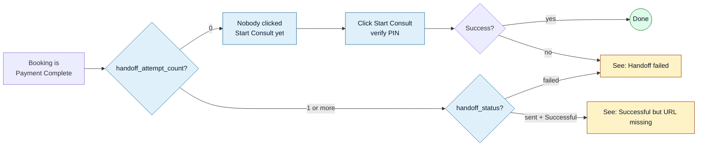

<Section id="symptoms" num="01 — Symptoms" title="The shape of the gap">

A booking can sit at <Pill variant="ok">Payment Complete</Pill> for an arbitrarily long time before it advances to <Pill variant="ok">Successful</Pill>. From the patient's perspective the booking is "paid" — money has changed hands, T&Cs are signed — but the auto-register call to CareFirst Patient hasn't yet succeeded.

Common causes of the gap:

- **No handoff attempted yet** — the operator hasn't clicked Start Consult, or the operator's role is `user` and is waiting for a manager
- **Handoff attempted but rejected** — CareFirst returned a non-2xx; see <a href="/reports/carefirst-handoff-failing">Handoff Error Scenarios</a>
- **Auto-handoff at T&Cs fired but the response was malformed** — handoff succeeded but no redirect URL was returned

For the CareFirst team, this doc is mostly useful as background when a patient or support ticket references "the booking is stuck" — it explains the state machine and what we do to retry on our side.

</Section>

<Section id="triage" num="02 — Triage" title="Triage flow">

To see those fields: open the booking in Patient History, click **View**. You'll see:

| Field | Tells you |
|---|---|
| `handoff_attempt_count` | How many Start Consult attempts have been made (0 = never tried) |
| `handoff_status` | `sent` (success), `failed` (error), or blank (never tried) |
| `handoff_error_reason` | The latest failure reason verbatim |
| `last_handoff_attempt_at` | When the latest attempt happened |
| `handoff_redirect_url` | Stored CareFirst URL — present when status is `sent` |

</Section>

<Section id="handoff-stuck" num="03 — Stuck before handoff" title="Handoff hasn't been attempted yet">

`handoff_attempt_count` is 0 — nobody's clicked Start Consult yet.

### Resolve

1. Confirm the patient is genuinely paid (status is **Payment Complete**, not just "In Progress")
2. Click **Start Consult** on the booking row
3. Enter your PIN when the modal opens
4. If the handoff succeeds, the booking flips to Successful and a CareFirst tab opens

<Callout variant="warn" title="Why was it left at Payment Complete?">
Three common reasons:
<ul>
<li><b>Operator role is <code>user</code></b> — Start Consult is manager+ only. Your manager runs the handoff for them.</li>
<li><b>Auto-handoff for self-collect/monthly didn't fire</b> — only fires for managers and admins on T&Cs accept. Users would have just gone home.</li>
<li><b>Operator forgot</b> — happens at the end of a busy shift. Patient History's <i>Payment Complete</i> filter shows these at a glance.</li>
</ul>
</Callout>

</Section>

<Section id="handoff-failed" num="04 — Handoff failed" title="Handoff was attempted but failed">

`handoff_attempt_count` is 1 or more, `handoff_status` is `failed`. Read the `handoff_error_reason` and go to the matching scenario in [CareFirst Handoff Is Failing](/reports/carefirst-handoff-failing).

Quick map:

| Reason | Where to go |
|---|---|
| "already registered to a different account" | [Identity collision](/reports/carefirst-handoff-failing#already-registered) |
| HTTP 500 / 502 / network | [CareFirst outage](/reports/carefirst-handoff-failing#server-error) |
| "Missing required patient data" | [Data gap](/reports/carefirst-handoff-failing#missing-data) |
| Anything else | [Escalate](/reports/carefirst-handoff-failing#escalate) |

</Section>

<Section id="missing-redirect" num="05 — Missing redirect URL" title="Successful but the URL is missing">

`status` is **Successful**, `handoff_status` is `sent`, but `handoff_redirect_url` is empty. This is rare — CareFirst registered the patient but didn't return a session URL.

### Resolve

1. Click **Open in CareFirst** on the booking — the server will return the stored URL or fail with 409 if none
2. If 409, escalate to support with the booking ID — they can issue a fresh session URL from the CareFirst side
3. The patient can also sign in to CareFirst Patient directly with the email we registered them under

</Section>

<Section id="manual-confirm" num="06 — Manual confirm" title="Manual confirm (system_admin only)">

<Pill variant="warn">Use sparingly</Pill> If a booking is stuck because the **payment side** never reflected — not the handoff side — system_admin can manually flip it to Payment Complete.

### When to use it

- PayFast's dashboard shows the payment as **COMPLETE** but our booking is still **In Progress**
- Reconcile didn't pick it up (e.g. booking older than 24 hours, beyond reconcile's window)
- You've cross-checked the PayFast amount against the booking amount and they match

### How

1. Patient History → click the stuck booking
2. Click **Manual confirm** (only visible to system_admin)
3. PIN modal — enter your PIN
4. Booking flips to Payment Complete with `payment_type = 'manual'`
5. The audit log records the actor, action, and reason

<Callout variant="err" title="Don't use this to skip reconcile">
Manual confirm bypasses PayFast verification. Use it only when you've <b>already verified</b> the payment is real on PayFast's side. Misusing it creates billing discrepancies you can't easily reverse.
</Callout>

</Section>

<Section id="prevention" num="07 — Prevention" title="Prevention">

The Payment-Complete-but-not-Successful pile usually grows during busy shifts where operators forget to click Start Consult. Recommendations:

<Grid2>
<Card variant="brand" title="End-of-shift sweep">
Last 5 minutes of every shift: Patient History → filter to <b>Payment Complete</b> → resolve each one (Start Consult or note for manager).
</Card>

<Card variant="brand" title="Auto-handoff for managers">
For self-collect / monthly clients, Accept on T&Cs auto-handoff when a manager is signed in. Keeps the pile small without extra clicks.
</Card>

<Card variant="brand" title="Identity-lock awareness">
Ignoring the identity-lock warning on Step 1 leads to handoff-time collisions. Treat the banner seriously — investigate the existing ID before pressing on.
</Card>

<Card variant="brand" title="Reconcile is automatic">
For system_admin sessions, reconcile fires on first Patient History load. Most ITN gaps close themselves before anyone investigates.
</Card>
</Grid2>

</Section>
