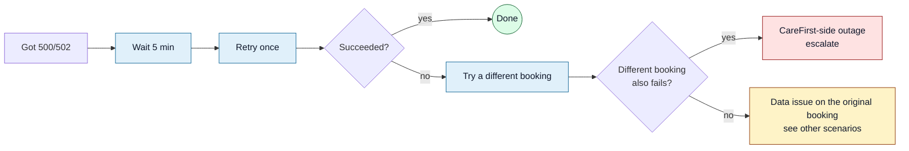

<Section id="symptoms" num="01 — Symptoms" title="What a handoff failure looks like on our side">

When the SSO auto-register call returns a non-2xx response (or fails at the network level), we record it as a failed attempt against the booking and surface the reason to the operator. Concretely, on a failed handoff:

- The booking **stays at Payment Complete** — it does not advance to Successful
- A red banner appears in the operator UI quoting the reason verbatim from your response body
- `handoff_status` flips to `failed`, `handoff_error_reason` stores the parsed reason, `handoff_attempt_count` increments
- The booking is **safe to retry** — every attempt is logged separately; nothing is corrupted

This document catalogues the specific reasons we see and what we do for each. It's mostly a contract reference for the CareFirst team — useful to confirm we're interpreting your error responses the way you intend.

</Section>

<Section id="diagnose" num="02 — Diagnose" title="Read the banner first">

The banner contains the actual reason CareFirst gave us. Match it to the scenarios below.

```mermaid
flowchart LR
    A[Start Consult failed] --> B{Banner text?}
    B -->|"already registered"| C[Scenario A<br/>Identity collision]
    B -->|"HTTP 500 / 502"| D[Scenario B<br/>CareFirst-side outage]
    B -->|"Missing required..."| E[Scenario C<br/>Patient data gap]
    B -->|Empty redirect URL| F[Scenario D<br/>Handoff partial]
    B -->|"CSRF" or "PIN"| G[Scenario E<br/>Auth gate]

    classDef brand fill:#e0f0fa,stroke:#1f6f9d,color:#0f172a;
    classDef warn  fill:#fef3c7,stroke:#92400e,color:#0f172a;
    classDef err   fill:#fee2e2,stroke:#991b1b,color:#0f172a;
    class B brand;
    class C,D,E,F,G warn;
```

If the banner is vague or empty, open the booking's **View** panel — the `handoff_error_reason` field shows the most recent reason verbatim. Worst case, **Audit Log → filter by booking ID** shows every attempt with its full reason.

</Section>

<Section id="already-registered" num="03 — Scenario A" title='"Already registered to a different account"'>

<Pill variant="err">Most common</Pill> The patient's ID number is already linked to a different name in CareFirst's records. Their identity check refuses the handoff.

### Root cause

- A previous booking captured the patient's ID with a different name (typo, married/maiden, capture error)
- A genuinely different person was registered under this ID
- The patient's record was created in CareFirst directly (not via us) with different details

### How to recover

<Grid2>
<Card variant="brand" title="Step 1 — verify the ID">
Ask the patient to physically show their ID. Compare against what's captured on the booking. If it's wrong, that's the root cause — see Step 2.
</Card>

<Card variant="brand" title="Step 2 — find the original record">
1. Search Patient History by ID number<br/>
2. The earlier booking with the conflicting name will appear<br/>
3. Compare the two name spellings<br/>
4. If both bookings belong to the same person but with different spellings, escalate to support — only CareFirst can merge / correct the canonical record
</Card>
</Grid2>

<Callout variant="warn" title="Do NOT retry repeatedly">
Each retry increments <code>handoff_attempt_count</code> and adds noise to the audit log. Resolve the identity mismatch <i>before</i> the next attempt. Two or three retries on the same error doesn't fix anything — it just makes the failure more visible in metrics.
</Callout>

### Why the booking system tries to prevent this upstream

Step 1 of patient capture has **identity-lock** — if an existing booking with the same ID has a populated name, the identity fields go read-only. This catches most collisions before payment. But it's not perfect — if the earlier booking captured the name AFTER the new booking started, or if CareFirst has data we don't, the collision lands at handoff time.

</Section>

<Section id="server-error" num="04 — Scenario B" title="HTTP 500 / 502 / network error">

<Pill variant="warn">Transient</Pill> CareFirst's API is down, slow, or rate-limited.

### How to recover

1. **Wait 5 minutes.** Most transient issues resolve themselves in that window.
2. **Retry Start Consult.** If it works on the second attempt, you're done.
3. **If it fails 3+ times within 15 minutes**, CareFirst's side has a real problem — escalate to support.

<Callout title="Operator-visible status check">
There's currently no public status page for CareFirst Patient. The fastest signal that "it's them, not us" is: if multiple bookings are failing for multiple operators at the same time, it's a CareFirst-side outage. One booking, one operator → much more likely a data issue.
</Callout>



</Section>

<Section id="missing-data" num="05 — Scenario C" title='"Missing required patient data"'>

The booking is missing one of CareFirst's required fields: email, contact number, ID number, first names, or surname.

### How to recover

1. Open the booking from Patient History (**View** panel)
2. Check which field is blank in the **What we captured** section
3. Reopen the patient-details flow at the appropriate step and fill it in
4. Save the booking; retry Start Consult

<Callout variant="warn" title="Why didn't the booking flow catch this?">
The patient-details steps validate field-level required-ness only. The CareFirst-specific required set is enforced at the handoff API. A pre-handoff validator would catch this earlier — it's on the roadmap.
</Callout>

### Which fields are mandatory for CareFirst

| Field | Source | Notes |
|---|---|---|
| `email_address` | Step 3 — Contact | Used for SSO identity |
| `contact_number` | Step 3 — Contact | Including country code |
| `id_number` | Step 1 — Basic info | National ID or passport |
| `first_names` | Step 1 — Basic info | Combined first names, can be one word |
| `surname` | Step 1 — Basic info | Single string |

</Section>

<Section id="no-redirect" num="06 — Scenario D" title="Handed off but no redirect URL">

<Pill variant="warn">Rare</Pill> CareFirst's API returned 200 OK but the response body didn't include a redirect URL. The booking is **marked Successful** anyway (we believe the patient is registered) but you can't open the consult tab.

### How to recover

1. Click **Open in CareFirst** on the booking — the system re-checks for a stored redirect URL
2. If still empty, escalate to support with the booking ID. Support can look up the patient in CareFirst Patient and provide a session URL
3. As a last resort: the patient can sign in to CareFirst Patient directly with the email we registered them with, and access the consult that way

<Callout title="The booking is not stuck">
Because the booking is marked Successful, it won't appear in the operator's "needs attention" filter. Make a manual note for support and continue your shift.
</Callout>

</Section>

<Section id="pin-throttle" num="07 — Scenario E" title="PIN modal won't accept">

You enter your PIN and the modal rejects it.

### Check, in this order

1. **Is it your PIN, not the nurse's?** The Start Consult modal asks for the **operator's** PIN — the one you signed in with. The nurse-verification PIN is a separate gate at booking-creation time.
2. **Is your PIN current?** Try [Forgot PIN](/reports/user-management#forgot) if you suspect a stale PIN.
3. **Did the modal show "throttled"?** Too many wrong attempts — wait the displayed window out and try again.
4. **Is your account active?** A system_admin may have disabled your user. Check **User Management** or ask your manager.

</Section>

<Section id="escalate" num="08 — Escalate" title="When to escalate and what to include">

If you've tried the matching scenario above and the handoff still fails, escalate. Include:

- **Booking ID** (UUID, visible in Patient History → View)
- **Banner text** verbatim (screenshot the banner if possible)
- **Number of attempts** (visible as `handoff_attempt_count` on the booking)
- **Time of first attempt** (audit log entry)
- **Patient name + ID number** (so support can search CareFirst Patient by the same identifier)

Escalation contact: <a href="mailto:support@firstcare.solutions">support@firstcare.solutions</a> or your team lead.

</Section>
