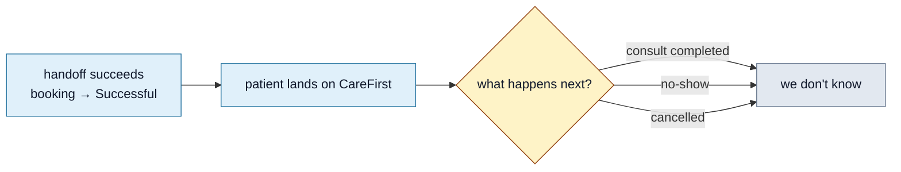

<Section id="problem" num="01 — Problem" title="The problem">

Today the integration between us and CareFirst Patient is **one-way**: we POST to your auto-register endpoint, you return a redirect URL, and after that the patient is in your hands. We never learn what happened next.

That means we can't tell the difference between:

- **Consult completed normally** — script issued, patient happy
- **No-show** — patient never joined the consult
- **Cancelled** — patient or clinician cancelled mid-way

All three of these resolve to <Pill variant="ok">Successful</Pill> on our side, because that status reflects only that the **handoff succeeded** — not that the consult happened.



The downstream effects: month-end invoicing overstates service delivered for monthly-billing clients (we invoice per handoff, not per consult), support can't see what happened from our side alone, and no-show reporting is impossible without your data.

</Section>

<Section id="proposal" num="02 — Proposal" title="Proposal">

A **server-to-server webhook from CareFirst Patient → our system** that fires on consultation state changes. Inbound, shared-secret authenticated, idempotent on `referenceId`.

Endpoint we'd expose:

```
POST https://<our-app>/api/webhooks/carefirst/consultation-status
```

Once HTTPS is live (see [Deployment & Hosting](/reports/deployment-hosting)), this endpoint can be secured with a shared secret + signature header — same pattern PayFast uses.

</Section>

<Section id="payload" num="03 — Payload" title="Suggested payload">

```json
POST /api/webhooks/carefirst/consultation-status
x-cf-signature: <hmac-sha256 of body with shared secret>
content-type: application/json

{
  "referenceId":      "<the externalReferenceId you returned to us on auto-register>",
  "uniqueReference":  "<the booking UUID we sent originally>",
  "status":           "started | completed | cancelled | no_show",
  "occurredAt":       "2026-05-14T09:35:12Z",
  "outcome": {
    "scriptIssued":   true,
    "referredTo":     "...",
    "notes":          "optional free-text"
  }
}
```

Either `referenceId` or `uniqueReference` is enough to find the booking on our side — we'd index both. Sending both is robust.

</Section>

<Section id="status-states" num="04 — Status states" title="Status states we'd react to">

| Webhook `status` | Meaning | New booking status on our side |
|---|---|---|
| `started` | Consult is in session | (No status change; informational only) |
| `completed` | Consult ended normally | <Pill variant="ok">Consultation Complete</Pill> (new) |
| `cancelled` | Patient or clinician cancelled | <Pill variant="mute">Consultation Cancelled</Pill> (new) |
| `no_show` | Patient never joined | <Pill variant="mute">No-show</Pill> (new) |

We'd add these as states downstream of <Pill variant="ok">Successful</Pill> on our state diagram (see [Booking Status Lifecycle](/reports/status-lifecycle)).

</Section>

<Section id="our-actions" num="05 — Our actions" title="What we'd do with each event">

| Event | Operational effect |
|---|---|
| `started` | Track time-to-start metric; mark consult as in-progress for support visibility |
| `completed` | Mark <Pill variant="ok">Consultation Complete</Pill>; include in monthly-invoice billing for `bill_monthly` clients |
| `cancelled` | Mark <Pill variant="mute">Consultation Cancelled</Pill>; **exclude** from monthly invoice |
| `no_show` | Mark <Pill variant="mute">No-show</Pill>; **exclude** from monthly invoice; surface in reporting |

Even just `completed` and `no_show` would close 80% of the gap. The other two are valuable but not blocking.

</Section>

<Section id="security" num="06 — Security" title="Security model">

Two layers, identical to how PayFast's ITN is secured:

1. **Shared secret** — issued at provisioning time, configured per environment; never reaches the client
2. **HMAC-SHA256 signature header** — covers the request body; we verify before parsing

```http
x-cf-signature: <hex-encoded HMAC-SHA256 of raw body with shared secret>
```

We'd also IP-allowlist your origin IPs at the Traefik layer as a third defence. Replay protection via the `occurredAt` timestamp (reject anything older than, say, 5 minutes).

<Callout variant="warn" title="HTTPS prerequisite">
This webhook can't go live until our HTTPS rollout is complete — see <a href="/reports/deployment-hosting">Deployment & Hosting</a>. Accepting your POST over plain HTTP would make the signature meaningless. We're targeting domain + TLS this quarter; happy to align release dates once we have a firm slot.
</Callout>

</Section>

<Section id="open-questions" num="07 — Open questions" title="Open questions for CareFirst">

1. **Feasibility** — is a webhook from your application to a third-party feasible on your side today, or roadmap?
2. **Authentication preference** — shared secret + HMAC works for us. Do you prefer a different scheme (mTLS, API key, JWT)?
3. **Retry policy** — what's your retry-on-failure behaviour? (We'd target at-least-once delivery with idempotent processing on our end.)
4. **Status enum** — are the four states above (`started/completed/cancelled/no_show`) a reasonable approximation of what your system tracks? If you have additional states, list them.
5. **Outcome detail** — would you be willing to send `scriptIssued: boolean` and `referredTo: string` in the outcome block? Important for downstream reporting; understand if it raises medical-data-handling concerns.
6. **Backfill** — for the period between go-live and now, can we receive historical webhooks? Or do we just accept the visibility gap pre-launch?
7. **Per-client opt-in** — should this be configured per CareFirst client, or always-on?

</Section>
