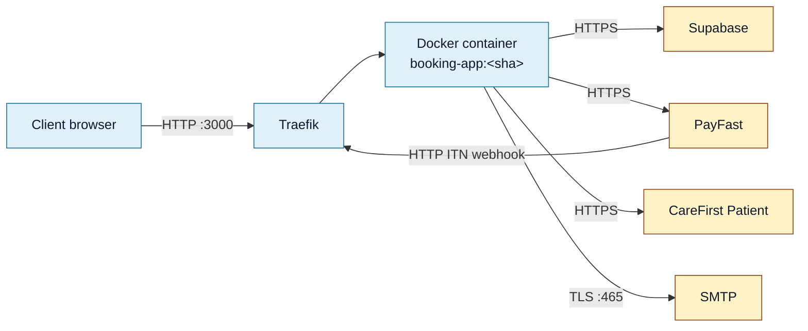

<Section id="current" num="01 — Current" title="Current state">

| Item | Value |
|---|---|
| Provider | Hostinger VPS (Ubuntu 24.04 KVM 1) |
| Public IP | `187.127.135.11` |
| App URL | `http://187.127.135.11:3000` |
| Transport | HTTP (no TLS yet) |
| Domain | Not yet — IP-only access |
| SSL certificate | None — pending domain |
| Reverse proxy | Traefik |
| App runtime | Docker — single container, multi-stage build |

</Section>

<Section id="stack" num="02 — Hosting stack" title="Hosting stack">



We make outbound HTTPS calls to every external service. We only **receive** traffic over HTTP today, and only on port 3000.

</Section>

<Section id="http-only" num="03 — HTTP-only constraint" title="What HTTP-only means in practice">

We can't currently accept secure inbound webhooks because we have no TLS certificate. Specific consequences:

| Constraint | Workaround |
|---|---|
| PayFast ITN delivery is unreliable on some networks | We rebuild state by polling PayFast's Transaction History API — see <a href="/reports/payfast-payment-didnt-reflect">PayFast</a> |
| Some browsers warn users on the operator UI | We're an internal tool; operators dismiss the warning. Not acceptable for any patient-facing surface |
| OAuth-style integrations from third parties typically refuse HTTP callback URLs | We don't have any of those yet, but it'd block future ones |
| **A CareFirst-side webhook to us would have to land over HTTP** | This is the immediate blocker for the consultation-outcome webhook in <a href="/reports/scheduling-integration">Scheduling RFC</a> |

</Section>

<Section id="https-plan" num="04 — HTTPS plan" title="HTTPS / domain rollout plan">

Planned steps, in order:

1. **Provision a production domain** (e.g. `booking.carefirst.co.za`) and point DNS at `187.127.135.11`
2. **Configure Traefik to terminate TLS** using Let's Encrypt — Traefik supports this natively, just needs the resolver block enabled
3. **Update `NEXT_PUBLIC_APP_URL`** to the HTTPS domain so `returnUrl` and email links use it
4. **Update PayFast merchant config** to use the new return / notify URLs
5. **Re-provision the CareFirst auto-register `returnUrl`** to the HTTPS domain
6. **Verify ITN delivery rate** improves once HTTPS is in place

This is the prerequisite for the CareFirst consultation-outcome webhook. We can't accept inbound webhooks securely until this lands.

</Section>

<Section id="deploy" num="05 — Deploy" title="Deploy and rollback">

We deploy by SSHing to the VPS and running the deploy one-liner. Every deploy tags the new image with the commit SHA, keeping the previous image available locally as a rollback target.

```bash
cd /opt/3rd-Party-Booking-System && \
  git pull origin main && \
  export IMAGE_TAG=$(git rev-parse --short HEAD) && \
  cd booking-app && \
  docker compose build && \
  docker compose up -d
```

Rollback is a single command — no rebuild, ~10 seconds:

```bash
export IMAGE_TAG=<previous-short-sha>
docker compose up -d --no-build
```

Health check post-deploy:

```bash
curl -sf http://127.0.0.1:3000/api/health
# → { "status": "ok", "time": "...", "checks": { "db": "ok" } }
```

</Section>

<Section id="implications" num="06 — Implications" title="Implications for CareFirst">

<Callout variant="warn" title="Inbound webhooks from CareFirst are gated on our HTTPS rollout">
If your team builds the consultation-outcome webhook before we have a domain + TLS, we'd be accepting your POST over plain HTTP — that's an authentication signal you can't safely rely on, and a security surface neither of our compliance posture would tolerate.

The right sequence:
<ol>
<li>We complete HTTPS rollout (planned this quarter)</li>
<li>You build the webhook against our HTTPS URL with shared-secret + signature validation</li>
<li>We go live with the new states (<code>Consultation Complete</code>, <code>No-show</code>, etc.)</li>
</ol>

In the meantime, the scheduling RFC's <b>slot-availability</b> ask (an <i>outbound</i> call from us to you) is unblocked — we can build that against your existing HTTPS-only endpoints today.
</Callout>

<Callout title="One-way HTTPS is fine for outbound calls">
We can call your HTTPS API freely from our HTTP-served app — the outbound TLS is independent of our inbound transport. So the SSO auto-register call, plus any new outbound calls you expose, work today.
</Callout>

</Section>
