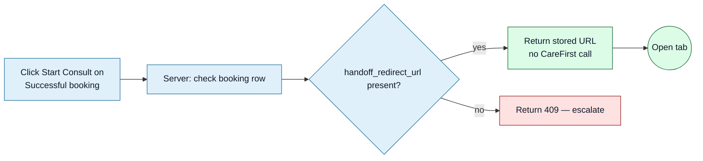

<Section id="principle" num="01 — Principle" title="The principle in one sentence">

**A retry of the same handoff for the same booking should produce the same result, not a second registration.**

We send the same `uniqueReference` (our booking UUID) on every retry. As long as CareFirst's auto-register endpoint treats `uniqueReference` as an idempotency key, the patient is never registered twice no matter how many times we POST.

</Section>

<Section id="our-side" num="02 — Our side" title="What we do on our side">

### Successful handoffs are cached

Once a booking is marked <Pill variant="ok">Successful</Pill> with a stored `handoff_redirect_url`, **clicking Start Consult again doesn't make a fresh call to your API**. We return the stored URL directly. So a "retry" on an already-handed-off booking is purely client-side from your perspective — no extra load on you.

### Failed handoffs are retry-able

When CareFirst returns non-2xx, the booking stays at <Pill variant="ok">Payment Complete</Pill>. The operator can click Start Consult again. Each attempt:

- Increments `handoff_attempt_count`
- Updates `last_handoff_attempt_at` and `handoff_error_reason`
- Sends the **same `uniqueReference`** as the previous attempt
- Sends the **same payload contents** — no field values change between retries

### Double-clicks are deduplicated client-side

The Start Consult button disables itself the moment it's clicked and stays disabled until the response lands. A frantic operator double-click doesn't produce two requests. PIN modal also locks once the PIN is submitted.

</Section>

<Section id="your-side" num="03 — Your side" title="What we expect from your side">

Two assumptions baked into our design:

1. **`uniqueReference` is treated as an idempotency key.** Repeated POSTs with the same value should be deduplicated. We'd suggest:
   - First POST: register the patient, return `redirectUrl` + `referenceId`
   - Second POST (same `uniqueReference`): return the **same** `redirectUrl` + `referenceId`, no second registration
2. **Errors are deterministic.** A "rejected" response (e.g. identity collision) should look the same on attempt 1 and attempt 5 — same HTTP status, same error body, same `displayMessage`. We surface the latest error verbatim; operators need to trust that "same error twice" means "actually the same problem", not transient flakiness.

</Section>

<Section id="scenarios" num="04 — Scenarios" title="Concrete scenarios">

<Grid2>
<Card variant="brand" title="Scenario A — success on first attempt">
Booking → Payment Complete → Start Consult → CareFirst 2xx → booking → Successful. `handoff_attempt_count = 1`. No retries.
</Card>

<Card variant="brand" title="Scenario B — transient failure, then success">
Attempt 1: 502 from CareFirst. Booking stays Payment Complete, attempt_count = 1. 
Attempt 2 (operator retries 5 min later): 2xx. Booking → Successful, attempt_count = 2.
</Card>

<Card variant="warn" title="Scenario C — persistent identity collision">
Attempts 1, 2, 3 all return "already registered to a different account". Each increments attempt_count. <code>handoff_error_reason</code> stays the same. Operator should stop retrying and escalate — no amount of retries will fix an identity collision.
</Card>

<Card variant="warn" title="Scenario D — duplicate Start Consult clicks">
Operator clicks Start Consult. Server makes one POST to CareFirst. Operator's network is slow; they click again before the spinner clears. Client-side button-disable prevents a second POST. No duplicate registration possible.
</Card>
</Grid2>

</Section>

<Section id="edge-cases" num="05 — Edge cases" title="Edge cases worth pinning">

### Booking content drifts between attempts

If the operator edits patient details between handoff attempts (e.g. corrects a typo'd email), the **payload values change** even though `uniqueReference` stays the same. We'd treat this as the operator's intent — but if your idempotency caches the first-attempt's response, the changed fields wouldn't take effect.

**Question:** is the canonical patient record locked to the first-attempt values, or refreshed each attempt? Affects how we communicate "edit and retry" to operators.

### Booking status was changed out-of-band

If a system_admin manually flips a booking to Successful (rare; emergency override), `handoff_redirect_url` may be blank. Future Start Consult clicks hit our cache-empty branch and refuse with 409. This is a deliberate edge case — we don't want to silently re-register an already-handed-off patient.

### Time between attempts

We don't enforce a backoff between attempts. The operator can mash the button as fast as the UI allows (limited only by the round-trip time of the previous request). If you'd prefer we throttle — say, refuse attempt 2 if it's within 10 seconds of attempt 1 — we can add that.

</Section>

<Section id="requests" num="06 — Requests" title="Specific requests from CareFirst">

1. **Confirm `uniqueReference` is honoured as an idempotency key.** Critical to the design.
2. **Confirm error responses are deterministic.** Same input + same state → same error body. If you cache error responses, when are they invalidated?
3. **Document maximum acceptable retry rate.** If we exceed N retries/sec on the same `uniqueReference`, do we get rate-limited? Want to know before operators feel the impact.
4. **Document maximum reasonable retry count.** Is there a point at which you'd consider a `uniqueReference` "poisoned" and refuse all further attempts?
5. **Refreshable values.** If the patient record on your side reflects first-attempt values, can we trigger an update via a different endpoint (e.g. for email correction)? Or is the only path a separate booking with a fresh `uniqueReference`?

</Section>
