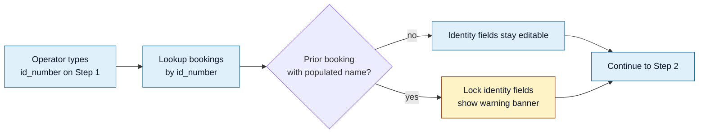

<Section id="why" num="01 — Why" title="Why CareFirst should care">

When our SSO auto-register call lands on your side, the `idNumber` field is the most load-bearing identifier — it's what your system uses to decide if this is a returning patient or a brand-new registration. If two of our bookings send the same `idNumber` with **different** names, your system rejects the second one with "already registered to a different account" — and the patient is stuck mid-flow.

This document covers how we work to ensure that doesn't happen, plus the residual edge cases where it can still slip through.

</Section>

<Section id="search" num="02 — Search" title="How we find the patient before we capture them">

Step 0 of the booking flow is **patient search**. The operator picks one of three modes:

| Mode | What we ask for | What we do |
|---|---|---|
| **National ID** | 13-digit SA ID | Luhn-validate, then look up existing bookings by `id_number` |
| **Passport** | Alphanumeric string | Look up by `id_number` |
| **Date of Birth** | First name + surname + DOB | Look up by all three; may return multiple matches |

If a single match is found, we **pre-fill** the next page (Step 1 — Basic Info) with the existing patient's name, address, and contact. This means we send the same `idNumber + name` combination to CareFirst on this booking as we did on a previous one — exactly the deduplication you'd want from a 3rd-party booking system.

If multiple DOB matches are found, the operator routes through `/select-patient` and asks the patient to self-confirm by email or phone before we proceed.

</Section>

<Section id="sa-id-validation" num="03 — SA ID validation" title="SA ID validation">

13-digit SA IDs are validated **before submit**. We check, in order:

1. Length is exactly 13 digits
2. The first 6 digits parse to a valid date (`YYMMDD`)
3. The 11th digit indicates SA citizen (0) or permanent resident (1)
4. The full ID passes the [Luhn algorithm](https://en.wikipedia.org/wiki/Luhn_algorithm) check

Failures show inline on the form and block Next — the booking can't proceed until the ID is valid. So an SA-ID booking that reaches CareFirst is guaranteed to have a structurally valid SA ID.

Note: validity ≠ truthfulness. A Luhn-valid SA ID could belong to a different person if someone deliberately mistypes. That risk is managed through the **identity-lock** mechanism below.

</Section>

<Section id="passport" num="04 — Passport" title="Passport handling">

Passports we treat as opaque strings — alphanumeric, any length. We don't validate them at our layer (no Luhn equivalent exists for passport numbers, and country-specific formats vary widely).

Date-of-birth + name are also captured separately. The combination of `passport + name + DOB` is what CareFirst's matching logic should rely on for these patients.

</Section>

<Section id="identity-lock" num="05 — Identity-lock" title="Identity-lock — preventing collisions before payment">

When the operator enters an ID number on Step 1, we look up any existing booking with the same `id_number`. If we find one **with a populated name**, we lock the identity fields (first names, surname, ID, DOB) on the current form. They become read-only.

This means:

- If patient X uses ID `1234567890123` and bookings exist with name "John Doe" — we lock the name to "John Doe" on the new booking
- The operator cannot rename "John Doe" to "Jane Smith" mid-flow
- The CareFirst handoff will send `John Doe` + `1234567890123` — matching previous handoffs

The banner explicitly tells the operator why — typically: "An existing patient with this ID has a different name. To prevent registration issues, these fields are locked. Speak to support if you need to correct the record."

</Section>

<Section id="mapping" num="06 — Mapping" title="Mapping to CareFirst's enums">

We capture an `id_type` field as free-text-ish (operator picks from a dropdown) and map it to the integer enum CareFirst's API expects.

| Our captured `id_type` | We send `idNumberType` |
|---|---|
| `national`, `id`, `sa id`, "South African ID" | `0` |
| `passport` | `1` |
| Anything else / unknown | `2` (Other) |

The mapping is case-insensitive and tolerant of variations. If you change the enum on your side, we have one helper function to update — see `mapIdNumberType` in `src/lib/carefirst.ts`.

Similarly for `countryCode` and `nationality`, we accept several inputs and normalise to `za`, `bw`, or `lso`:

| Our captured value | We send |
|---|---|
| `za`, `south africa`, `rsa` | `za` |
| `bw`, `botswana` | `bw` |
| `lso`, `ls`, `lesotho` | `lso` |
| Anything else | `null` |

</Section>

<Section id="edge-cases" num="07 — Edge cases" title="Edge cases CareFirst should know about">

<Grid2>
<Card variant="warn" title="The 'already registered' error still happens">
Identity-lock catches collisions that originated <i>in our system</i>. If your system has a record for the same ID under a different name (e.g. captured directly through CareFirst Patient bypassing us), we won't know — our lock only triggers on our own prior bookings.

The first time we attempt that handoff, CareFirst rejects it. The operator sees the banner and escalates.
</Card>

<Card variant="warn" title="Passport patients are harder">
Without Luhn validation, a fat-fingered passport number can produce a valid-looking string that doesn't match anything in CareFirst. Operators are trained to physically check the passport, but slip-ups happen. Identity-lock still catches duplicate-passport-different-name cases on our side.
</Card>

<Card variant="brand" title="The same person legitimately changing names">
Marriage / preferred name changes are real. Today our identity-lock prevents this entirely on the booking system — the operator has to escalate to system_admin to correct the canonical record before the new booking can proceed. Worth a future conversation about whether your system has a similar lock or supports a "rename" call we could trigger.
</Card>

<Card variant="brand" title="No-ID bookings">
Some patients (foreign visitors with paper docs, minors) don't have a usable ID. Today the booking system requires an ID number at Step 1 — there's no way to create a booking without one. If this becomes a use case, we'd want to coordinate with you on what's acceptable for SSO.
</Card>
</Grid2>

</Section>
