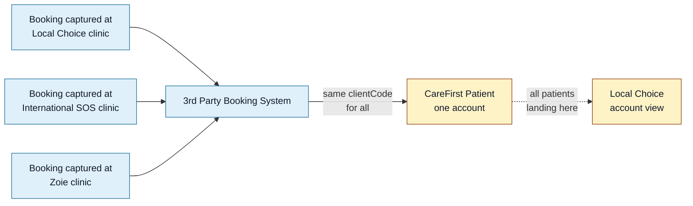
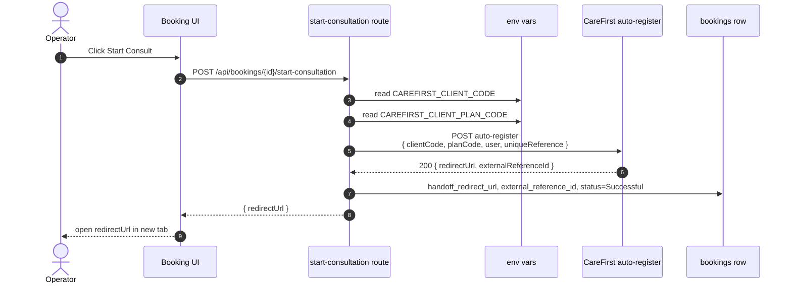
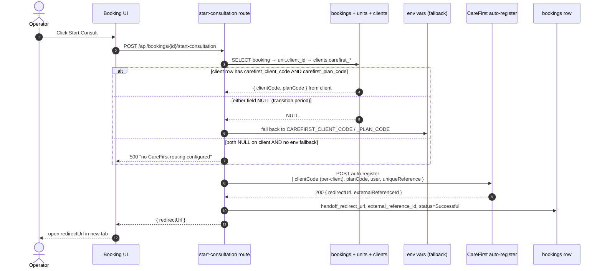

<Section id="tl-dr" num="01 — TL;DR" title="TL;DR">

The 3rd Party Booking System is live and stable in production. We're preparing the system for use by Local Choice, with International SOS and Zoie to follow in future.

Our SSO handoff currently uses the **single `clientCode` + `planCode` pair** you issued us — held in an environment variable on our side — so every booking lands in the same CareFirst account. To onboard International SOS and Zoie, we'd like to resolve `clientCode` + `planCode` **per booking** from the owning client record on our side, so each clinic group's patients are associated with the correct CareFirst account.

The work on our side is small (~half a day of engineering). What we'd need from your team is **one `clientCode` + `planCode` pair per clinic group**, plus a quick confirmation on the auth model (one shared `x-api-key` vs. one per client).

<Callout title="Your API already supports per-request routing — thank you">
The <code>auto-register</code> payload spec you shared shows <code>clientCode</code> and <code>planCode</code> as per-request fields, so the endpoint can already accept a different pair per call. That makes our side of the work very straightforward — we just need additional credentials issued so we can pass the right ones per booking.
</Callout>

</Section>

<Section id="problem" num="02 — Context" title="Context">

The 3rd Party Booking System is a shared intake and payment gateway that sits in front of CareFirst Patient. Multiple clinic groups use our UI to capture patient details, take payment, capture vital signs, and hand the booking off via SSO. Each clinic group is a distinct **client** in our data model:

| Clinic group | We track | We'd like them to land on CareFirst |
|---|---|---|
| Local Choice | Their own client record in our DB, with their units (branches) under it | Their own CareFirst account, patient list, and billing |
| International SOS | New client record (currently configured but kept inactive) | Their own CareFirst account |
| Zoie | New client record (currently configured but kept inactive) | Their own CareFirst account |
| (future clinic groups) | New client record when onboarded | A new CareFirst account they'd be issued |

Our SSO handoff today doesn't have a way to route per-client. The `clientCode` + `planCode` we send come from environment variables on our server:

```
CAREFIRST_CLIENT_CODE=<the single pair you issued us>
CAREFIRST_CLIENT_PLAN_CODE=<...>
```

So every patient — regardless of which clinic captured them — currently routes to the same account on your side. This works for now because Local Choice is the only clinic group we're actively preparing. Once we enable International SOS or Zoie, their patients would also be associated with the same account unless we change something.



</Section>

<Section id="current-flow" num="03 — Current" title="Current handoff flow">



The `clientCode` + `planCode` are fixed for the lifetime of the container. No per-booking variability today.

</Section>

<Section id="proposal" num="04 — Proposal" title="Proposed flow">

Walk the existing booking → unit → client chain, read the `clientCode` + `planCode` off the client row, and pass those through to the auto-register payload.



Importantly the **rest of the payload contract doesn't change** — only `clientCode` and `planCode` become per-booking values rather than fixed environment values. Same fields, same shape. The `x-api-key` header also stays the same unless your team prefers per-client keys (see question 2 below).

</Section>

<Section id="data-model" num="05 — Data model" title="Data-model change">

A new migration (`040_clients_carefirst_codes.sql`) adds two nullable text columns on `public.clients`:

```sql
ALTER TABLE public.clients
  ADD COLUMN IF NOT EXISTS carefirst_client_code TEXT,
  ADD COLUMN IF NOT EXISTS carefirst_plan_code   TEXT;
```

| Column | Type | Why |
|---|---|---|
| `carefirst_client_code` | `text NULL` | The per-client identifier CareFirst issues us. Nullable so existing clients fall through to the environment-variable defaults during rollout. |
| `carefirst_plan_code`  | `text NULL` | The plan code CareFirst issues per client (matches the `planCode` field in the payload). Same nullable rationale. |
| `carefirst_api_key`     | `text NULL` | **Only added if CareFirst confirms one `x-api-key` per client** (see question 2). Stored encrypted on our side; nullable so the global environment-variable key applies otherwise. |

A new UI section on `Manage Client · Settings · CareFirst integration` exposes both fields to **system_admin only** (free-text inputs, since the codes are issued out-of-band by CareFirst). The Settings tab is the existing canonical pattern — see [Per-Client Configuration](/reports/per-client-configuration).

</Section>

<Section id="payload-diff" num="06 — Payload" title="Payload diff">

The shape doesn't change — only the source of two values.

| Field | Before | After |
|---|---|---|
| `clientCode` | `process.env.CAREFIRST_CLIENT_CODE` | `clients.carefirst_client_code` (fallback to env if NULL) |
| `planCode`  | `process.env.CAREFIRST_CLIENT_PLAN_CODE` | `clients.carefirst_plan_code` (fallback to env if NULL) |
| `uniqueReference` | `booking.id` (UUID) | `booking.id` — unchanged |
| `user.*` | Patient details | Unchanged |
| `returnUrl` | `${getAppUrl()}/patient-history` | Unchanged |
| `x-api-key` header | `process.env.CAREFIRST_API_KEY` | **Unchanged** if CareFirst recommends Option A (shared key); per-client `clients.carefirst_api_key` under Option B (see question 2 below) |

</Section>

<Section id="edge-cases" num="07 — Edge cases" title="Edge cases and decisions on our side">

These are decisions we'd take on our end; documenting them here for transparency on how the implementation would behave.

**Partial configuration on a client record.** If `carefirst_client_code` is set but `carefirst_plan_code` is missing (or vice versa), we'd fail closed and surface a clear error rather than silently falling back to the default pair — partial configuration is the kind of state that could otherwise cause patients to be associated with the wrong account.

**Both fields empty on a client record.** Fall back to the environment-variable pair. This is the transition path: any client we haven't yet configured per-client just continues to use the default credentials.

**Both fields empty and no environment fallback set.** Surface a clear operator-facing message: "CareFirst routing not configured — contact support".

**Codes changed on a client mid-pilot.** New bookings would use the new codes; bookings already at `Successful` are unchanged (we don't replay handoffs). Bookings sitting at `Payment Complete` would use the new codes when the operator next clicks Start Consult. We'd record every change to client credentials in our audit log.

**Unit moved between clients.** A booking carries its `unit_id`, so moving the unit later doesn't retroactively change handoff codes on already-completed bookings — but new bookings on the moved unit pick up the new client's codes. This matches the existing semantics for other per-client settings on our side (self-collect, monthly-invoice, accent colour, etc).

</Section>

<Section id="rollout" num="08 — Rollout" title="Suggested rollout sequence">

A safe rollout that lets us pilot one client at a time without disrupting the others:

1. **CareFirst** issues a `clientCode` + `planCode` pair per clinic group (and a per-client `x-api-key` if that's the preferred auth model). Delivered via a secure channel (encrypted email / shared vault).
2. **We ship** the database migration, Settings UI, and resolver. Existing clients keep working off the environment-variable defaults because their per-client fields are still empty.
3. **System admin populates** the codes on the Settings tab for one client first (e.g. Local Choice if those codes are confirmed as theirs).
4. **Verify per client.** A test booking on that client should land in their CareFirst account. If anything looks off, clearing the codes reverts that client to the environment-variable defaults while we diagnose with your team.
5. **Repeat** for International SOS, then Zoie.
6. **Retire the environment-variable defaults** once every client has its own codes set — they'd become an emergency override only.

</Section>

<Section id="questions" num="09 — What we'd need" title="What we'd need from CareFirst">

To enable per-client routing on our side, there are two things we'd like to discuss with your team. Both are quick to confirm, and once we have your guidance the work on our side is about half a day.

<Callout title="1. A separate clientCode + planCode pair per clinic group">
We currently have one pair (the one in the Postman collection you shared). To associate each clinic group's patients with the correct CareFirst account, we'd need a distinct <code>clientCode</code> + <code>planCode</code> pair for each:

<ul>
<li><strong>Local Choice</strong> — the pair we already have (assuming it was issued for them; please confirm)</li>
<li><strong>International SOS</strong> — new pair</li>
<li><strong>Zoie</strong> — new pair</li>
<li><strong>Future clinic groups</strong> — could you share the process for requesting new pairs as we onboard them?</li>
</ul>

Any format / case-sensitivity / character-set constraints we should validate against in our Settings UI would also be helpful, so we can surface clear errors if anything's mistyped.
</Callout>

<Callout title="2. Same x-api-key for all clinic groups, or one per client?">
Today we authenticate every call with the single <code>x-api-key</code> you issued us. The payload spec shows <code>clientCode</code> as a per-request field, so we'd like to confirm the auth model you'd prefer:

<ul>
<li><strong>Option A:</strong> we keep using a single <code>x-api-key</code> for all clinic groups, and the <code>clientCode</code> in the payload determines routing.</li>
<li><strong>Option B:</strong> you issue a separate <code>x-api-key</code> per client, and we send the matching one with each request.</li>
</ul>

Either model is fine on our side — we just need to know which you'd recommend so we model the storage appropriately. (If Option B, we'd add an encrypted per-client API key field on our end alongside the other credentials.)
</Callout>

<Callout variant="warn" title="A minor follow-up clarification (non-blocking)">
<strong>Scope of <code>uniqueReference</code> deduplication.</strong> Our <code>uniqueReference</code> is the booking UUID — globally unique across our system, so it won't collide regardless of which <code>clientCode</code> it's sent with. If you dedupe <code>uniqueReference</code> globally, we're fine. If per-<code>clientCode</code>, we're also fine. Worth a quick confirmation when convenient so we can document it on our side, but not blocking anything.
</Callout>

</Section>

<Section id="not-now" num="10 — Out of scope" title="Out of scope for this discussion">

To keep the scope tight, the following are intentionally not part of this proposal — flagging them here for transparency:

- **Existing bookings.** Bookings already at `Successful` status stay associated with whichever account they were routed to at the time. We wouldn't retroactively re-route any historical handoff.
- **Per-unit routing.** We considered per-unit codes (rather than per-client), but units within a clinic group always share the same downstream CareFirst account, so per-client is the right granularity. If that ever changes we'd extend the resolver to check unit-level codes first.
- **Custom `returnUrl` per client.** All clients currently use the same booking-system UI, so a single `returnUrl` is correct. If a clinic group ever wants their patients to return to a client-specific page, that's a separate, smaller change we could make.
- **Per-client API key rotation policy.** If your team confirms Option B (one `x-api-key` per client), we'd want to align on a rotation process. Worth a follow-up conversation once the main routing is in place.

</Section>
