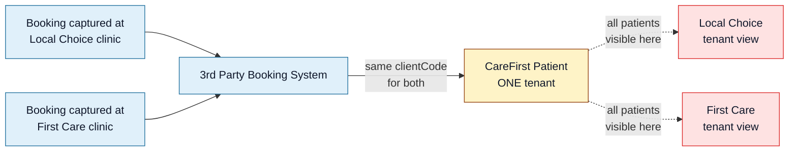
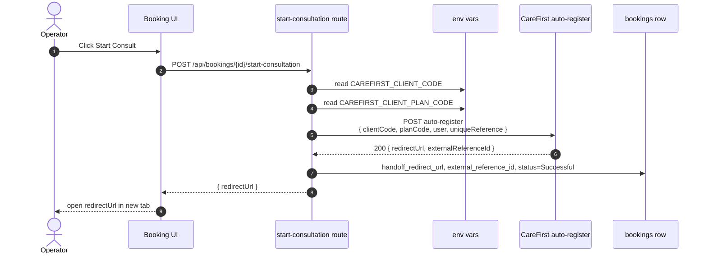
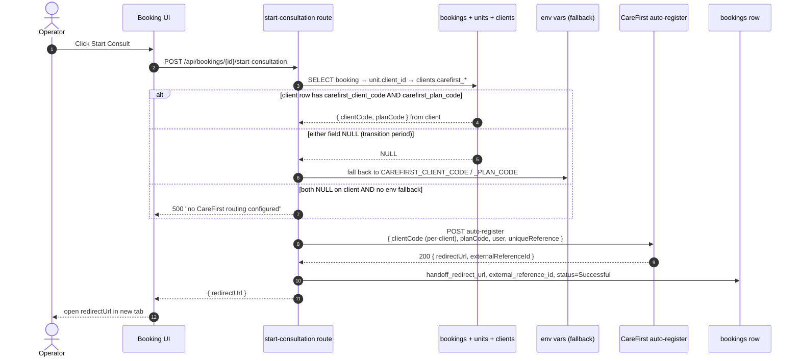

<Section id="tl-dr" num="01 — TL;DR" title="TL;DR">

Today our SSO handoff hard-codes the **single `clientCode` + `planCode` pair** CareFirst issued us into an environment variable, so every booking — regardless of which clinic captured it — lands in the same CareFirst tenant. To onboard International SOS and Zoie alongside Local Choice (and future clients), we need to resolve `clientCode` + `planCode` **per booking** from the owning client row.

The implementation on our side is small (~half a day). The blocker is that we need CareFirst to **issue us one `clientCode` + `planCode` pair per clinic group** and confirm whether each requires its own `x-api-key`.

<Callout title="The CareFirst API already supports per-request routing">
The <code>auto-register</code> payload spec CareFirst sent us shows <code>clientCode</code> and <code>planCode</code> as per-request fields. The endpoint already accepts a different pair per call. The reason every booking goes to one tenant today is purely that we've only been issued one pair — not a limitation of the API.
</Callout>

</Section>

<Section id="problem" num="02 — Problem" title="The problem">

The 3rd Party Booking System is a **shared intake gateway** in front of CareFirst Patient. Multiple clinic groups use our UI to capture patient data, take payment, and hand off via SSO — Local Choice clinics, First Care Solutions clinics, and future partners. Each of them is a distinct **client** in our data model:

| Clinic group | We track | They have on CareFirst |
|---|---|---|
| Local Choice | Their own `clients` row in our DB, with their units (branches) under it | Their own CareFirst tenant, their own patient list, their own billing |
| First Care Solutions | Their own row, their own units | Their own CareFirst tenant |
| (future partners) | New `clients` row when onboarded | New CareFirst tenant they'd need to provision |

But our SSO handoff doesn't know any of this. The `clientCode` + `planCode` we send to CareFirst come from **environment variables** on the VPS:

```
CAREFIRST_CLIENT_CODE=<one-code-for-everyone>
CAREFIRST_CLIENT_PLAN_CODE=<one-plan-for-everyone>
```

So every patient — regardless of which clinic captured them — currently routes to the same tenant on your side. Today this is "safe" because the pilot has been single-tenant. As soon as a second client goes live, patients leak into the wrong tenant on handoff.



</Section>

<Section id="current-flow" num="03 — Current" title="Current handoff flow">



The `clientCode` + `planCode` are fixed for the lifetime of the container. No per-booking variability today.

</Section>

<Section id="proposal" num="04 — Proposal" title="Proposed flow">

Walk the existing booking → unit → client chain, read the `clientCode` + `planCode` off the client row, and pass those through to the auto-register payload.



Crucially the **rest of the payload contract doesn't change** — only `clientCode` and `planCode` become per-booking-derived rather than env-derived. Same fields, same shape, same `x-api-key` header.

</Section>

<Section id="data-model" num="05 — Data model" title="Data-model change">

A new migration (`040_clients_carefirst_codes.sql`) adds two nullable text columns on `public.clients`:

```sql
ALTER TABLE public.clients
  ADD COLUMN IF NOT EXISTS carefirst_client_code TEXT,
  ADD COLUMN IF NOT EXISTS carefirst_plan_code   TEXT;
```

| Column | Type | Why |
|---|---|---|
| `carefirst_client_code` | `text NULL` | The per-client identifier CareFirst issues us. Nullable so existing clients fall through to the env-var fallback during rollout. |
| `carefirst_plan_code`  | `text NULL` | The plan code CareFirst issues per client (matches the `planCode` field in the payload). Same nullable rationale. |
| `carefirst_api_key`     | `text NULL` | **Only added if CareFirst confirms one `x-api-key` per client** (see Q2). Stored encrypted at the DB layer; nullable so the global env-var key applies otherwise. |

A new UI section on `Manage Client · Settings · CareFirst integration` exposes both fields to **system_admin only** (free-text inputs, since the codes are issued out-of-band by CareFirst). The Settings tab is the existing canonical pattern — see [Per-Client Configuration](/reports/per-client-configuration).

</Section>

<Section id="payload-diff" num="06 — Payload" title="Payload diff">

The shape doesn't change — only the source of two values.

| Field | Before | After |
|---|---|---|
| `clientCode` | `process.env.CAREFIRST_CLIENT_CODE` | `clients.carefirst_client_code` (fallback to env if NULL) |
| `planCode`  | `process.env.CAREFIRST_CLIENT_PLAN_CODE` | `clients.carefirst_plan_code` (fallback to env if NULL) |
| `uniqueReference` | `booking.id` (UUID) | `booking.id` — unchanged |
| `user.*` | Patient details | Unchanged |
| `returnUrl` | `${getAppUrl()}/patient-history` | Unchanged |
| `x-api-key` header | `process.env.CAREFIRST_API_KEY` | **Unchanged** unless CareFirst requires per-client keys (Q4 below) |

</Section>

<Section id="edge-cases" num="07 — Edge cases" title="Edge cases and decisions">

**Partial config on a client row.** If `carefirst_client_code` is set but `carefirst_plan_code` is NULL (or vice versa), we **fail closed** with `500 "CareFirst routing for this client is incompletely configured"`. We do NOT silently fall back to env for the missing field — silent partial config is exactly how cross-tenant leakage happens.

**Both fields NULL on the client row.** Fall back to the env-var pair as a whole. This is the transition path: clients we haven't migrated yet keep working off the env defaults.

**Both fields NULL and no env fallback set.** Fail fast with a clear error. Operator sees `"CareFirst routing not configured — contact support"`.

**Codes changed on a client mid-pilot.** New bookings use the new codes; bookings already at `Successful` are unchanged (we don't replay handoffs). Bookings sitting at `Payment Complete` would use the new codes when the operator next clicks Start Consult. Audit-log row records every change to the client codes.

**Unit moved between clients.** The booking carries its `unit_id` — moving the unit later doesn't retroactively change handoff codes on already-completed bookings, but new bookings on the moved unit pick up the new client's codes. This matches the existing semantics for self-collect, monthly-invoice, accent colour, etc.

**Local Choice (or any client) doesn't have CareFirst at all.** Today this isn't a real case — every active client uses the SSO handoff. If it ever becomes one, we'd add a `carefirst_disabled` flag and short-circuit Start Consult to surface an operator message instead of attempting the handoff. Out of scope here.

</Section>

<Section id="rollout" num="08 — Rollout" title="Rollout sequence">

1. **CareFirst answers** the two questions below — issues us per-client `clientCode` + `planCode` pairs, and confirms the auth model (one shared `x-api-key` vs. one per client).
2. **CareFirst delivers** the per-client `clientCode` + `planCode` pairs (and per-client `x-api-key` if applicable) via a secure channel (1Password vault / encrypted email).
3. **We ship** migration 040 + Settings UI + resolver helper + tests, behind no flag. Live clients still use env fallback since their rows are NULL.
4. **System admin populates** the codes on the Settings tab for each client (one-by-one, in coordination with CareFirst — pilot one client first, verify, then enable the rest).
5. **Verify per client.** A test booking on each client should land in that client's CareFirst tenant. If anything is off, NULL out the codes on that client row and it reverts to env fallback while we diagnose.
6. **Remove env-var defaults** once every client has codes set. The env vars become an emergency override only.

</Section>

<Section id="questions" num="09 — Questions" title="Questions for CareFirst">

Just two questions. Both unblock our implementation as soon as we have answers.

<Callout title="Q1 — Issue us one clientCode + planCode pair per clinic group">
We currently have a single pair (the one in the Postman collection). To route bookings correctly, we need a distinct <code>clientCode</code> + <code>planCode</code> pair for each clinic group:

<ul>
<li><strong>Local Choice</strong> — the pair we already have (assuming it was issued for them)</li>
<li><strong>International SOS</strong> — new pair needed</li>
<li><strong>Zoie</strong> — new pair needed</li>
<li><strong>Future clients</strong> — process for requesting new pairs</li>
</ul>

<strong>Can you issue these and confirm the process for requesting more in future?</strong> Any format / case-sensitivity / character-set constraints we should validate against in our Settings UI?
</Callout>

<Callout title="Q2 — One x-api-key for all clients, or one per client?">
Today we authenticate every call with a single <code>x-api-key</code>. The payload spec shows <code>clientCode</code> as a per-request field, but we want to confirm the auth model:

<strong>Do we keep using one <code>x-api-key</code> for all clinic groups (with the <code>clientCode</code> in the payload determining routing), or do you issue a separate <code>x-api-key</code> per client?</strong>

If the latter, we'll add a third secret column on the client row (encrypted at the DB layer). Either model is acceptable; we just need to know which you're recommending.
</Callout>

<Callout variant="warn" title="Minor follow-up (non-blocking)">
<strong>Scope of <code>uniqueReference</code> deduplication.</strong> Our <code>uniqueReference</code> is the booking UUID — globally unique across our entire system, so it never collides regardless of which <code>clientCode</code> it's sent with. If you dedupe <code>uniqueReference</code> globally, we're already fine. If per-<code>clientCode</code>, we're also fine. Worth confirming so we can document the contract on our side, but not blocking implementation.
</Callout>

</Section>

<Section id="not-now" num="10 — Not now" title="Out of scope for this RFC">

- **Existing bookings.** Already-Successful bookings stay where they landed. No retroactive re-routing.
- **Per-unit routing.** We considered per-unit codes (rather than per-client), but units within a client always share the same downstream CareFirst tenant, so per-client is the right granularity. If that ever changes we'd extend the resolver to check `units.carefirst_*` first.
- **Routing of returnUrl per client.** All clients use the same booking-system UI, so a single `returnUrl` is correct. If a client ever wants their patients to return to a client-specific page, that's a separate change to `getAppUrl()`.
- **Per-client API key rotation policy.** Once we have multiple clients with their own keys, we'll want a documented rotation process. Defer until Q4 is answered.

</Section>
