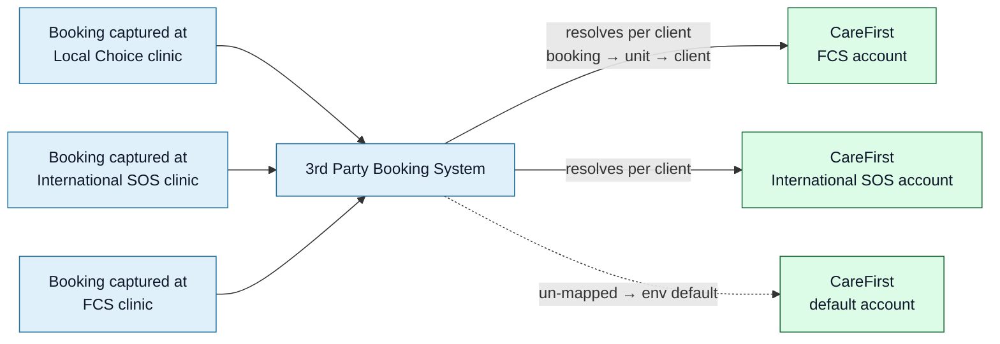
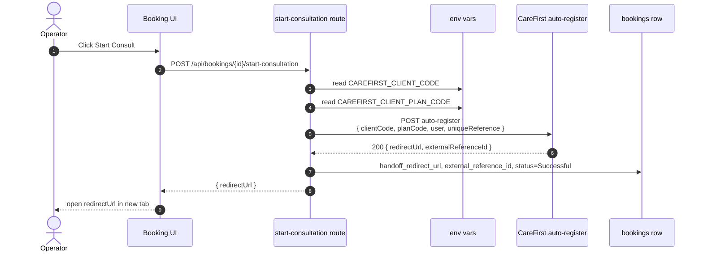
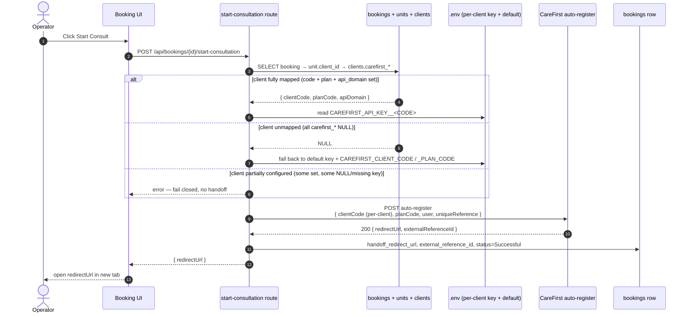

<Callout variant="ok" title="Implemented 2026-06-11 — live and verified">
This started as an RFC to the CareFirst Patient dev team and is now <strong>shipped in production</strong>. Each booking hands off to its <strong>owning client's</strong> CareFirst account, resolved via <code>booking.unit_id → unit.client_id → clients</code>. Un-mapped clients fall back to the global environment default; partially-configured clients <strong>fail closed</strong> (we never route a patient to the wrong account). The secret scheme is <strong>B-ENV</strong>: each client's API key lives in the SSH <code>.env</code> as <code>CAREFIRST_API_KEY__&lt;CODE&gt;</code>, and only NON-secret routing fields live in the database. <strong>FCS and International SOS are mapped and live-verified;</strong> Local Choice and Zoie remain on the env default until their codes are issued. The four RFC questions below are answered inline.
</Callout>

<Section id="tl-dr" num="01 — TL;DR" title="TL;DR">

The 3rd Party Booking System is live and stable in production. As of **2026-06-11**, the SSO handoff routes **per booking**: it resolves `clientCode` + `planCode` from the booking's owning client record (walking `booking → unit → client`), so each clinic group's patients are associated with the correct CareFirst account.

Previously the handoff used a **single `clientCode` + `planCode` pair** held in an environment variable, so every booking landed in the same CareFirst account. That env pair is now the **fallback** for clients that don't yet have their own codes configured.

The four things we originally needed from CareFirst (a per-client `clientCode` + `planCode` pair, and a confirmation on the auth model) are **resolved**: CareFirst issues a separate `clientCode` + `planCode` per clinic group, and authentication is a **separate API key per client** (see [§09](#questions)). The keys are NOT stored in the database — they live in the server's `.env` keyed by client code.

<Callout title="CareFirst's API supports per-request routing">
The <code>auto-register</code> payload accepts <code>clientCode</code> and <code>planCode</code> as per-request fields, so the endpoint accepts a different pair per call. That made our side of the work straightforward — we pass the right pair per booking and send the matching per-client API key.
</Callout>

</Section>

<Section id="problem" num="02 — Context" title="Context">

The 3rd Party Booking System is a shared intake and payment gateway that sits in front of CareFirst Patient. Multiple clinic groups use our UI to capture patient details, take payment, capture vital signs, and hand the booking off via SSO. Each clinic group is a distinct **client** in our data model:

| Clinic group | We track | We'd like them to land on CareFirst |
|---|---|---|
| Local Choice | Their own client record in our DB, with their units (branches) under it | Their own CareFirst account, patient list, and billing |
| International SOS | New client record (currently configured but kept inactive) | Their own CareFirst account |
| Zoie | New client record (currently configured but kept inactive) | Their own CareFirst account |
| (future clinic groups) | New client record when onboarded | A new CareFirst account they'd be issued |

Until 2026-06-11 the SSO handoff had no way to route per-client. The `clientCode` + `planCode` came from a single environment-variable pair on our server, so every patient — regardless of which clinic captured them — routed to the same CareFirst account. That single-account behaviour is now the **fallback** path only.

Today, each booking routes to its owning client's account. FCS and International SOS are mapped and live-verified; Local Choice and Zoie continue on the env default until CareFirst issues their codes.



</Section>

<Section id="current-flow" num="03 — Previous" title="Previous handoff flow">



This was the behaviour up to 2026-06-11: the `clientCode` + `planCode` were fixed for the lifetime of the container, with no per-booking variability. It is now the fallback path for un-mapped clients.

</Section>

<Section id="proposal" num="04 — Implemented" title="Implemented flow">

The live resolver walks the existing booking → unit → client chain, reads the `carefirst_client_code` + `carefirst_plan_code` (and `carefirst_api_domain`) off the client row, looks up that client's API key from the `.env` (keyed by client code), and passes them through to the auto-register call.



Importantly the **rest of the payload contract didn't change** — only `clientCode`, `planCode`, the API domain, and the `x-api-key` header become per-client values rather than fixed environment values. Same payload fields, same shape. Per-client API keys are resolved from the `.env` (scheme **B-ENV**), never from the database.

</Section>

<Section id="data-model" num="05 — Data model" title="Data model (as shipped)">

Migration `042` (`clients_carefirst_codes`) added three **nullable** text columns on `public.clients`. These hold only the **non-secret** routing fields; the per-client API key is NOT in the database.

```sql
ALTER TABLE public.clients
  ADD COLUMN IF NOT EXISTS carefirst_client_code TEXT
    CHECK (carefirst_client_code ~ '^[A-Z0-9]+$'),
  ADD COLUMN IF NOT EXISTS carefirst_plan_code   TEXT,
  ADD COLUMN IF NOT EXISTS carefirst_api_domain  TEXT;
```

| Column | Type | Why |
|---|---|---|
| `carefirst_client_code` | `text NULL` | The per-client identifier CareFirst issues us. Also the key used to look up the API key in the `.env` (`CAREFIRST_API_KEY__<code>`). CHECK constraint `^[A-Z0-9]+$`. Nullable so un-mapped clients fall through to the env default. |
| `carefirst_plan_code`  | `text NULL` | The plan code CareFirst issues per client (matches the `planCode` field in the payload). Same nullable rationale. |
| `carefirst_api_domain` | `text NULL` | Per-client CareFirst API domain. Nullable; un-mapped clients use the env-default domain. |

The **API key is never stored in the DB** (scheme **B-ENV**). Each mapped client's key lives in the server's SSH `.env` as `CAREFIRST_API_KEY__<CODE>` (e.g. `CAREFIRST_API_KEY__FCS`), resolved at handoff time by the client's `carefirst_client_code`. This keeps secrets out of Postgres and out of any DB backup/export.

A UI section on `Manage Client · Settings · CareFirst integration` exposes the non-secret routing fields to **system_admin only** (free-text inputs, since the codes are issued out-of-band by CareFirst). The Settings tab is the existing canonical pattern — see [Per-Client Configuration](/reports/per-client-configuration).

<Callout title="Two distinct 'client codes' — don't conflate them" variant="brand">
<code>clients.carefirst_client_code</code> (CareFirst's code, this doc) is separate from <code>clients.client_code</code> (OUR code — the PayFast <code>m_payment_id</code> prefix, migration 041). See the <a href="/reports/glossary">Glossary</a>.
</Callout>

</Section>

<Section id="payload-diff" num="06 — Payload" title="Payload diff">

The shape doesn't change — only the source of two values.

| Field | Before | After (shipped) |
|---|---|---|
| `clientCode` | `process.env.CAREFIRST_CLIENT_CODE` | `clients.carefirst_client_code` (fallback to env if un-mapped) |
| `planCode`  | `process.env.CAREFIRST_CLIENT_PLAN_CODE` | `clients.carefirst_plan_code` (fallback to env if un-mapped) |
| API domain | `process.env.CAREFIRST_API_DOMAIN` | `clients.carefirst_api_domain` (fallback to env if un-mapped) |
| `uniqueReference` | `booking.id` (UUID) | `booking.id` — unchanged |
| `user.*` | Patient details | Unchanged |
| `returnUrl` | `${getAppUrl()}/patient-history` | Unchanged |
| `x-api-key` header | `process.env.CAREFIRST_API_KEY` | Per-client `process.env.CAREFIRST_API_KEY__<CODE>` for mapped clients; env default for un-mapped (scheme **B-ENV** — key resolved from `.env`, never the DB) |

</Section>

<Section id="edge-cases" num="07 — Edge cases" title="Edge-case behaviour (as shipped)">

How the live resolver behaves:

**Partial configuration on a client record.** If a client is partially mapped — e.g. `carefirst_client_code` is set but `carefirst_plan_code`/`carefirst_api_domain` is missing, or the matching `CAREFIRST_API_KEY__<CODE>` is absent from the `.env` — we **fail closed** and surface a clear error rather than silently falling back to the default pair. Partial configuration is the kind of state that could otherwise route a patient to the wrong account, so we never do it.

**Un-mapped client (all `carefirst_*` fields NULL).** Falls back to the env-default credentials (key, code, plan, domain). This is the path Local Choice and Zoie are on until CareFirst issues their codes.

**Un-mapped client AND no env fallback set.** Surfaces a clear operator-facing message: "CareFirst routing not configured — contact support".

**Codes changed on a client.** New bookings use the new codes; bookings already at `Successful` are unchanged (we don't replay handoffs). Bookings sitting at `Payment Complete` use the new codes when the operator next clicks Start Consult. Every change to the non-secret routing fields is recorded in the audit log (the `.env` key is changed out-of-band via SSH).

**Unit moved between clients.** A booking carries its `unit_id`, so moving the unit later doesn't retroactively change handoff codes on already-completed bookings — but new bookings on the moved unit pick up the new client's codes. This matches the existing semantics for other per-client settings (self-collect, monthly-invoice, accent colour, etc).

</Section>

<Section id="rollout" num="08 — Rollout" title="Rollout sequence (executed)">

The rollout that took us live one client at a time without disrupting the others:

1. **CareFirst** issued a `clientCode` + `planCode` pair plus a per-client API key per clinic group, delivered via a secure channel. **Done** for FCS and International SOS; pending for Local Choice and Zoie.
2. **We shipped** migration 042 (non-secret routing columns), the Settings UI, and the resolver. Un-mapped clients keep working off the env defaults because their `carefirst_*` fields are NULL.
3. **System admin populated** the routing codes on the Settings tab and the matching `CAREFIRST_API_KEY__<CODE>` in the `.env` (FCS first, then International SOS).
4. **Verified per client.** A test booking on each mapped client landed in the correct CareFirst account (FCS + International SOS live-verified 2026-06-11). Clearing the routing fields reverts a client to the env defaults if needed.
5. **Remaining:** International SOS done; **Local Choice and Zoie** stay on the env default until CareFirst issues their codes.
6. **Retire the env defaults** once every client has its own codes set — at which point they become an emergency override only.

</Section>

<Section id="questions" num="09 — RFC questions" title="RFC questions — now resolved">

These were the open asks to the CareFirst team. Kept here for history, annotated with the answer that shipped on 2026-06-11.

<Callout variant="ok" title="1. A separate clientCode + planCode pair per clinic group — RESOLVED: yes">
<strong>Answer: yes.</strong> CareFirst issues a distinct <code>clientCode</code> + <code>planCode</code> pair per clinic group. <strong>FCS and International SOS are issued, mapped, and live-verified.</strong> Local Choice and Zoie are pending issuance. The codes are validated in our Settings UI against the DB CHECK constraint <code>^[A-Z0-9]+$</code>.

<ul>
<li><strong>FCS</strong> — issued, live</li>
<li><strong>International SOS</strong> — issued, live</li>
<li><strong>Local Choice</strong> — pending CareFirst issuance (on env default)</li>
<li><strong>Zoie</strong> — pending CareFirst issuance (on env default)</li>
</ul>
</Callout>

<Callout variant="ok" title="2. Same x-api-key for all, or one per client? — RESOLVED: one per client (Option B)">
<strong>Answer: Option B — a separate API key per client.</strong> We send the matching key per request. Crucially, we store these keys in the server's <code>.env</code> as <code>CAREFIRST_API_KEY__&lt;CODE&gt;</code> (scheme <strong>B-ENV</strong>), <strong>not</strong> in the database — so no secret ever lands in Postgres or a DB backup. Only the non-secret routing fields (code, plan, domain) live on the <code>clients</code> row.
</Callout>

<Callout variant="ok" title="Codes issued by CareFirst — RESOLVED">
Both the <code>clientCode</code> and <code>planCode</code> are issued by CareFirst out-of-band and entered by a system_admin; the API key is delivered securely and placed in the <code>.env</code> via SSH.
</Callout>

<Callout variant="warn" title="A minor follow-up clarification (non-blocking)">
<strong>Scope of <code>uniqueReference</code> deduplication.</strong> Our <code>uniqueReference</code> is the booking UUID — globally unique across our system, so it won't collide regardless of which <code>clientCode</code> it's sent with. If you dedupe <code>uniqueReference</code> globally, we're fine. If per-<code>clientCode</code>, we're also fine. Worth a quick confirmation when convenient, but not blocking anything.
</Callout>

</Section>

<Section id="not-now" num="10 — Out of scope" title="Out of scope for this discussion">

To keep the scope tight, the following are intentionally not part of this proposal — flagging them here for transparency:

- **Existing bookings.** Bookings already at `Successful` status stay associated with whichever account they were routed to at the time. We wouldn't retroactively re-route any historical handoff.
- **Per-unit routing.** We considered per-unit codes (rather than per-client), but units within a clinic group always share the same downstream CareFirst account, so per-client is the right granularity. If that ever changes we'd extend the resolver to check unit-level codes first.
- **Custom `returnUrl` per client.** All clients currently use the same booking-system UI, so a single `returnUrl` is correct. If a clinic group ever wants their patients to return to a client-specific page, that's a separate, smaller change we could make.
- **Per-client API key rotation policy.** Now that Option B (one `x-api-key` per client) is live, we'd want to align on a rotation process. Rotation on our side is an `.env` edit + redeploy. Worth a follow-up conversation.

</Section>
