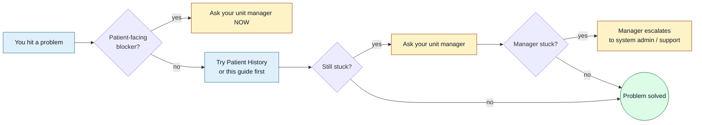

<Section id="welcome" num="01 — Welcome" title="Welcome to the booking system">

This guide is **everything you need to take your first booking, end-to-end, today.** It assumes nothing about prior experience with the system. Allow about 20 minutes to read it, plus 5 minutes to take a practice booking after.

You'll learn:

1. How to sign in (and why we use a PIN, not a password)
2. The five pages you'll use during a normal shift
3. How a booking flows from "patient walks in" to "consult starts"
4. What to do when something doesn't behave as expected

By the end, you should be able to take a booking unsupervised. Your manager will be on hand for the first few.

</Section>

<Section id="sign-in" num="02 — Sign in" title="Signing in for the first time">

Your account was created by your manager. You should have received an email from <code>noreply@carefirst.co.za</code> with:

- The system URL (something like `https://booking.carefirst.co.za` or, while we're pre-domain, `http://187.127.135.11:3000`)
- Your **6-digit PIN**

### Steps

1. Open the system URL in Chrome or Edge (Firefox works too; Safari is fine)
2. Enter your email
3. Enter the 6-digit PIN from the invite email
4. You'll land on **Home**

<Callout variant="warn" title="Lost your PIN already?">
Click <b>Forgot PIN</b> on the sign-in page. Enter your email and you'll get a fresh code by email. The code is valid for 15 minutes and can only be used once. Setting a new PIN signs you out of every device — useful if you suspect someone else has the old PIN.
</Callout>

### Why a PIN, not a password?

PINs are easier to type on a busy front-desk keyboard and they're hashed in the database (same as passwords would be). The 6-digit space is small enough that we wrap it in **shared throttle**: too many wrong attempts from your IP triggers a cool-down, which makes brute-forcing impractical even though the PIN space is short.

</Section>

<Section id="tour" num="03 — The five pages" title="The five pages you'll use">

<StepRow>
  <Step num="1." title="Home">Quick-glance dashboard with your unit context and a Create Booking shortcut.</Step>
  <Arrow />
  <Step num="2." title="Create Booking">The patient-intake flow — search, capture, pay, confirm, hand off.</Step>
  <Arrow />
  <Step num="3." title="Patient History">Every booking your unit has ever made. Where you go after the fact.</Step>
</StepRow>

<StepRow>
  <Step num="4." title="Switch Unit">Only if you're assigned to more than one unit — picks which unit you're acting on.</Step>
  <Arrow />
  <Step num="5." title="Profile">Your avatar, name, and a "Change PIN" button.</Step>
</StepRow>

That's it. Everything else (Client Management, User Management, Audit Log, Security) is admin-facing and you won't see those tiles in your sidebar.

</Section>

<Section id="first-booking" num="04 — First booking" title="Your first booking, end-to-end">

A patient walks in. You sit at the booking desk. Here's the full flow.

```mermaid
flowchart LR
    A([Patient<br/>arrives]) --> B[Search patient<br/>by ID / passport / DOB]
    B --> C[Capture details<br/>basic + address + contact]
    C --> D[Booking type<br/>Instant or Scheduled]
    D --> E[Verification<br/>review + nurse PIN]
    E --> F[Payment<br/>gateway / self-collect / monthly]
    F --> G[Vitals<br/>BP / glucose / etc.]
    G --> H[T&Cs<br/>patient signs]
    H --> I[Start Consult<br/>CareFirst opens]
    I --> J((Patient seen))

    classDef brand fill:#e0f0fa,stroke:#1f6f9d,color:#0f172a;
    classDef ok    fill:#dcfce7,stroke:#166534,color:#0f172a;
    class B,C,D,E,F,G,H,I brand;
    class A,J ok;
```

### Walkthrough

1. **Click "Create Booking"** from the sidebar or Home.
2. **Search for the patient** — try National ID first, Passport if foreign, Date of Birth if neither. If they've been here before, the form pre-fills.
3. **Step 1 — Basic info**: confirm name, ID, title, gender, DOB, nationality. If a banner says "identity locked", don't try to edit those fields — that's a safety mechanism.
4. **Step 2 — Address**: ask the patient. Suburb + city + postal code are needed.
5. **Step 3 — Contact**: phone (with country code) and email. Optional: send the script to a different email at the end.
6. **Step 4 — Booking type**: Instant if the patient is being seen now; Scheduled if they're booking for a future slot. Scheduled requires picking date + time.
7. **Step 5 — Verification**: review everything. If anything's wrong, click the section to edit. If your client requires nurse verification, a PIN modal will pop up — enter the on-duty nurse's PIN.
8. **Step 6 — Payment**: this is the one place the flow branches. You'll see one of:
   - **Gateway** (PayFast) — hand the patient the device or send them a link
   - **Self-collect** — confirm payment-in-unit with your PIN
   - **Monthly invoice** — this step is automatic and instant; you'll see "Marked monthly invoice"
9. **Vitals** — BP, glucose, temp, O₂, heart rate. Skip-able per client; if your client skips this, you'll jump straight to T&Cs.
10. **T&Cs** — the patient reads and accepts. The system records the timestamp.
11. **Start Consult** — if you're a manager/admin, this fires automatically when T&Cs are accepted. CareFirst opens in a new tab and the patient is in their hands.

<Callout variant="ok" title="Auto-save protects your work">
The patient-details steps auto-save every <b>2 seconds</b>. A power cut at step 3 costs you at most one sentence of typing — when you come back, the booking is right where you left it (look for it in Patient History → In Progress).
</Callout>

</Section>

<Section id="idle-lock" num="05 — Idle lock" title="What happens if you walk away">

The system watches for inactivity:

| Timer | Behaviour |
|---|---|
| **5 minutes idle** | Warning modal pops up asking if you're still there |
| **7 minutes idle** | Auto sign-out — your session ends, you're back at the sign-in page |
| **Tab returns to foreground** | The idle timer re-checks immediately, even if it was suspended |

This is a security measure for unattended workstations. The 5-minute warning gives you time to dismiss it. If you genuinely walked away, the 7-minute auto-out protects the data behind your account.

<Callout variant="warn" title="Your in-flight booking is safe">
Auto sign-out doesn't lose the booking you were in the middle of. Auto-save persists every field, including the current step. After you sign back in, open Patient History, filter to <b>In Progress</b>, click <b>Continue</b> on your booking, and you'll resume right where you stopped.
</Callout>

</Section>

<Section id="things-go-wrong" num="06 — When things go wrong" title="The common five">

<Grid2>
<Card variant="warn" title="The PIN modal keeps rejecting me">
<ol>
<li>Double-check you're typing the right person's PIN — nurse PIN ≠ your PIN</li>
<li>If it says "throttled", wait the displayed window (a few minutes)</li>
<li>Still failing? Have your manager run <b>Reset PIN</b> for the affected user</li>
</ol>
</Card>

<Card variant="warn" title="Patient paid but the booking says In Progress">
<ol>
<li>Wait 30 seconds — the PayFast confirmation can take a moment</li>
<li>If still stuck, ask your manager to click <b>Reconcile with PayFast</b> on Patient History</li>
<li>If that doesn't pick it up, manager can <b>Manual confirm</b> the booking with their PIN</li>
</ol>
</Card>

<Card variant="warn" title="CareFirst handoff fails on Start Consult">
<ol>
<li>Read the banner — it tells you the exact reason</li>
<li>"Already registered to a different account" → escalate to support; don't try again</li>
<li>"500 / 502" → CareFirst's side, wait 5 minutes and retry</li>
<li>"Missing required patient data" → reopen the booking and fill the missing fields</li>
</ol>
</Card>

<Card variant="warn" title="I can't find the booking I just made">
<ol>
<li>Check the status filter — the booking might be on a different tab (e.g. Payment Complete vs In Progress)</li>
<li>Confirm your active unit is the one you created the booking under (Switch Unit if needed)</li>
<li>Check date range filters — they may exclude today</li>
</ol>
</Card>
</Grid2>

</Section>

<Section id="who-to-ask" num="07 — Who to ask" title="Escalation path">

When in doubt — your unit manager is the right first call. They have the troubleshooting tools (reconcile, manual confirm, reset PIN) that you don't.

</Section>

<Section id="cheatsheet" num="08 — Cheat sheet" title="One-page cheat sheet">

Print this. Stick it next to the workstation.

| Question | Answer |
|---|---|
| Where do I sign in? | The system URL given to you; PIN from your invite email |
| Where do I make a new booking? | Sidebar → <b>Create Booking</b> |
| Where do I find an old booking? | Sidebar → <b>Patient History</b> |
| How long can I be idle? | Warning at 5 min, sign-out at 7 min |
| What if I lose my PIN? | Sign-in page → <b>Forgot PIN</b> |
| What if a patient paid but it didn't reflect? | Ask manager to <b>Reconcile</b> |
| What if Start Consult fails? | Read the banner; "already registered" → escalate, "500/502" → wait + retry |
| Who do I ask first when stuck? | Your unit manager |

</Section>
