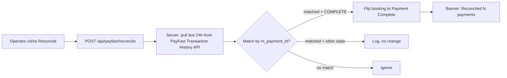
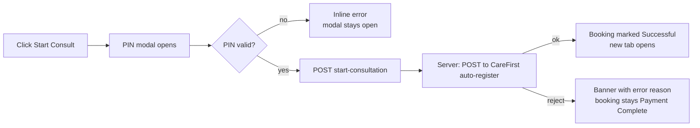

<Section id="overview" num="01 — Overview" title="What this page is for">

Patient History is the **post-booking control panel**. Every booking the unit has ever created lives here, in every state — in progress, paid, handed off, abandoned, discarded. From this page you can:

- Find a specific booking by patient name, ID, or date
- See exactly what status a booking is in and why
- Reconcile a payment that PayFast confirmed but the booking didn't pick up
- Manually start a CareFirst consult when the auto-handoff failed
- Export the day's bookings for billing or audit

It's the page operators open first thing in the morning and last thing before signing off.

</Section>

<Section id="layout" num="02 — Layout" title="Columns at a glance">

| Column | Shows |
|---|---|
| **Patient** | Full name (firstNames + surname) or "Unknown" if blank |
| **ID Number** | National ID / Passport — exactly as captured |
| **Status** | Coloured pill — see [Statuses](#statuses) |
| **Unit** | Unit the booking belongs to (operators only see their units) |
| **Client** | Parent client of the unit |
| **Date** | When the booking was created, in your local timezone |
| **Actions** | Buttons specific to the booking's current state |

The table is sortable by clicking a column header. Default sort is **most recent first**.

<Callout variant="warn" title="Visibility by role">
- <Pill variant="brand">system_admin</Pill> sees every booking across every client
- <Pill variant="brand">unit_manager</Pill> sees bookings in their assigned units only
- <Pill variant="brand">user</Pill> sees bookings in their assigned units only

The server enforces this via RLS — there's no way to URL-hack into bookings from a different unit.
</Callout>

</Section>

<Section id="filters" num="03 — Filters" title="Filters & search">

The toolbar above the table has four ways to narrow the list:

<Grid2>
<Card variant="brand" title="Search box">
Matches against patient name, ID number, and booking ID. Type as you go — results filter live.
</Card>

<Card variant="brand" title="Status filter tabs">
**All · In Progress · Incomplete · Payment Complete · Successful · Abandoned**. "Incomplete" is the aggregated catch-all for stuck states.
</Card>

<Card variant="brand" title="Date range">
Pick a from/to date. Useful when reconciling end-of-month or pulling a specific day's bookings for export.
</Card>

<Card variant="brand" title="Unit filter">
If you have access to multiple units, toggle which ones to show. Defaults to **your currently active unit**.
</Card>
</Grid2>

</Section>

<Section id="statuses" num="04 — Statuses" title="Reading the status pills">

Every booking has exactly one status at any moment. Here's how to read them:

| Pill | Meaning | Typical next action |
|---|---|---|
| <Pill variant="brand">In Progress</Pill> | Booking created, payment not yet complete | Wait for patient to pay, or operator to confirm |
| <Pill variant="warn">Incomplete</Pill> | Catch-all label for stuck states on the filter tab | Investigate the underlying status |
| <Pill variant="ok">Payment Complete</Pill> | Paid (gateway / self-collect / monthly), awaiting Start Consult | Click **Start Consult** |
| <Pill variant="ok">Successful</Pill> | Handed off to CareFirst Patient app | Done — patient is now in CareFirst's hands |
| <Pill variant="mute">Abandoned</Pill> | Idle &gt; 30 min mid-flow | Reconcile may rescue if patient finished paying after |
| <Pill variant="mute">Discarded</Pill> | Operator clicked Discard | Hidden by default; visible to system_admin |

<Callout variant="warn" title="Payment-mode tinting">
Inside <b>Payment Complete</b>, the pill colour subtly differs by how the booking was paid:

- **Yellow** — gateway (PayFast)
- **Amber** — self-collect (paid at the unit, confirmed with PIN)
- **Blue** — monthly invoice (auto-marked, no operator action)

This helps you spot reconcile candidates at a glance — yellow Payment Completes are the ones that go through PayFast and so the ones where the ITN might have dropped.
</Callout>

</Section>

<Section id="actions" num="05 — Per-booking actions" title="What the action buttons do">

The Actions column shows only the buttons that apply to the booking's current state.

| Status | Button | What it does |
|---|---|---|
| In Progress | **Continue** | Re-opens the booking at its saved step (auto-save persists every 2s) |
| In Progress | **Discard** | Marks the booking Discarded — soft-delete; admin can still see it |
| Payment Complete | **Start Consult** | PIN-gated handoff to CareFirst — see [Start Consult](#start-consult) |
| Payment Complete | **Manual confirm** | system_admin only — flips status when reconcile can't catch it |
| Successful | **Open in CareFirst** | Opens the saved redirect URL in a new tab; idempotent (re-uses the URL) |
| Any | **View** | Read-only detail panel — captured fields, audit trail, handoff attempts |

<Callout variant="ok" title="Idempotent Start Consult">
Clicking Start Consult on a booking already marked Successful is safe — the server returns the previously-stored redirect URL instead of re-registering with CareFirst.
</Callout>

</Section>

<Section id="reconcile" num="06 — Reconcile" title="Reconcile with PayFast">

When PayFast's webhook (ITN) doesn't reach us — usually because of HTTPS-pending issues or transient network — a booking can stay <Pill variant="brand">In Progress</Pill> even though the patient has paid. Reconcile fixes this by polling PayFast's Transaction History API and matching their record against our booking IDs.

<Grid2>
<Card variant="brand" title="When to run it">
- Bookings stuck in <Pill variant="brand">In Progress</Pill> with a <code>payment_amount</code> set
- After an HTTPS outage / known ITN drop
- End-of-day, just in case
</Card>

<Card variant="warn" title="Limitations">
- Only matches bookings created in the last **24 hours**
- Only triggers status change for <code>COMPLETE</code> PayFast records
- system_admin button only — operators can ask their manager to run it
</Card>
</Grid2>

The page also runs reconcile **automatically on first load** for system_admin sessions, so most ITN gaps close themselves before anyone has to think about it.

</Section>

<Section id="start-consult" num="07 — Start Consult" title="Handing the patient off to CareFirst">

Once a booking is Payment Complete and the patient has accepted T&Cs, **Start Consult** registers them with CareFirst Patient via SSO and opens the consult in a new tab.

<Callout variant="warn" title="PIN gate">
The PIN modal fires <b>every</b> time you click Start Consult — including retries. It's intentional: handoff is an irreversible action against CareFirst, and the PIN is the same "are you really the operator" gate used elsewhere.
</Callout>

### Common reasons Start Consult fails

- **"Already registered to a different account"** — patient ID is in CareFirst under a different name. Identity-lock on Step 1 usually prevents this; if it slips through, escalate to support.
- **HTTP 500 / 502 from CareFirst** — their side is down or rate-limited. Wait 5 minutes, click again.
- **PIN throttled** — too many wrong attempts. Wait the throttle window out (shown in the error), or have a different authorised user do the handoff.

</Section>

<Section id="export" num="08 — Export" title="Export to CSV / Excel">

The **Export to Excel** button (system_admin only) dumps the current filtered view to a CSV file. Columns exported:

- Patient Name, ID Number, ID Type
- Status
- Unit, Client
- Date (local timezone, en-ZA formatted)
- Payment Type, Payment Amount

<Callout title="Filter before export">
Whatever filters you have applied (status, date range, unit, search) carry through to the export. Set up the view you want first, then click Export.
</Callout>

</Section>

<Section id="troubleshoot" num="09 — Troubleshooting" title="Common situations">

<Grid2>
<Card variant="warn" title="Patient paid but status is In Progress">
1. Click **Reconcile with PayFast** (system_admin)
2. If still stuck, check the booking ID + reference in PayFast dashboard
3. If PayFast shows COMPLETE: system_admin can **Manual confirm**
4. If PayFast shows PENDING/FAILED: ask patient to retry the payment link
</Card>

<Card variant="warn" title="Start Consult button is disabled">
- Booking isn't Payment Complete yet — operator needs to finish the flow first
- Booking has missing required fields (email, contact, ID, names) — manager opens the booking and completes them
- You aren't authorised (operators in role <code>user</code> can't handoff — managers run Start Consult for them)
</Card>

<Card variant="warn" title="Booking shows Abandoned but patient says they paid">
1. Run **Reconcile** — if matched, the booking flips to Payment Complete and the abandonment is rescued
2. If reconcile finds nothing, patient probably abandoned the PayFast checkout — ask them to retry from a fresh booking
</Card>

<Card variant="warn" title="CareFirst handoff keeps failing for one patient">
Check the **handoff_error_reason** in the booking's audit / view panel. The most common cause is the "already registered to a different account" error — escalate to support to resolve the CareFirst-side record before retrying.
</Card>
</Grid2>

</Section>
