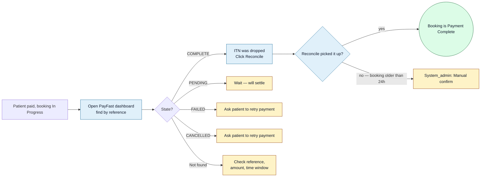
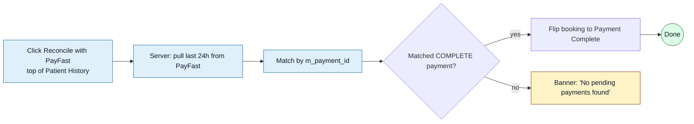

<Section id="symptoms" num="01 — Symptoms" title="The payment-side surface, in one paragraph">

For gateway-paid bookings we redirect the patient to PayFast, then wait for PayFast's ITN (Instant Transaction Notification) webhook to flip our booking from <Pill variant="brand">In Progress</Pill> to <Pill variant="ok">Payment Complete</Pill>. If the ITN doesn't arrive — HTTPS issues, firewall, transient outages — the booking stays In Progress even though the patient has paid. We close that gap by **reconciling** against PayFast's Transaction History API, which we run on demand and automatically on first Patient History load.

This document covers the full set of states a payment can be in on PayFast's side, the symptoms we'd see for each, and what our recovery looks like. It's reference material for the CareFirst team — most of these states don't affect your handoff, but they do affect when the handoff *can* happen.

### Quick symptom recap

- Booking status is <Pill variant="brand">In Progress</Pill>
- `payment_amount` may or may not be set
- The Patient History row hasn't moved off In Progress in 30+ seconds

The most common cause is an **ITN drop** — PayFast tried to webhook us, we didn't receive it (HTTPS pending, firewall, network blip). The booking is **recoverable**; nothing's actually lost.

</Section>

<Section id="states" num="02 — PayFast states" title="States explained">

PayFast records a payment in one of these terminal states (visible in their dashboard):

| State | Meaning | Our action |
|---|---|---|
| `COMPLETE` | Money is settled with the merchant | Should flip our booking to Payment Complete (via ITN or Reconcile) |
| `PENDING` | Awaiting confirmation (e.g. EFT or 3DS in progress) | No action — wait |
| `FAILED` | Bank declined, card insufficient, etc. | Booking stays In Progress; operator can retry |
| `CANCELLED` | Patient hit Cancel on PayFast's UI | Booking stays In Progress; operator can retry |

Our booking system listens for `COMPLETE` only. `PENDING`/`FAILED`/`CANCELLED` should leave the booking untouched.

</Section>

<Section id="triage" num="03 — Triage" title="Decision flow">

**Step 0 in every case** — log in to PayFast's merchant dashboard and search for the payment by our **booking ID** (used as PayFast's `m_payment_id`). The state column tells you which branch to take below.

</Section>

<Section id="itn-dropped" num="04 — ITN dropped" title="ITN dropped (most common)">

<Pill variant="warn">Most common</Pill> PayFast shows the payment as **COMPLETE**, but our booking is still In Progress.

### What an ITN drop is

PayFast's webhook (Instant Transaction Notification) tells our server "this payment is done". The webhook can fail to land for several reasons:

- We're not on HTTPS yet (planned with the domain rollout). Some browsers block ITN posts to HTTP.
- A firewall or load-balancer rejected the request
- Our server was restarting at the moment PayFast posted
- Transient network blip between PayFast and our VPS

PayFast retries ITN delivery a few times, but if all retries fail, the booking stays stuck. **Reconcile** closes the gap by pulling payment records directly from PayFast.

### How to recover

**Reconcile** is the **Reconcile with PayFast** button at the top of Patient History (system_admin only). For system_admin sessions it also runs **automatically on first load**, so most ITN gaps close themselves before anyone investigates.

<Callout variant="warn" title="Reconcile window: 24 hours">
Reconcile only matches bookings created in the last 24 hours. Older bookings need <a href="/reports/booking-stuck-payment-complete#manual-confirm">manual confirm</a> after cross-checking the payment in PayFast.
</Callout>

</Section>

<Section id="cancelled" num="05 — Cancelled" title="User cancelled or aborted">

PayFast shows `CANCELLED` — the patient pressed Cancel on PayFast's page, or closed the tab before completing.

### Resolve

1. Confirm with the patient that they did NOT actually pay (they may have re-entered card details successfully later — check for a separate COMPLETE record)
2. If genuinely cancelled, the booking stays In Progress for retry
3. Operator can ask the patient to retry — re-open the booking and send a fresh payment link, OR re-do device payment

</Section>

<Section id="pending" num="06 — Pending or failed" title="Payment pending or failed">

### PENDING

The payment is in flight (EFT settlement, 3DS challenge). No action needed — wait.

- EFT can take minutes to hours
- Card 3DS challenges usually resolve in seconds
- If PENDING persists more than 2 hours, contact PayFast support

### FAILED

The bank or card-issuer declined.

1. Ask the patient to use a different card or method
2. Re-open the booking, get a fresh PayFast link
3. The previous attempt stays in PayFast as FAILED; it doesn't affect the new attempt

</Section>

<Section id="not-found" num="07 — No matching payment" title="No matching payment in PayFast">

PayFast dashboard has no record of the payment under our booking ID. Possibilities:

1. **Patient confused payment for another service.** Ask them when they paid, what amount, and on what device. If the amount or timing doesn't fit, they may have paid a different bill.
2. **They paid via the wrong link.** If you sent multiple links (e.g. for a retried booking), the payment may be against an older `m_payment_id`. Check both.
3. **PayFast hasn't finished indexing.** Wait 60 seconds, search again.
4. **They didn't actually pay.** Politeness aside, this happens. Confirm by asking for the PayFast receipt SMS/email — if they don't have one, no payment happened.

</Section>

<Section id="when-call" num="08 — When to call PayFast" title="When to escalate to PayFast">

Most issues are recoverable on our side. Escalate to PayFast support only when:

- A payment shows `PENDING` for more than 2 hours
- Patient has a PayFast receipt but it doesn't appear in our merchant dashboard at all
- Reconcile reports a payment exists but with a mismatched amount (potential fraud)
- You suspect a duplicate charge — both attempts show COMPLETE for the same booking

Provide PayFast support with: **merchant ID**, **payment reference** (our booking ID), **amount**, **approximate time of payment**.

</Section>
