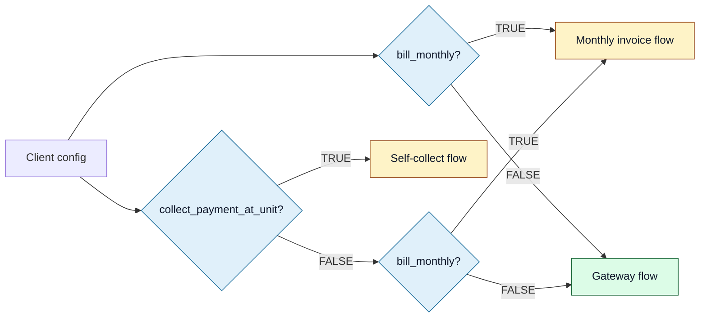

<Section id="why" num="01 — Why" title="Why CareFirst should care">

The same SSO auto-register payload is generated by every client — same field names, same shape. But which **paths** the booking takes to get to that payload differ per client. When a CareFirst support conversation says "the patient says they were never asked for payment", the answer depends on which flags are flipped for that client.

This document is the canonical mapping between client config and the patient's experience leading up to the handoff. Useful background for triaging "why did this patient see X?" questions.

</Section>

<Section id="flags" num="02 — Flags" title="The flags">

Stored on the `clients` table. Each flag can be ON or OFF independently (with mutual-exclusion rules called out below). Default values are OFF unless otherwise noted.

| Flag | When ON | Effect on the flow |
|---|---|---|
| `collect_payment_at_unit` | Operator confirms payment at the unit with a PIN; we skip PayFast entirely | Step 6 shows a "Confirm payment in unit" panel instead of the PayFast picker |
| `bill_monthly` | Client is invoiced monthly; operator never sees Step 6 | Step 6 auto-fires `mark-monthly-invoice`; booking advances without operator action |
| `skip_patient_metrics` | Skips the vitals capture page; only available if one of the two above is ON | Booking goes from Payment Complete → /creating directly |
| `nurse_verification` | Requires nurse PIN at search, verification, and handoff | Inserts up to 4 PIN gates across the flow |
| `accent_color` | Custom brand colour (hex) applied via CSS variable | Affects UI only — operator + (in future) patient-facing surfaces |

</Section>

<Section id="payment-modes" num="03 — Payment modes" title="Payment-mode flags interact">

`collect_payment_at_unit` and `bill_monthly` cannot both be ON. The UI cascades — turning one on disables the other — and the server PATCH endpoint clamps if both ever arrive TRUE.

| Resulting mode | What the patient experiences | What CareFirst sees |
|---|---|---|
| **Gateway** (default) | Pays via PayFast, returns to our /payment/success | `payment_type = "gateway"` if we ever exposed it |
| **Self-collect** | Pays cash/card at the unit; operator confirms with their PIN | `payment_type = "self_collect"` |
| **Monthly invoice** | No payment step at all — client is billed monthly | `payment_type = "monthly_invoice"` |

We do not currently send `payment_type` to CareFirst in the auto-register payload. The handoff is identical regardless of mode. If it'd be useful for your end (e.g. for billing reconciliation), we can add it.

</Section>

<Section id="scenarios" num="04 — Scenarios" title="Common configurations">

<Grid2>
<Card variant="brand" title="Retail pharmacy, walk-in patients">
- <code>collect_payment_at_unit</code> = FALSE
- <code>bill_monthly</code> = FALSE
- <code>nurse_verification</code> = TRUE
- → Gateway payment + nurse PIN at booking time
</Card>

<Card variant="brand" title="Corporate wellness, contracted">
- <code>bill_monthly</code> = TRUE
- <code>skip_patient_metrics</code> = TRUE
- <code>nurse_verification</code> = FALSE
- → No payment step, no vitals; fastest possible flow
</Card>

<Card variant="brand" title="Private clinic, cash on site">
- <code>collect_payment_at_unit</code> = TRUE
- <code>skip_patient_metrics</code> = FALSE
- <code>nurse_verification</code> = TRUE
- → Operator confirms cash payment with PIN; vitals captured
</Card>

<Card variant="brand" title="Standard default (no flags set)">
- All flags FALSE
- → Gateway payment, vitals captured, no nurse PIN gates
</Card>
</Grid2>

</Section>

<Section id="handoff-effect" num="05 — Handoff effect" title="What reaches CareFirst across configurations">

For all four scenarios above, the **SSO auto-register payload is identical in shape**. The fields that vary:

- `bookingType` — only `"scheduled"` if the operator picked it on Step 4 (independent of client config)
- `scheduledAt` — same condition
- All other fields are the same

**Things CareFirst does NOT see today:**

- Whether the patient paid via gateway, self-collect, or monthly invoice
- Whether `nurse_verification` was required
- Whether vitals were captured or skipped
- The accent colour / branding the client uses

If any of these would be useful to surface in the handoff payload (e.g. for analytics or downstream behaviour on your side), let us know — they're all on the booking row and easy to forward.

</Section>

<Section id="governance" num="06 — Governance" title="Who can change these flags">

Only <Pill variant="brand">system_admin</Pill> can edit client config. The Settings tab on Manage Client is gated, and the API PATCH endpoint enforces the same on the server.

| Change | Effect | Reversible? |
|---|---|---|
| Flip `collect_payment_at_unit` ON | Next new booking sees self-collect flow | Yes — flip OFF restores gateway |
| Flip `bill_monthly` ON | Next new booking is auto-marked monthly | Yes — same |
| Flip `skip_patient_metrics` ON | Next new booking skips vitals | Yes — same |
| Flip `nurse_verification` ON | Next sign-in / next booking sees PIN gates | Yes — same |
| Change `accent_color` | Branding updates on next page load | Yes — change again |

**In-flight bookings are unaffected** — only newly-created bookings pick up the new config. We don't retroactively rewrite the flow for bookings already in progress.

</Section>
