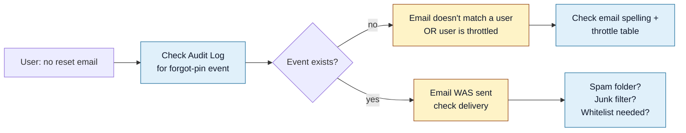

<Section id="symptoms" num="01 — Symptoms" title="The auth surface, in one paragraph">

Our operator-side authentication is **PIN-based** — every staff user has a 6-digit PIN (hashed at rest with bcrypt) that's the sole credential. When a user loses theirs, they submit the **Forgot PIN** form at `/forgot-pin`, which generates a single-use 6-digit code (15-min expiry, hashed in DB) and emails it via SMTP. The screen always shows a generic "Check your inbox…" confirmation — even when the email doesn't match a known user — to prevent user enumeration.

The catch: "I saw the confirmation" doesn't necessarily mean "the email was sent". This document covers the real causes of missed reset emails and the operational gotchas (especially the SMTP cert mismatch) that affect our delivery rate. Useful background for CareFirst when discussing how patient identity / operator auth differ in our system.

</Section>

<Section id="triage" num="02 — Triage" title="Triage flow">



The two genuine root causes:

1. **The email wasn't sent** — user typed the wrong email, or the throttle blocked it
2. **The email was sent but didn't land** — spam folder, mailbox-level filter, deliverability

Admin can tell them apart by checking **Audit Log → filter by action `forgot-pin`**. A row there means the email was sent.

</Section>

<Section id="spam" num="03 — Spam / junk" title="Spam folder check (do this first)">

The reset email comes from <code>noreply@carefirst.co.za</code>. Many mailbox providers route first-time external senders to junk by default.

### What the user should do

1. Open spam / junk / promotions folders
2. Search for "carefirst" or "PIN reset" or "noreply"
3. If found: mark as **Not Junk** so future emails arrive in inbox
4. Whitelist <code>noreply@carefirst.co.za</code> in mailbox rules / safe-senders

### If found in spam

That's the resolution — proceed with the reset using the code in the email. Setting a new PIN will sign all sessions out and the user can sign in with the fresh PIN.

</Section>

<Section id="throttle" num="04 — Throttle" title="Forgot-PIN throttle">

The forgot-PIN flow has its own throttle to prevent enumeration. Repeated requests for the same email or from the same IP get throttled silently — the screen still shows the generic confirmation, but no email is actually sent.

### Symptoms of being throttled

- Audit Log has NO `forgot-pin` event for the most recent request
- Audit Log has multiple `forgot-pin` events from the same IP / email within a short window

### Resolve

Wait the throttle window out (typically a few minutes) and try again. System_admin can clear the throttle from the **Security dashboard → Throttle table** in urgent cases.

<Callout title="Throttle is good design, not a bug">
Without throttle, a malicious actor could probe the user table by submitting many emails and watching response timing. The throttle is the cost of that defence. Avoid clearing it unless you're confident the request is legitimate.
</Callout>

</Section>

<Section id="typo" num="05 — Email typo" title="Email typo or wrong address">

Most "didn't arrive" reports trace back to a simple typo or the user submitting their personal email when the account uses their work address.

### Confirm the email on file

1. Open **User Management** as system_admin
2. Search for the user by name
3. Note the email on file
4. Compare against what the user is typing on the forgot-PIN form

If they don't match, the user is submitting an address that doesn't exist in our system. The system silently ignores it (enumeration protection). Have them resubmit using the correct email.

</Section>

<Section id="smtp" num="06 — SMTP cert mismatch" title="SMTP cert mismatch (server-side gotcha)">

<Pill variant="warn">Sysadmin only</Pill> If MULTIPLE users report missing emails simultaneously, the SMTP server is the suspect.

### Known gotcha

Our SMTP host is <code>mail.carefirst.co.za</code> — **not** <code>smtp.carefirst.co.za</code>. The cert is issued for <code>mail.</code>, so a misconfigured <code>SMTP_HOST</code> environment variable produces a TLS cert mismatch and silent send failures.

### Check

```bash
# On the VPS:
docker exec booking-app printenv | grep SMTP_
```

Expected:
- `SMTP_HOST=mail.carefirst.co.za`
- `SMTP_PORT=465`
- `SMTP_USER=noreply@carefirst.co.za`
- `SMTP_PASS=...` (set)

If `SMTP_HOST` is wrong, update Hostinger's Environment panel, then redeploy.

### Check the container logs

```bash
docker logs booking-app 2>&1 | grep -i "smtp\|mail"
```

Errors like `certificate mismatch`, `Hostname/IP does not match certificate` confirm the SMTP_HOST gotcha. Other errors (auth, rate limit) need separate investigation.

</Section>

<Section id="admin-reset" num="07 — Admin reset" title="Admin-side rescue">

If forgot-PIN is broken and the user is genuinely locked out, system_admin can rescue them without using the email flow at all.

### How

1. **User Management** → search for the user
2. Click **Manage** → **Reset PIN**
3. A new 6-digit PIN is auto-generated, hashed, and stored
4. Same email is sent to the user — same delivery path as forgot-PIN

### When email delivery itself is broken

If SMTP is down (e.g. cert mismatch), the admin's Reset PIN attempt will also fail to deliver. In that case:

1. Fix the SMTP env var (see [SMTP cert mismatch](#smtp)) before issuing further resets
2. As a last-resort escape hatch: a system_admin with DB access can set a known PIN hash directly. This is dangerous (no audit, no rotation) — only use it to bootstrap one admin who can then sign in and run the proper Reset PIN flow from the UI.

</Section>

<Section id="deliverability" num="08 — Deliverability" title="Long-term deliverability checks">

If "missed reset email" complaints become frequent (not just one-off), the underlying problem is likely deliverability, not the application.

### Things to check

- **SPF record** for <code>carefirst.co.za</code> includes the mail server's IP
- **DKIM** is configured for outgoing mail from <code>noreply@carefirst.co.za</code>
- **DMARC** policy is at least `p=quarantine` so receivers know our domain takes deliverability seriously
- **Bounce-back logs** on the mail server show whether specific receivers (Gmail, Outlook) are rejecting

These are infrastructure tasks, not application changes. Coordinate with the team that owns the carefirst.co.za DNS + mail server.

</Section>
