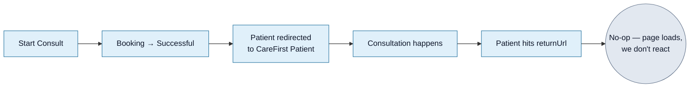

<Section id="what" num="01 — What" title="What returnUrl is">

In the SSO auto-register payload we send a `returnUrl` field:

```json
{
  ...
  "returnUrl": "https://<our-app>/patient-history"
}
```

This is where we ask CareFirst Patient to send the patient **after the consultation is complete** (or after they navigate away from the consult tab). Currently we point this at `/patient-history`, but the value is essentially a placeholder — there's no specific state we expect to read when the patient lands there.

</Section>

<Section id="current" num="02 — Current" title="What we do today (very little)">

When CareFirst redirects the patient to our `returnUrl`:

| What we read | What we do |
|---|---|
| Query parameters | Nothing — we ignore them |
| Referrer | Nothing — we don't read it |
| Cookies | Nothing — the patient isn't authenticated as an operator |

The patient effectively lands on a public page. If they happened to know an operator URL, the auth guard would bounce them to `/sign-in` — but as far as the booking flow goes, `returnUrl` is the **terminal step** from our perspective. The booking is already marked Successful at the moment of the handoff response, not at the return.



</Section>

<Section id="future" num="03 — Future" title="What we'd like to do (if you could send us anything)">

If the `returnUrl` redirect carried any state, we could:

- Mark the booking as **Consultation Started** vs **Consultation Complete** if we knew which it was
- Surface a friendlier landing page ("Thanks, your consult is done — your script will arrive by email" vs "You closed the consult tab")
- Trigger analytics events for completed consultations
- Pre-populate a post-consult survey or follow-up booking flow

Without state from CareFirst, all of this requires either the inbound webhook proposed in <a href="/reports/consultation-outcome-webhook">Consultation Outcome Webhook</a> or polling your API (which we'd rather not do).

</Section>

<Section id="query-params" num="04 — Query params" title="Query parameters we'd find useful">

If you could append these to `returnUrl` on redirect, we'd integrate against them:

```
https://<our-app>/patient-history
  ?reference=<our booking UUID>
  &status=completed | cancelled | abandoned
  &outcome=script | referral | no_action
  &returnedAt=<ISO 8601>
```

We'd verify `reference` matches a known booking and ignore anything that doesn't. The patient is unauthenticated, so we'd treat any redirect-borne signals as **soft** — we wouldn't change billing state on `returnUrl` alone, only on the matching server-to-server webhook.

Even just `status` would unlock a meaningful UX improvement: the patient lands on a page that knows whether to say "consultation complete" vs "tab closed".

</Section>

<Section id="states" num="05 — States" title="Patient state when they land on returnUrl">

The patient lands on our domain in one of these states:

| State | Booking on our side | What they probably want |
|---|---|---|
| Consult finished normally | <Pill variant="ok">Successful</Pill> | A "thanks, you're done" confirmation |
| Patient closed the tab mid-consult | <Pill variant="ok">Successful</Pill> | A "did you mean to leave?" prompt + how to resume |
| Patient hit a CareFirst error | <Pill variant="ok">Successful</Pill> | An error message + escalation path |
| Patient gave up before joining | <Pill variant="ok">Successful</Pill> | Same as "closed the tab" |

All four states resolve to the same booking status on our side because **we mark Successful at handoff, not at return**. The `returnUrl` page can't distinguish between these without a hint from CareFirst.

</Section>

<Section id="questions" num="06 — Questions" title="Open questions on the returnUrl contract">

1. **Are you currently appending any query params on redirect?** We're ignoring whatever you send today; if there's something there, we'd add a handler.
2. **Would adding `?reference=<bookingId>&status=<state>` to the redirect be feasible on your side?** Strictly a sender-side change; we can deploy our handler independently.
3. **Is there a distinct `returnUrl` for "consult complete" vs "patient cancelled"?** Some scheduling systems use multiple URLs for this. We currently send one — let us know if you'd prefer two.
4. **Should the returnUrl be patient-facing or operator-facing?** Today it's `/patient-history` (operator). Probably we should split: patient-facing thank-you for the redirect, operator-facing for the consultation-outcome webhook.

</Section>
