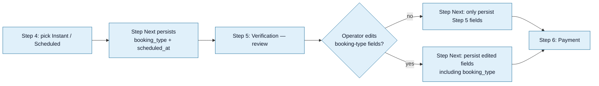

<Section id="dimension" num="01 — Dimension" title="The booking-type dimension">

Every booking has a `booking_type`: `instant` or `scheduled`. Captured on **Step 4** of the patient-details flow, between Contact (Step 3) and Verification (Step 5).

The choice doesn't change payment, vitals, or T&Cs — those happen identically either way. It only affects:

1. Whether we capture a date and time
2. Whether we send `bookingType` and `scheduledAt` to CareFirst
3. The mental model the operator builds with the patient ("you're being seen now" vs "your appointment is on Thursday")

</Section>

<Section id="instant" num="02 — Instant" title="Instant — the default">

<Pill variant="ok">Default</Pill> The patient is being seen now. After payment + T&Cs, Start Consult fires and CareFirst Patient opens immediately.

Step 4 for instant bookings: a single button "Instant Consult" — no further input. The operator moves to Step 5.

The auto-register payload sent for an instant booking:

```payload
{
  "clientCode":      "<...>",
  "uniqueReference": "<bookingId>",
  "user":            { /* identity, contact, address */ },
  "returnUrl":       "https://<our-app>/patient-history"
  // no bookingType, no scheduledAt
}
```

We deliberately omit `bookingType` rather than sending `"instant"` — `instant` is the absence of a scheduled-at, not a separate kind. Less surface area on your end.

</Section>

<Section id="scheduled" num="03 — Scheduled" title="Scheduled — date + time captured">

The patient is booking for a future slot. Step 4 surfaces:

- A date picker (modal-based, single date)
- A time picker (modal-based, HH:MM)

Both are required for Next to enable. We don't validate slot availability against CareFirst — see [Scheduling Integration RFC](/reports/scheduling-integration) for why this is a known weakness.

The auto-register payload sent for a scheduled booking:

```payload
{
  "clientCode":      "<...>",
  "uniqueReference": "<bookingId>",
  "user":            { /* identity, contact, address */ },
  "bookingType":     "scheduled",
  "scheduledAt":     "2026-05-14T09:30:00Z",
  "returnUrl":       "https://<our-app>/patient-history"
}
```

`scheduledAt` is stored UTC, displayed local, and sent as ISO 8601 with the `Z` suffix. We make no assumption about your timezone — you receive UTC and render it however you need.

</Section>

<Section id="payload-diff" num="04 — Payload diff" title="The single payload difference">

| Field | Instant | Scheduled |
|---|---|---|
| `bookingType` | (omitted) | `"scheduled"` |
| `scheduledAt` | (omitted) | ISO 8601 UTC |
| Everything else | Identical | Identical |

That's the whole difference at the wire level. Identity, payment, vitals, address — all the same.

</Section>

<Section id="persistence" num="05 — Persistence" title="Persistence and edit semantics">

Booking-type persistence has a subtle wrinkle that's worth knowing if you ever see odd `scheduledAt` values.



The catch: **auto-save (every 2 seconds during capture) doesn't carry booking-type or scheduled_at by default**. Only explicit "Next" clicks persist them. That's why Step 5 includes a re-persistence on Next click for any edits to booking-type fields.

In practice, this means a booking captured but never advanced past Step 4 may have a stale `scheduled_at` if the operator went back and changed it but never clicked Next. Edge case; rare.

</Section>

<Section id="gotchas" num="06 — Gotchas" title="Gotchas">

<Grid2>
<Card variant="warn" title="No slot-availability validation today">
We don't check with you whether the picked `scheduledAt` is a real bookable slot. The operator can pick 03:00 on a public holiday and we'll happily send it. CareFirst's auto-register either accepts or rejects — and rejection lands after payment. See <a href="/reports/scheduling-integration">Scheduling RFC</a>.
</Card>

<Card variant="warn" title="Timezone confusion is possible">
Operators see the time in their local timezone. We send UTC. If a patient says "I booked for 9:30" and your system shows "07:30 UTC", that's correct — same instant, different display. Surface the local time alongside UTC where useful.
</Card>

<Card variant="brand" title="No 'past time' check">
Today we don't refuse `scheduledAt` values in the past. If the operator picks yesterday's date, the booking goes through. CareFirst's response decides what happens next. Worth a discussion on whether your side validates this.
</Card>

<Card variant="brand" title="Booking-type can change post-create">
On Step 5 the operator can flip from Instant to Scheduled (or back). The `booking_type` column reflects the most recent choice at the moment of handoff.
</Card>
</Grid2>

</Section>

<Section id="multi-service" num="07 — Multi-Service" title="Relationship to Multi-Service config">

This dimension exists on **our** side today regardless of how the CareFirst client is configured. But its meaningfulness depends on Multi-Service:

- **Single-Service Instant Video client** — only `instant` is meaningful. `scheduled` likely lands the patient in an instant consult anyway, since the CareFirst client doesn't support scheduled.
- **Multi-Service client** — both are meaningful; CareFirst Patient renders different UIs.

See [Multi-Service Config](/reports/multi-service-config) for the related open questions about whether Step 4 should exist at all for Multi-Service clients.

</Section>
