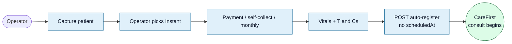
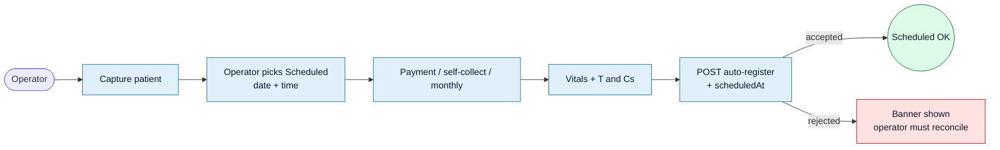
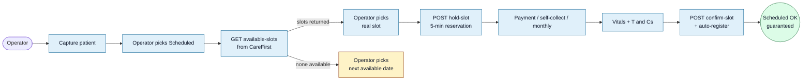

<Section id="context" num="01 — Context" title="What the booking system does today">

The 3rd Party Booking System acts as an **intake and payment gateway** for CareFirst-affiliated retail clinics. Operators capture patient details, take payment, and hand the consultation off to the CareFirst Patient app via the SSO auto-register endpoint (`POST /api/external/client-sso/auto-register`). On success, the patient receives a redirect URL that launches the virtual consultation.

Recently we introduced a **booking-type** dimension that splits bookings into two flavours:

- **Instant** — consult begins immediately after handoff.
- **Scheduled** — consult is for a future date and time, captured by the operator.

Combined with the three payment modes already in place (gateway / self-collect / monthly invoice), this produces three scheduling-relevant scenarios that we'd like the CareFirst team to evaluate.

### Today we send to CareFirst

| Field | Notes |
|---|---|
| `clientCode` + `planCode` | Client identity; unchanged across bookings. |
| `uniqueReference` | Our internal booking ID. |
| `user.{email,cellNumber,idNumber,userProfile}` | Standard SSO payload. |
| `bookingType: "scheduled"` | Only when operator picks "Scheduled" on Step 4. |
| `scheduledAt: ISO-8601` | Sent *as a request* — we do not currently verify availability before sending. |
| `returnUrl` | Where we redirect after the patient finishes. |

</Section>

<Section id="scenario-a" num="02 — Scenario A · baseline" title="Instant Consult">

<Pill variant="ok">Working today</Pill> The patient is seen straight away after payment + T&Cs. No scheduling concern. Included here for completeness, so the three scenarios can be compared side-by-side.

### Flow



### What we send to CareFirst

```payload
// POST /api/external/client-sso/auto-register
{
  "clientCode":       "<clientCode>",
  "uniqueReference":  "<bookingId>",
  "user": { /* email, idNumber, userProfile, ... */ },
  "returnUrl":        "https://<our-app>/patient-history"
  // no bookingType, no scheduledAt
}
```

### Failure modes today

- SSO rejected (e.g. *"already registered to a different account"*) — booking stays <Pill variant="warn">Payment Complete</Pill>, operator retries.
- Network / 5xx error — booking stays paid, operator retries from Patient History.

<Callout variant="ok" title="Ask for CareFirst">
None for instant flow — current contract works. Documented for context.
</Callout>

</Section>

<Section id="scenario-b" num="03 — Scenario B · current implementation" title="Scheduled Consult — Send Request">

<Pill variant="warn">Currently shipped</Pill> The operator picks any date + time on Step 4. We persist it on the booking, take payment, collect T&Cs, and then send `scheduledAt` to CareFirst on Start Consult. CareFirst is the source of truth for whether the slot is bookable — but we only find out *after* the patient has paid.

### Flow



### What we send to CareFirst

```payload
// POST /api/external/client-sso/auto-register
{
  "clientCode":       "<clientCode>",
  "uniqueReference":  "<bookingId>",
  "user": { /* email, idNumber, userProfile, ... */ },
  "bookingType":      "scheduled",
  "scheduledAt":      "2026-05-14T09:30:00Z",
  "returnUrl":        "https://<our-app>/patient-history"
}
```

### Known weakness — payment-before-validation

<Callout variant="warn" title="Risk surface">
Because the operator picks an arbitrary `scheduledAt` without consulting CareFirst's calendar, the slot may be unbookable for reasons we cannot see locally: clinician booked, outside operating hours, conflicts with another patient, public holiday, etc. Any rejection surfaces **after**:

- The patient has paid (PayFast / self-collect / monthly billing)
- T&Cs have been signed and stored
- The operator has clicked Start Consult

Recovery is operator-driven and ambiguous: re-pick + retry? Refund? Manual call to the patient? There is no automated reconciliation today.
</Callout>

### Questions for CareFirst on this flow

1. How does your API currently respond when `scheduledAt` falls outside an available slot? (Specific HTTP status, error body shape, retryable vs not.)
2. Is there an existing rule set (operating hours, lead time, max future days, clinician load) we can document and validate against locally?
3. If a slot is rejected, do you record the requested time anywhere so support can follow up, or is it discarded?

</Section>

<Section id="scenario-c" num="04 — Scenario C · proposed" title="Scheduled Consult — Display Available Slots">

<Pill variant="brand">Proposed</Pill> The operator only ever sees slots that CareFirst confirms are bookable. The slot is optionally held during payment and confirmed at handoff time — same atomic pattern PayFast already gives us for money. Failure shifts to the front of the flow (operator can't even propose an impossible time), eliminating the post-payment surprise.

### Flow



### What we'd need from CareFirst

<Grid2>
<Card variant="brand" title="1. List available slots">
**Endpoint shape (suggested):**

```payload
GET /api/external/scheduling/slots
  ?clientCode=<code>
  &fromDate=2026-05-12
  &toDate=2026-05-19

// Response (example)
{
  "slots": [
    { "start": "2026-05-12T09:00Z",
      "end":   "2026-05-12T09:15Z" },
    ...
  ]
}
```
</Card>

<Card variant="brand" title="2. Hold-then-confirm (optional but ideal)">
**Endpoints (suggested):**

```payload
POST /api/external/scheduling/hold
{ "slotStart": "...",
  "holdSeconds": 300 }
// → returns holdId

POST /api/external/scheduling/confirm
{ "holdId": "...",
  "uniqueReference": "<bookingId>" }
```
</Card>
</Grid2>

A minimum-viable subset of the above would be the *list-available-slots* endpoint alone — we would pre-check before submitting payment, which already shrinks the failure window from "after payment" to "before payment". Hold-then-confirm closes the remaining race condition (slot becomes unavailable between display and handoff).

### Benefits

- Operator only sees real, bookable slots — no "subject to availability" disclaimer needed.
- Patient is never charged for a slot that can't be honoured.
- Failure mode moves to the front of the flow, where it can be recovered cleanly.
- Same atomic guarantee PayFast already gives us for money — now extended to scheduling.

### Tradeoffs / acceptable costs

- Scheduled bookings depend on CareFirst's scheduling API being reachable.
- One extra round-trip in the Step 4 UX (acceptable — happens before payment).
- Slot-hold expiry needs UX handling (warn operator if hold elapses during payment).

### Questions for CareFirst on this flow

1. Is there an existing availability API we can call, or is this on the roadmap?
2. If yes, what's the granularity (per clinician, per clinic, per client) and the response shape?
3. Is a hold-then-confirm pattern supported, or only "request + confirm in one shot"?
4. What's the expected response time for the slot-list endpoint? (UX-impacting.)
5. Auth — same `x-api-key` as auto-register, or a separate credential?

</Section>

<Section id="comparison" num="05 — Comparison" title="Side-by-side">

| Concern | A — Instant | B — Scheduled, request | C — Scheduled, slot-display |
|---|---|---|---|
| Operator sees real availability? | N/A | <Pill variant="err">No</Pill> | <Pill variant="ok">Yes</Pill> |
| Slot can be rejected after payment? | N/A | <Pill variant="err">Yes</Pill> | <Pill variant="ok">No (held first)</Pill> |
| Recovery cost on rejection | N/A | High — refund / call patient | Low — pick another slot |
| CareFirst API surface needed | Auto-register only | Auto-register + `scheduledAt` | Auto-register + slot list (+ hold/confirm) |
| Dependency on CareFirst uptime for scheduled bookings | <Pill variant="ok">Low</Pill> | <Pill variant="warn">Medium (silent until handoff)</Pill> | <Pill variant="warn">Medium (fails fast — acceptable)</Pill> |
| Operational risk today | <Pill variant="ok">Acceptable</Pill> | <Pill variant="err">Payment-before-validation</Pill> | <Pill variant="ok">Designed around the risk</Pill> |

</Section>

<Section id="asks" num="06 — Asks" title="What we're asking from your team">

<Callout title="Primary asks">

1. **Confirm the failure mode for Scenario B.** What HTTP status + error body do you return when `scheduledAt` isn't bookable? Is it deterministic?
2. **Confirm whether an availability endpoint exists or is on the roadmap.** If yes, share the spec. If on the roadmap, share the expected timeline.
3. **Indicate whether a hold-then-confirm pattern is supported.** Optional but ideal — without it we still have a small race condition between display and handoff.

</Callout>

<Callout title="Secondary asks (related but lower priority)">

1. **Consultation-outcome webhook.** Today the integration is one-way after handoff — we never learn whether a consult actually happened, was cancelled, or resulted in a dispense. Even a minimal status-changed webhook would let us mark bookings <Pill variant="ok">Consultation Complete</Pill> (vs the current "Successful" = "handed off") and improve month-end invoice accuracy for monthly-billing clients.
2. **Stable `externalReferenceId`** in the auto-register response so we can quote it when raising support tickets. We currently extract it from the response opportunistically.

</Callout>

</Section>

<Section id="appendix" num="07 — Appendix" title="Current payload reference">

For completeness, the full body we POST to `/api/external/client-sso/auto-register` today. `bookingType` and `scheduledAt` are only present for scheduled bookings.

```payload
{
  "clientCode":       "<configured per environment>",
  "planCode":         "<optional>",
  "uniqueReference":  "<our booking UUID>",
  "user": {
    "email":        "patient@example.com",
    "cellNumber":   "+27...",
    "idNumber":     "<13-digit SA ID or passport>",
    "userProfile": {
      "title":         "MR | MRS | MS | ...",
      "firstName":     "...",
      "surname":       "...",
      "idNumberType":  "0 (National) | 1 (Passport) | 2 (Other)",
      "dateOfBirth":   "YYYY-MM-DD",
      "countryCode":   "za | bw | lso",
      "nationality":   "za | bw | lso",
      "gender":        "M | F | O | N",
      "fullAddress":   { /* address, suburb, city, province, country, postalCode */ }
    }
  },
  "bookingType":  "scheduled",         // only when scheduled
  "scheduledAt":  "2026-05-14T09:30:00Z", // ISO 8601, only when scheduled
  "returnUrl":    "https://<app>/patient-history"
}
```

</Section>
