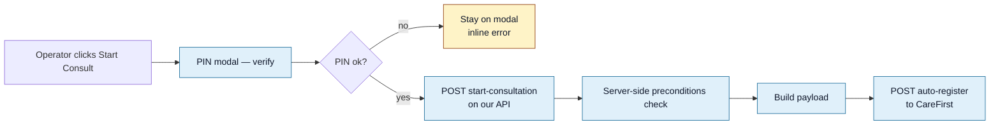

<Section id="endpoint" num="01 — Endpoint" title="The endpoint">

```
POST https://<CAREFIRST_API_DOMAIN>/api/external/client-sso/auto-register
```

`CAREFIRST_API_DOMAIN` is configured per environment (staging vs production). The call is made server-side from our Next.js API route at `/api/bookings/[id]/start-consultation`. The browser never sees this URL or the API key.

</Section>

<Section id="auth" num="02 — Auth" title="Authentication">

| Mechanism | Value |
|---|---|
| Header | `x-api-key: <per-client key>` — `CAREFIRST_API_KEY__<CODE>` for mapped clients, `CAREFIRST_API_KEY` default otherwise |
| Transport | HTTPS only |
| Audience | Per-environment AND per-client (one key per clinic group, shipped 2026-06-11) |
| Rotation | We can rotate keys via env-var update + redeploy; no breaking changes required |

Keys are stored as non-`NEXT_PUBLIC_` env vars only, so they never reach the client bundle — and **never in the database** (scheme B-ENV). Since 2026-06-11 each mapped client has its own key, resolved from the `.env` by the client's `carefirst_client_code`. See [Multi-Client Routing](/reports/multi-client-routing).

</Section>

<Section id="when" num="03 — When" title="When we call this">

The auto-register call fires when an operator clicks **Start Consult** on a booking whose status is <Pill variant="ok">Payment Complete</Pill>. Preconditions:

- Booking exists and is owned by an authorised actor (system_admin or unit_manager for that unit)
- Booking status is exactly `Payment Complete` (`In Progress` / `Successful` / `Abandoned` / `Discarded` are all refused with HTTP 409)
- Required patient fields are populated: `email_address`, `contact_number`, `id_number`, `first_names`, `surname`
- Caller passed PIN verification at the modal layer just before the API was invoked



</Section>

<Section id="payload" num="04 — Payload" title="Request body — every field">

The full body we POST.

```json
{
  "clientCode":      "<resolved per-client; env default fallback>",
  "uniqueReference": "<our booking UUID>",
  "user": {
    "email":      "patient@example.com",
    "cellNumber": "+27...",
    "idNumber":   "<13-digit SA ID or passport>",
    "userProfile": {
      "title":         "MR | MRS | MS | MISS | MASTER | DR | PROF | REV | DS",
      "firstName":     "...",
      "surname":       "...",
      "idNumberType":  0,
      "dateOfBirth":   "YYYY-MM-DD",
      "countryCode":   "za | bw | lso",
      "nationality":   "za | bw | lso",
      "gender":        "M | F | O | N",
      "fullAddress": {
        "address":    "...",
        "suburb":     "...",
        "city":       "...",
        "province":   "...",
        "country":    "...",
        "postalCode": "..."
      }
    }
  },
  "returnUrl":   "https://<our-app>/patient-history"
}
```

### Field-by-field

| Field | Source on our side | Notes |
|---|---|---|
| `clientCode` | `clients.carefirst_client_code` (env `CAREFIRST_CLIENT_CODE` fallback) | **Now per-client** (shipped 2026-06-11) — resolved from the booking's owning client; un-mapped clients fall back to the env default. See [Multi-Client Routing](/reports/multi-client-routing). |
| `planCode` | `clients.carefirst_plan_code` (env `CAREFIRST_CLIENT_PLAN_CODE` fallback) | Same as `clientCode`. Pairs with it; resolved per-client. |
| `uniqueReference` | `bookings.id` (UUID) | One value per booking; safe to use as your idempotency key |
| `user.email` | `bookings.email_address` | Captured at patient-details step 3 |
| `user.cellNumber` | `bookings.contact_number` | Strict E.164 (`+27…`) — validated and normalised on capture |
| `user.idNumber` | `bookings.id_number` | 13-digit SA ID OR passport string |
| `user.userProfile.title` | `bookings.title` | Mapped to your enum (see below) |
| `user.userProfile.firstName` | `bookings.first_names` | Combined first names; can be one word |
| `user.userProfile.surname` | `bookings.surname` | Single string |
| `user.userProfile.idNumberType` | Derived from `bookings.id_type` | `0` National, `1` Passport, `2` Other |
| `user.userProfile.dateOfBirth` | `bookings.date_of_birth` | Always `YYYY-MM-DD` |
| `user.userProfile.countryCode` | `bookings.country_code` | `za` / `bw` / `lso` only |
| `user.userProfile.nationality` | `bookings.nationality` | Same enum as `countryCode` |
| `user.userProfile.gender` | `bookings.gender` | First character upper-cased, defaulted to `N` |
| `user.userProfile.fullAddress` | `bookings.{address,suburb,city,...}` | `null` if `address` or `city` is blank |
| `returnUrl` | `<APP_URL>/patient-history` | We send the operator back here after the patient finishes |

### Title enum

We map our captured `title` field through this whitelist; values outside it become `null`:

```
MR · MRS · MS · MISS · MASTER · DR · PROF · REV · DS
```

</Section>

<Section id="response" num="05 — Response" title="Response handling">

We treat any **2xx** as success and look for two pieces of information in the response body:

| Field we look for | Used for |
|---|---|
| `redirectUrl` (or `redirect_url` / `url` / `ssoUrl`) | The URL we open in the operator's new tab |
| `referenceId` (or `reference_id` / `patientId` / `sessionId`) | Stored as `external_reference_id` on the booking |

We try a few common field names defensively because the response shape hasn't been pinned in writing. On a **stable contract**, we'd prefer:

```json
{
  "redirectUrl": "https://<your-domain>/sso/...",
  "referenceId": "..."
}
```

If we receive a 2xx but **no** `redirectUrl`, we still mark the booking <Pill variant="ok">Successful</Pill> — we assume the patient is registered — but raise a warning banner for the operator to contact support.

</Section>

<Section id="errors" num="06 — Errors" title="Errors we handle">

We look for error reasons in this order of field-name preference (first match wins):

```
displayMessage > errorMessage > message > error > detail > title
```

That covers the shape we observed in production (`{ result: false, displayMessage: "...", errorMessage: "..." }`) plus standard REST conventions for future-proofing.

| HTTP status | Our action | Booking status |
|---|---|---|
| `2xx` | Mark Successful, store `redirectUrl`, open tab | <Pill variant="ok">Successful</Pill> |
| `4xx` with displayMessage | Show banner verbatim; record `handoff_status=failed`, `handoff_error_reason` | <Pill variant="ok">Payment Complete</Pill> (unchanged, retry-able) |
| `5xx` / network error | Same as above; operator can retry | <Pill variant="ok">Payment Complete</Pill> (unchanged) |

Specific error strings we've encountered and surface to operators:

| Reason | Frequency | Operator action |
|---|---|---|
| `"Already registered to a different account"` | Most common | Investigate identity collision; we have an upstream identity-lock that catches most |
| `"HTTP 500"` / `"HTTP 502"` / network | Occasional | Wait, retry |
| `"Missing required..."` | Rare on our side (we pre-validate) | Reopen booking, fill missing field |

</Section>

<Section id="retries" num="07 — Retries" title="Retries and idempotency">

Operators can retry as many times as they want. Each attempt:

1. Increments `bookings.handoff_attempt_count`
2. Updates `bookings.last_handoff_attempt_at`
3. Updates `bookings.handoff_error_reason` (overwrites — only the latest reason is kept; full history is in our audit log)

We use the booking UUID as `uniqueReference`. **You can treat it as an idempotency key** — repeated POSTs with the same `uniqueReference` should produce the same `redirectUrl` (or, if you don't deduplicate, we'll just open the latest one).

If the booking is already <Pill variant="ok">Successful</Pill> on our side and we have a stored `handoff_redirect_url`, **we return the stored URL without making a fresh call to your API**. So a "retry" on an already-handed-off booking is purely client-side from your perspective — no extra load.

</Section>

<Section id="questions" num="08 — Open questions" title="Open questions on this contract">

In rough priority order:

1. **Per-client `clientCode` + `planCode` — RESOLVED & SHIPPED 2026-06-11.** Each booking now routes to its owning client's CareFirst account, with a per-client API key (scheme B-ENV). FCS and International SOS are mapped and live-verified; Local Choice and Zoie remain on the env default until CareFirst issues their codes. Full design in [Multi-Client Routing](/reports/multi-client-routing).
2. **Stable `referenceId` field.** Can you commit to a field name so we can stop opportunistic parsing? We'd suggest top-level `referenceId` returning your patient or session identifier.
3. **Field name for `redirectUrl`** — same question. Pin one name, we'll use it exclusively.
4. **Error body shape.** Can we standardise on `{ displayMessage, errorMessage, errorCode }`? `errorCode` (an enum / string token, not human-readable) would let us route operators to the right scenario without parsing English strings.
5. **Multiple environments.** Confirm staging/production endpoint URLs, API key issuance process, and any rate limits.

</Section>
