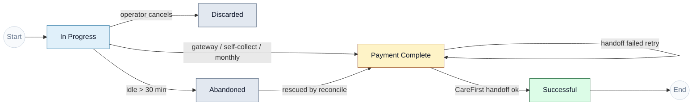
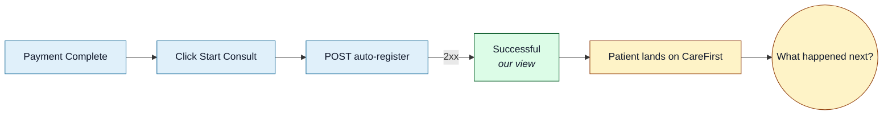

<Section id="overview" num="01 — Overview" title="What this document covers">

Every booking in our system has exactly **one status** at any given moment. The status reflects only what **we** know — we can observe up to the SSO handoff response, but not what happens once the patient lands in CareFirst Patient.

This means our terminal status, <Pill variant="ok">Successful</Pill>, marks a successful **handoff** — not a successful **consultation**. The distinction matters for monthly billing and audit completeness. This doc explains how we model the lifecycle today and what we'd need from CareFirst to close the visibility gap.

</Section>

<Section id="state-diagram" num="02 — State diagram" title="The state diagram">



</Section>

<Section id="statuses" num="03 — Statuses" title="What each status means">

| Status | Triggered by | Reachable from |
|---|---|---|
| <Pill variant="brand">In Progress</Pill> | Operator started a booking | Initial state |
| <Pill variant="ok">Payment Complete</Pill> | Payment confirmed (PayFast ITN, self-collect mark, monthly auto-mark) OR rescue from Abandoned | In Progress, Abandoned, Payment Complete (failed handoff retry) |
| <Pill variant="ok">Successful</Pill> | CareFirst auto-register returned 2xx | Payment Complete |
| <Pill variant="mute">Abandoned</Pill> | No activity for &gt; 30 minutes mid-flow | In Progress |
| <Pill variant="mute">Discarded</Pill> | Operator clicked Discard | In Progress |

<Callout title="Payment-mode tint on Payment Complete">
On the UI, <b>Payment Complete</b> is sub-tinted by how the payment came in:<br/>
<b>Yellow</b> — PayFast gateway · <b>Amber</b> — Self-collect at unit · <b>Blue</b> — Monthly invoice
<br/><br/>
This is purely informational; the canonical status is still <b>Payment Complete</b> regardless of route.
</Callout>

</Section>

<Section id="handoff-fields" num="04 — Handoff fields" title="Handoff-related fields on the booking row">

When the auto-register call fires, we update these fields:

| Column | When it updates | What it holds |
|---|---|---|
| `handoff_status` | Every attempt | `sent` (succeeded) or `failed` (rejected) |
| `handoff_error_reason` | Only on failure | Latest error string, parsed from your response body |
| `handoff_attempt_count` | Every attempt | Increments by 1 each time |
| `last_handoff_attempt_at` | Every attempt | UTC timestamp |
| `handed_off_at` | Only on success | UTC timestamp of the successful call |
| `handoff_redirect_url` | Only on success | The URL we extracted from your response |
| `external_reference_id` | Only on success | The ID we extracted from your response (if present) |

Full audit detail (actor, IP, before/after states) lives in our `audit_log` table.

</Section>

<Section id="successful-gap" num="05 — Successful gap" title='Why "Successful" ≠ "consultation complete"'>

Our <Pill variant="ok">Successful</Pill> status means: **CareFirst Patient's auto-register endpoint returned 2xx and we opened the redirect URL in a new tab.** That's the entirety of what we know.

What we **don't** know:

- Did the patient actually start the consultation, or close the tab?
- Did the consultation complete, or did the patient or clinician disconnect mid-way?
- Was a script issued?
- Was the patient referred elsewhere?



The terminal state from our perspective is the handoff itself. Everything after the dashed line is opaque to us.

</Section>

<Section id="implications" num="06 — Implications" title="What this means for CareFirst">

The gap has three operational consequences worth flagging.

<Grid2>
<Card variant="warn" title="Month-end billing for monthly-invoice clients">
Clients on <code>bill_monthly</code> are invoiced per booking handed off — not per consultation completed. If a meaningful percentage of handed-off bookings don't result in actual consultations (e.g. patient drops off after seeing the consult tab), the invoiced quantity overstates the service delivered.
</Card>

<Card variant="warn" title="No-show tracking is blind">
We have no way to know whether the patient actually attended the consultation after handoff. The booking sits at <code>Successful</code> regardless of attendance. Reporting on no-show rates is impossible from our side alone.
</Card>

<Card variant="warn" title="Support requires cross-system lookups">
When a patient calls support saying "I never had my consultation", we can confirm the handoff happened but can't see what happened in CareFirst Patient. Support has to call your team to get the full picture.
</Card>

<Card variant="brand" title="What we DO have visibility of">
Every step before handoff — payment, vitals captured, T&Cs accepted, exact patient data sent, error reasons, retry counts. The opacity is purely post-handoff.
</Card>
</Grid2>

</Section>

<Section id="webhook-ask" num="07 — Webhook ask" title="The consultation-outcome webhook ask">

The cleanest fix is a **webhook from CareFirst to us** that fires on consultation state changes. Minimal shape:

```json
POST https://<our-app>/api/webhooks/carefirst/consultation-status
Authorization: x-api-key <shared-secret>

{
  "referenceId": "<the externalReferenceId we stored>",
  "uniqueReference": "<the booking UUID we sent originally>",
  "status": "started | completed | cancelled | no_show",
  "occurredAt": "2026-05-14T09:35:12Z",
  "outcome": {
    "scriptIssued": true,
    "referredTo": "...",
    "notes": "optional"
  }
}
```

What we'd do with it:

| Webhook status | Our action |
|---|---|
| `started` | Track time-to-start metrics; informational only |
| `completed` | Mark booking <Pill variant="ok">Consultation Complete</Pill> (new status); update monthly-billing counter |
| `cancelled` | Mark <Pill variant="mute">Consultation Cancelled</Pill> (new status); flag for monthly invoice exclusion |
| `no_show` | Mark <Pill variant="mute">No-show</Pill> (new status); flag for monthly invoice exclusion |

Even a barebones `completed`/`no_show` toggle would close most of the gap.

</Section>
