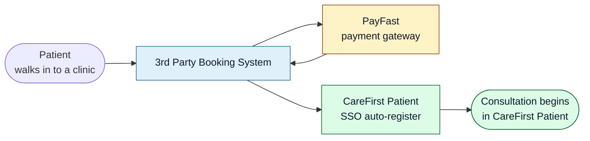

<Section id="tldr" num="01 — TL;DR" title="The 30-second version">

The **3rd Party Booking System** is an **intake-and-payment gateway** that sits in front of CareFirst Patient. It captures patient details, takes payment from the patient, captures vital signs, gets T&Cs accepted, and then hands the patient over to CareFirst Patient via the existing SSO auto-register endpoint.

We **do not** run the consultation. We don't store medical data beyond the vitals taken at intake. Once the SSO handoff succeeds, the patient is in your application's hands — we mark the booking <Pill variant="ok">Successful</Pill> on our side and step out of the way.

</Section>

<Section id="role" num="02 — Role" title="Our role in the ecosystem">



We sit **between** the patient and CareFirst Patient. The patient never sees CareFirst Patient until our handoff completes — they only see our UI (operator-driven on a clinic workstation, or self-service via a payment link). Once we hand off, CareFirst Patient takes over and the patient is no longer aware of us.

</Section>

<Section id="actors" num="03 — Actors" title="Who uses it">

| Actor | Role | What they do |
|---|---|---|
| **Operator** | Clinic staff at a workstation | Captures the patient, takes payment, runs the booking through to handoff |
| **Unit manager** | Clinic supervisor | Manages operators in their unit(s), runs Start Consult for non-managers, reconciles payments |
| **System admin** | First Care Solutions / CareFirst central ops | Manages clients, units, billing settings, audit log, security dashboard |
| **Patient** | End user | Provides their info to the operator, pays, accepts T&Cs — then meets CareFirst Patient |

A "**client**" in our system is a brand or organisation that owns one or more "**units**" (physical or virtual clinic sites). Each client has its own branding, payment configuration, and operator team.

</Section>

<Section id="scope" num="04 — Scope" title="What we own and don't own">

<Grid2>
<Card variant="brand" title="What we own">
- Patient identity capture (ID/passport/DOB, name, contact, address)
- Payment collection (PayFast gateway, self-collect at unit, monthly invoice)
- Vital-signs capture (BP, glucose, temp, O₂, heart rate)
- Terms and Conditions acceptance + timestamp
- Operator session management, PIN security, audit logging
- Per-client branding and billing configuration
- The SSO auto-register call to CareFirst Patient
</Card>

<Card variant="ok" title="What CareFirst owns">
- The consultation itself (video, clinician matching, scripts)
- Patient identity reconciliation (we send what we captured; you decide if it matches your records)
- Scheduling and slot management (currently we send `scheduledAt` as a request; see <a href="/reports/scheduling-integration">Scheduling RFC</a>)
- Medical records beyond intake vitals
- Anything that happens after our handoff returns 200
</Card>
</Grid2>

The boundary is the **`POST /api/external/client-sso/auto-register`** call. Everything before that POST is us. Everything after the patient lands on your `redirectUrl` is you.

</Section>

<Section id="stack" num="05 — Stack" title="Tech stack at a glance">

| Layer | Choice | Notes |
|---|---|---|
| Frontend | Next.js 16 (App Router) + React 19 | Server components where possible, client where needed for interactivity |
| Auth + DB | Supabase (Postgres + Auth) | Real RLS — operators only see their unit's bookings, enforced server-side |
| Payments | PayFast (sandbox + production) | Both ITN webhook and Transaction History API for reconcile |
| Email | SMTP via `mail.carefirst.co.za:465` | Used for PIN reset / invite codes |
| Hosting | Docker on Hostinger VPS | Traefik reverse proxy, currently HTTP-only (HTTPS pending domain rollout) |
| Audit | `audit_log` table + cookie-based CSRF | Every state-changing action recorded with actor + IP |

We're a fairly standard Next.js + Supabase application. Nothing exotic. The integration with CareFirst happens entirely through your HTTPS-only API — no shared database, no message queue, no shared file storage.

</Section>

<Section id="touchpoints" num="06 — Touchpoints" title="Where we touch CareFirst">

Today, there's exactly **one** outbound API call from our system to yours:

```
POST https://<your-api-domain>/api/external/client-sso/auto-register
```

Authenticated with `x-api-key` (configured per environment). Sent once per booking, after payment is complete and T&Cs are accepted. Full contract is in [SSO auto-register — the contract](/reports/sso-auto-register).

There is currently **no inbound** channel from CareFirst to us. That's intentional in v1, but it limits what we can observe — see [Status lifecycle](/reports/status-lifecycle) for the consequences and [Scheduling RFC](/reports/scheduling-integration) for the proposed extensions.

</Section>

<Section id="roadmap" num="07 — Roadmap" title="What we'd like next from CareFirst">

In rough priority order:

1. **Slot-availability API** — so we can show the operator real bookable slots instead of sending `scheduledAt` blind. Detail: <a href="/reports/scheduling-integration">Scheduling RFC</a>
2. **Consultation-outcome webhook** — so we can mark bookings <Pill variant="ok">Consultation Complete</Pill> (vs the current `Successful = handed off`) and improve month-end invoice accuracy
3. **Stable `externalReferenceId` in the auto-register response** — so we can quote it in support tickets without doing opportunistic parsing

These are documented as standalone RFCs in the **Open Questions / RFCs** category.

</Section>
