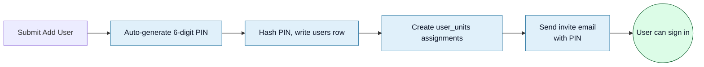
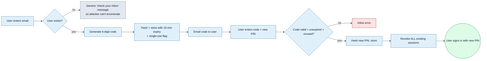

<Section id="roles" num="01 — Roles" title="Roles & what they can do">

Three roles, hard-enforced server-side via RLS and route guards.

| Role | Can do | Cannot do |
|---|---|---|
| <Pill variant="brand">system_admin</Pill> | Everything — manage clients, units, users, settings, audit log, security dashboard, reconcile | Nothing restricted |
| <Pill variant="brand">unit_manager</Pill> | Manage users and units **within their assigned units**, run Start Consult, manual confirm payments, edit bookings | Add clients, see audit log / security, edit other units |
| <Pill variant="brand">user</Pill> | Create bookings, capture vitals, accept T&Cs on behalf of patients | Run Start Consult, manual confirm, manage other users |

<Callout variant="warn" title="Unit scoping is per-assignment, not per-role">
A unit_manager only sees and acts on bookings/users in <b>their</b> assigned units. A manager assigned to "Sandton Pharmacy" can't manage users at "Rosebank Pharmacy" even though their role is the same. Add multiple unit assignments if the same person needs broader access.
</Callout>

</Section>

<Section id="invite" num="02 — Invite" title="Inviting a new user">

**User Management → Add User**. The form is short and the process is the same regardless of role.

| Field | Notes |
|---|---|
| First names + surname | Display name in the operator UI |
| Email | Sign-in identity — must be unique across the system |
| Role | <code>system_admin</code> / <code>unit_manager</code> / <code>user</code> |
| Client + units | Which units they can act on (see [next section](#units)) |
| Status | Defaults to **Active** |

On submit:

The PIN appears in the invite email and is **never shown again in the admin UI** — it's hashed at rest. If the user loses it, use [Forgot PIN](#forgot) (they'll get a new one).

<Callout title="Email troubleshooting">
Invites go through SMTP at <code>mail.carefirst.co.za:465</code> (not <code>smtp.</code> — cert mismatch). If invites aren't arriving:
<ol>
<li>Check the user's spam/junk folder first</li>
<li>Check <b>Audit Log</b> — the user creation event will be there even if email failed</li>
<li>System admin can trigger a manual <b>Reset PIN</b> from the user's row, which sends a fresh email</li>
</ol>
</Callout>

</Section>

<Section id="units" num="03 — Units" title="Assigning units">

A user can belong to **one or more units**. Their assigned units determine what they can see:

- Patient History rows are filtered to the active unit (plus any other units they can switch to)
- Create Booking creates against the **active unit**
- Manage Unit pages are gated on assignment

<Grid2>
<Card variant="brand" title="Adding units to an existing user">
<b>User Management → \[user name\] → Manage</b>. The Units section lists current assignments with an "Add unit" button. system_admin can assign any unit; unit_manager can only assign units they themselves belong to.
</Card>

<Card variant="brand" title="Active unit switching">
When a user has multiple units, they pick the active one via <b>Switch Unit</b> in the sidebar. The active unit drives branding (logo/accent), Patient History filter default, and Create Booking target.
</Card>
</Grid2>

</Section>

<Section id="pin-basics" num="04 — PIN basics" title="How PINs work">

The system uses **6-digit numeric PINs** for sign-in and for high-stakes actions (Start Consult, Manual confirm, T&Cs accept for managers).

| Property | Detail |
|---|---|
| Storage | Hashed at rest using bcrypt; the plaintext never persists |
| Comparison | Constant-time via the auth backend — no timing side-channel |
| Length | Always 6 digits, generated with `crypto.getRandomValues` |
| Initial issue | At account creation; emailed once, never re-displayed |
| Lifetime | No automatic expiry — but you can rotate via Reset PIN at any time |

<Callout variant="warn" title="PIN is the sole credential">
There's no password fallback. Lose the PIN → use Forgot PIN. There's no "I remember my username, just not my PIN" — the PIN <i>is</i> the credential.
</Callout>

</Section>

<Section id="forgot" num="05 — Forgot PIN" title="Forgot-PIN flow">

Self-service flow at `/forgot-pin`. The user enters their email and receives a one-time 6-digit code that lets them set a new PIN.

Key behaviours:

- **Single-use** — the code can be used once. Re-requesting one invalidates the previous.
- **15-minute expiry** — long enough to switch tabs and find the email, short enough to limit exposure.
- **Hashed in DB** — even a leaked DB row doesn't reveal the code.
- **All sessions revoked on reset** — if an attacker had a session, it's killed.
- **Email enumeration protected** — same response for unknown email vs known email, so attackers can't probe the user table.

### Admin-initiated reset

A system_admin can reset any user's PIN from **User Management → \[user\] → Reset PIN**. The mechanism is the same as Forgot PIN but bypasses the code step — a fresh PIN is auto-generated and emailed. Useful when a user can't access their email (e.g. former employee, mailbox dead) and the admin needs to hand the PIN to them by another channel.

</Section>

<Section id="throttle" num="06 — Throttle" title="Lockouts & throttle">

Wrong-PIN attempts are throttled to make brute-force attacks impractical.

<Grid2>
<Card variant="warn" title="Shared throttle key">
Throttle is keyed on <b>(IP address, unit)</b>, not just (IP) or just (user). This means a malicious actor can't bypass the throttle by trying many user emails from the same IP, but legitimate users on a shared NAT (e.g. a clinic on one ADSL) aren't all locked out by one person's bad PIN.
</Card>

<Card variant="warn" title="Window">
After N consecutive failures, the user must wait the throttle window out. The error message tells them how long. The window grows with repeated failures (exponential backoff) to deter persistent attacks.
</Card>
</Grid2>

### What to do when a legitimate user is locked out

1. Confirm the email is right — most lockouts are typos
2. Have them wait the displayed window out (usually a few minutes)
3. If they're sure of the PIN but it's still failing, the PIN may have changed — run **Reset PIN** for them
4. As a last resort, system_admin can clear the throttle from the **Security dashboard → Throttle table**

</Section>

<Section id="deactivate" num="07 — Deactivate" title="Deactivating users">

When someone leaves the team or no longer needs access, **deactivate** rather than delete. Deactivation preserves the audit trail and any booking validator references; deletion would break those.

**User Management → \[user\] → Set status to Disabled**. The user immediately loses sign-in access (their next attempt to sign in is refused) and all active sessions are revoked.

<Callout variant="warn" title="Reactivating is safe">
A disabled user can be flipped back to Active without losing their unit assignments or audit history. Their PIN is still valid — they sign in with the same PIN as before. If you also want to rotate the PIN on re-activation (recommended for ex-employees who've returned), run <b>Reset PIN</b> on the same row.
</Callout>

</Section>

<Section id="troubleshoot" num="08 — Troubleshooting" title="Common situations">

<Grid2>
<Card variant="warn" title="User says invite email never arrived">
1. Check Audit Log — does the user creation event exist? 
2. If yes, mailbox issue: check spam, ask user to whitelist <code>noreply@carefirst.co.za</code> 
3. As admin, run <b>Reset PIN</b> to send a fresh email with a new PIN
</Card>

<Card variant="warn" title="User locked out but can't remember PIN">
1. Wait the throttle window out (a few minutes typically) 
2. Run <b>Reset PIN</b> for them — fresh PIN emailed 
3. Or have them use the self-service <code>/forgot-pin</code> page
</Card>

<Card variant="warn" title="User can sign in but doesn't see their unit">
1. Check <b>User Management → \[user\] → Manage → Units</b> — are they assigned? 
2. If not, add the assignment 
3. The user needs to sign out and back in (or switch unit) to see the change
</Card>

<Card variant="warn" title="Two users sharing one mailbox">
Not supported. Email must be unique per user — it's the sign-in identity. If two people legitimately need to share an access point (e.g. a shared station), create one account for the station with a generic email like <code>station-3@client.com</code>.
</Card>
</Grid2>

</Section>
