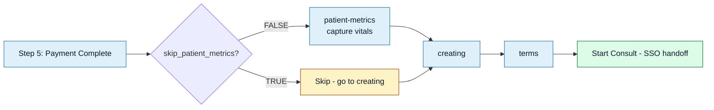

<Section id="what-we-capture" num="01 — What we capture" title="The five vitals">

After payment and before T&Cs, the operator captures five measurements at the unit:

| Vital | Unit | Column |
|---|---|---|
| Blood pressure | mmHg (systolic / diastolic) | `bp_systolic` + `bp_diastolic` |
| Blood glucose | mmol/L | `glucose` |
| Body temperature | °C | `temperature` |
| Oxygen saturation | % | `oxygen_saturation` |
| Heart rate | bpm | `heart_rate` |

All five are optional individually but the page expects most of them to be filled in for a complete capture. Operators can submit with blanks if a measurement device is broken or the patient declined.

</Section>

<Section id="when" num="02 — When" title="When in the flow">



Vitals capture sits **after** payment and **before** T&Cs. The data is part of the booking row by the time T&Cs are accepted and the handoff fires.

</Section>

<Section id="storage" num="03 — Storage" title="How we store it">

Stored as five columns on the same `bookings` row as everything else. No separate vitals table — keeping it denormalised makes pulling a complete booking record (one row) simple and avoids joins for the auto-register payload that **could** carry them.

| Column | Type | Constraint |
|---|---|---|
| `bp_systolic` | `int` | nullable, range-validated client-side |
| `bp_diastolic` | `int` | nullable, range-validated client-side |
| `glucose` | `numeric(4,1)` | nullable |
| `temperature` | `numeric(4,1)` | nullable |
| `oxygen_saturation` | `int` | nullable, 0–100 |
| `heart_rate` | `int` | nullable |

Range validations are at the input UI only — the database accepts any number in range for the type. Operators see ranges suggested ("normal range: 60–100 bpm") as hints, not blocking errors.

</Section>

<Section id="skip" num="04 — Skip" title="When vitals are skipped">

The `skip_patient_metrics` client flag bypasses this step entirely. Rules:

| `collect_payment_at_unit` | `bill_monthly` | `skip_patient_metrics` | Vitals captured? |
|---|---|---|---|
| FALSE | FALSE | (any) | **Always captured** (the flag is ignored for gateway payment) |
| TRUE | FALSE | FALSE | Captured |
| TRUE | FALSE | TRUE | **Skipped** |
| FALSE | TRUE | FALSE | Captured |
| FALSE | TRUE | TRUE | **Skipped** |

The flag only takes effect when payment isn't going through PayFast — the rationale being that clients running self-collect or monthly-invoice tend to be lighter-touch operations where vitals at every visit add friction.

For skipped bookings, all five columns stay `null`.

</Section>

<Section id="sent" num="05 — Sent" title="Sent to CareFirst (since 2026-06-03)">

All five vitals are forwarded to CareFirst inside the SSO auto-register payload as a `user.vitals` sub-object. See [SSO Auto-Register — The Contract](/reports/sso-auto-register#payload) for the full payload shape.

```json
"user": {
  ...identity / contact / address fields...,
  "vitals": {
    "bloodPressure":    "120/80",
    "glucose":          "5.4",
    "temperature":      "36.5",
    "oxygenSaturation": "98",
    "heartRate":        "72",
    "capturedAt":       "2026-06-03T10:30:00.000Z"
  }
}
```

<Callout title="Speculative — not yet in your published schema" variant="warn">
Neither your TypeScript interface (<code>UserValidationPayloadI</code>) nor your Postman collection currently defines a <code>vitals</code> block. We send it on the assumption that your endpoint silently ignores unknown fields. If your validation is strict and the payload is rejected, tell us — we'll either gate behind a per-client flag or pause until your schema catches up.
</Callout>

### Shape decisions

- **Strings, not numbers.** `bloodPressure` is a single composite string (`"120/80"`) since that's how operators enter it. The other readings are numeric values typed as text on the bookings row, and we forward them as-is to preserve exactly what was captured.
- **Block omitted when empty.** If every reading is null/empty (which is the case for `skip_patient_metrics` clients), the `vitals` key is absent from the payload entirely — we don't send `vitals: null`.
- **`capturedAt` is best-effort.** It's the booking row's `updated_at` timestamp, not specifically the vitals-capture event. In the typical flow, metrics are the last thing touched before T&Cs, so it's a usable proxy — but `updated_at` is also bumped by terms acceptance and other late-flow changes.
- **No unit annotations.** Units aren't sent alongside values (e.g. no `{ value: "5.4", unit: "mmol/L" }`); we assumed standard units (mmHg / mmol/L / °C / % / bpm). Worth confirming with you.

### Why ship it speculatively

- POPIA's minimisation principle is about not sending what isn't useful, not about deliberately withholding clinically useful data; vitals at handoff are clinically useful.
- Clinicians seeing pre-consult readings can triage urgency (BP 200/120 → seen first), skip re-capture if our readings are recent, or trend against history if you store longitudinally.
- The risk of being silently ignored by an undefined field is lower than the risk of waiting for a schema change that may take months.

</Section>

<Section id="questions" num="06 — Questions" title="Open questions for CareFirst">

1. **Are you OK with the field names + types we chose?** If your team has a preferred schema (e.g. `intakeMetrics` with `{ value, unit }` sub-objects, numbers instead of strings), tell us and we'll switch.
2. **Does your auto-register endpoint reject unknown fields under strict validation?** If yes, the payload may currently be failing for clients that have vitals captured. Easy fix: we'll gate behind a per-client flag until your schema is updated.
3. **Does CareFirst Patient have an "intake observations" surface** where these would land? Or would they need a new section?
4. **POPIA / data-sharing implications.** Vitals are health data under POPIA. Forwarding them to your application creates joint-controller responsibilities — worth a separate compliance conversation now that they're being sent.
5. **Trending against history.** Do your clinicians see incoming vitals as standalone readings or as part of a longitudinal record?
6. **Authority / overwrite rules.** If CareFirst captures vitals again during the consult, do ours stay as "pre-consult" and theirs as "in-consult", or do they overwrite? Affects how clinicians interpret them.

</Section>
