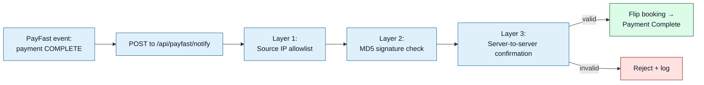

<Section id="why" num="01 — Why" title="Why this matters">

If CareFirst builds the proposed [Consultation Outcome Webhook](/reports/consultation-outcome-webhook) (or any other inbound integration), the security model needs to be airtight. A spoofed webhook from a malicious actor could:

- Mark a real booking as `Consultation Complete` when nothing happened — affects monthly billing
- Mark a real booking as `No-show` when the consult succeeded — affects monthly billing the other way
- Inject arbitrary patient outcome data into our records
- Affect downstream metrics and reporting

We already accept one webhook (PayFast ITN). This document captures how we secure it today and what we'd expect for any new inbound integration.

</Section>

<Section id="payfast" num="02 — PayFast" title="How PayFast ITN is secured today">



The PayFast ITN goes through **three independent verification layers** before we trust it. Any one of them failing rejects the request.

</Section>

<Section id="layers" num="03 — Layers" title="The three layers">

### Layer 1 — Source IP allowlist

PayFast publishes a list of their notify-server IPs. We check the request's source IP (X-Forwarded-For-aware) against that list. Spoofing this requires either compromising a network upstream of us or one of PayFast's servers — both serious threats but not "drive-by".

### Layer 2 — Signature verification

PayFast generates an MD5 hash over the request fields plus a shared **passphrase** (`PAYFAST_PASSPHRASE` env var on our side). We compute the same hash on receipt and compare. The passphrase never leaves either side.

```python
# pseudocode
expected_signature = md5(
  field_string + "&passphrase=" + url_encode(passphrase)
)
if expected_signature != received_signature:
    reject()
```

This catches:

- Tampered fields (any change to the request body invalidates the signature)
- Replays from a different environment (each env has its own passphrase)
- Anyone who has the field shape but not the passphrase

### Layer 3 — Server-to-server confirmation

Even with valid IP and signature, we make an **outbound HTTPS call back to PayFast** with the transaction reference, asking "is this transaction real?". PayFast confirms or denies. Only on confirmation do we update the booking.

This catches the case where layers 1+2 were somehow bypassed (e.g. a stolen passphrase + IP spoofing). The outbound confirmation is the ground truth.

</Section>

<Section id="future" num="04 — Future" title="For a future CareFirst webhook">

Recommended pattern for the Consultation Outcome Webhook:

| Layer | What it does | Required? |
|---|---|---|
| HTTPS | TLS for transport security | **Required** — non-negotiable. Gated on our HTTPS rollout (see [Deployment](/reports/deployment-hosting)) |
| Source IP allowlist | We allowlist CareFirst's outbound IPs at Traefik | Recommended — cheap, effective |
| HMAC-SHA256 signature | We share a secret; you compute `HMAC-SHA256(secret, raw body)`; send as `x-cf-signature` header | **Required** |
| Replay protection | `occurredAt` timestamp in body; we reject anything &gt; 5 min old | **Required** |
| Server-to-server confirmation | Optional callback to your API to confirm | Optional — only if you'd prefer the ground-truth model |

HMAC-SHA256 is the modern equivalent of PayFast's MD5 approach — stronger hash, same shape. The shared secret is provisioned during environment setup and rotated as needed.

Suggested header shape:

```http
POST /api/webhooks/carefirst/consultation-status HTTP/1.1
x-cf-signature: hex(hmac-sha256(secret, raw_body))
x-cf-event-id: 5c83bc2f...
content-type: application/json

{ ...payload... }
```

`x-cf-event-id` would let us deduplicate retries — important for at-least-once delivery patterns.

</Section>

<Section id="failure" num="05 — Failure" title="Failure modes — what we'd return">

| Scenario | Our response | What CareFirst should do |
|---|---|---|
| Signature missing or invalid | `401 Unauthorized` | Don't retry — fix the signature |
| `occurredAt` too old (replay window) | `400 Bad Request` | Don't retry — the moment has passed |
| Unknown `referenceId` / `uniqueReference` | `404 Not Found` | Don't retry — we have no booking for it |
| Booking exists but is in an unexpected state | `200 OK` | We accept and log; you don't need to retry |
| Internal error on our side | `500 Internal Server Error` | Retry with exponential backoff |
| Webhook event already processed (by `x-cf-event-id`) | `200 OK` (idempotent) | No further action |

The 200 on unexpected-state is deliberate — we don't want to bounce events back to your retry queue just because our side is in a state we didn't expect. We log and investigate; your side moves on.

</Section>

<Section id="questions" num="06 — Questions" title="Open questions for CareFirst">

1. **HMAC-SHA256 acceptable?** Or do you prefer mTLS, JWT, or another scheme?
2. **Outbound IP list.** Can you share the IPs your webhook delivery would come from, so we can allowlist?
3. **Replay window.** Is 5 minutes long enough for your retry policy, or too short?
4. **Event ID.** Will every webhook carry a unique event ID we can use for idempotency? Or would we need to derive one from `referenceId + occurredAt`?
5. **Failure retry policy.** What's your retry-on-failure schedule for webhook delivery? (Need to know to size our log retention for failed events.)
6. **Webhook payload signing format.** Are you happy with HMAC over the **raw bytes** of the body (canonical), or do you prefer signing a canonicalised JSON form?

</Section>
